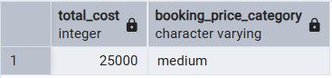
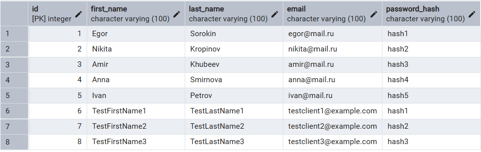

5. CASE

Категоризация стоимости бронирования.

```sql
CREATE OR REPLACE FUNCTION categorize_booking_price(booking_id INT)
RETURNS VARCHAR(20)
LANGUAGE plpgsql
AS $$
DECLARE
	current_cost INT;
	category VARCHAR(20);
BEGIN
	SELECT total_cost
	INTO current_cost
	FROM booking
	WHERE id = booking_id;

	category := CASE
		WHEN current_cost <= 10000 THEN 'low'
		WHEN current_cost <= 30000 THEN 'medium'
		ELSE 'high'
	END;

	RETURN category;
END;
$$;
SELECT total_cost, categorize_booking_price(15) AS booking_price_category
FROM booking
WHERE id = 15
```



6. WHILE

6.1. Создание тестовых клиентов с помощью цикла.

```sql
CREATE OR REPLACE PROCEDURE create_test_clients(count_clients INT)
LANGUAGE plpgsql
AS $$
DECLARE
    i INT := 1;
BEGIN
    WHILE i <= count_clients LOOP
        INSERT INTO client (first_name, last_name, email, password_hash)
        VALUES (
            'TestFirstName' || i,
            'TestLastName' || i,
            'testclient' || i || '@example.com',
            'hash' || i
        );
        i := i + 1;
    END LOOP;
END;
$$;
CALL create_test_clients(3);
SELECT * FROM client
```

