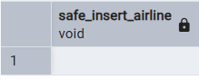
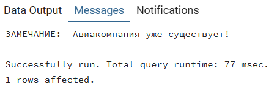
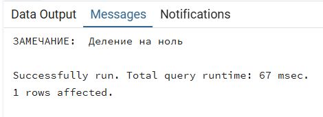

1. Процедуры

1.1 **Добавление нового города**

```sql
CREATE OR REPLACE PROCEDURE add_city(p_city_name VARCHAR)
LANGUAGE plpgsql
AS $$
BEGIN
    INSERT INTO city (name) VALUES (p_city_name);
END;
$$;

CALL add_city('Dubai');
```


1.2 **Обновление стоимости бронирования**

```sql
CREATE OR REPLACE PROCEDURE update_booking_cost(p_booking_id INT, p_new_cost INT)
LANGUAGE plpgsql
AS $$
BEGIN
    UPDATE booking 
    SET total_cost = p_new_cost 
    WHERE id = p_booking_id;
END;
$$;

CALL update_booking_cost(1, 50000);
```


1.3 **Регистрация нового клиента**

```sql
CREATE OR REPLACE PROCEDURE register_client(
    p_first_name VARCHAR, 
    p_last_name VARCHAR, 
    p_email VARCHAR, 
    p_pass_hash VARCHAR
)
LANGUAGE plpgsql
AS $$
BEGIN
    INSERT INTO client (first_name, last_name, email, password_hash) 
    VALUES (p_first_name, p_last_name, p_email, p_pass_hash);
END;
$$;

CALL register_client('Ivan', 'Ivanov', 'ivan@example.com', 'hash123');
```


1.4 Запрос для просмотра всех процедур

```sql
SELECT routine_name
FROM information_schema.routines 
WHERE routine_type = 'PROCEDURE' AND routine_schema = 'public';
```


2. Функции

2.1 **Получение общего количества клиентов**

```sql
CREATE OR REPLACE FUNCTION get_total_clients_count()
RETURNS BIGINT
LANGUAGE plpgsql
AS $$
DECLARE
    total BIGINT;
BEGIN
    SELECT count(*) INTO total FROM client;
    RETURN total;
END;
$$;

SELECT get_total_clients_count();
```


2.2 **Получение максимальной стоимости бронирования**

```sql
CREATE OR REPLACE FUNCTION get_max_booking_cost()
RETURNS INTEGER
LANGUAGE plpgsql
AS $$
DECLARE
    max_cost INTEGER;
BEGIN
    SELECT MAX(total_cost) INTO max_cost FROM booking;
    RETURN max_cost;
END;
$$;

SELECT get_max_booking_cost();
```

  


2.3 **Получение минимальной вместимости самолета**

```sql
CREATE OR REPLACE FUNCTION get_min_aircraft_capacity()
RETURNS INT
LANGUAGE plpgsql
AS $$
DECLARE
    min_cap SMALLINT;
BEGIN
    SELECT MIN(capacity) INTO min_cap FROM aircraft_model;
    RETURN min_cap;
END;
$$;

SELECT get_min_aircraft_capacity();
```


**2.4 Подсчет количества бронирований клиента**
```sql
CREATE OR REPLACE FUNCTION count_bookings(clnt_id INT)
RETURNS INT
LANGUAGE plpgsql
AS $$
DECLARE 
	bookings_count INT := 0;
BEGIN
	SELECT COUNT(*) INTO bookings_count
	FROM booking 
	WHERE client_id = clnt_id;
	
	RETURN bookings_count;
END;
$$;

SELECT count_bookings(1);
```


**2.5 Подсчет суммы стоимостей всех билетов оформленных на пассажира.**
```sql
CREATE OR REPLACE FUNCTION total_ticket_sum_by_passenger(pssngr_id INT)
RETURNS INT
LANGUAGE plpgsql
AS $$
DECLARE
	total_sum INT := 0;
BEGIN
	SELECT COALESCE(SUM(f.price), 0) INTO total_sum
	FROM ticket t JOIN fare f ON t.fare_id = f.id
	WHERE t.passenger_id = pssngr_id;
	RETURN total_sum;
END;
$$;

SELECT total_ticket_sum_by_passenger(1);
```


**2.6 Подсчет задерживающихся (`Delayed`) рейсов на определенную дату.**
```sql
CREATE OR REPLACE FUNCTION delayed_flights_count(date DATE)
RETURNS INT
LANGUAGE plpgsql
AS $$
DECLARE
	flights_count INT;
BEGIN
	SELECT COUNT(*) INTO flights_count
	FROM flight f JOIN flight_status s ON f.status_id = s.id
	WHERE s.description = 'Delayed' AND CAST(f.arrival_time AS DATE) = date;
	RETURN flights_count;
END;
$$;

SELECT delayed_flights_count('2025-10-21');
```


**2.7 Запрос просмотра всех функий**
```sql
SELECT routine_name
FROM information_schema.routines
WHERE routine_type = 'FUNCTION' AND routine_schema = 'public';
```


**3.1 Вставить тестового пассажира если еще не существует**
```sql
DO $$
BEGIN
    IF NOT EXISTS (SELECT 1 FROM passenger WHERE passport_series = '0000' AND passport_number = '111111') THEN
        INSERT INTO passenger(first_name, last_name, birthdate, passport_series, passport_number)
        VALUES('Test', 'Passenger', '2000-01-01', '0000', '111111');
    END IF;
END
$$;

SELECT * FROM passenger WHERE passport_series = '0000' AND passport_number = '111111';
```


**3.2  Сменить статус на `Delayed` для рейсов на которые не проданы билеты.**


```sql
SELECT f.id FROM flight f JOIN flight_status s ON f.status_id = s.id WHERE s.description = 'Delayed';

DO $$
BEGIN
	UPDATE flight
	SET status_id = (SELECT s.id FROM flight_status s WHERE s.description = 'Delayed')
	WHERE NOT EXISTS (
		SELECT 1 FROM ticket t WHERE t.flight_id = flight.id
	);
END
$$;

SELECT f.id FROM flight f JOIN flight_status s ON f.status_id = s.id WHERE s.description = 'Delayed';
```


**3.3 Удалить пассажиров, у которых ни одного купленного билета.**


```sql
SELECT * FROM passenger WHERE id NOT IN (SELECT DISTINCT passenger_id FROM ticket);

DO $$
BEGIN
    DELETE FROM passenger
    WHERE id NOT IN (
        SELECT DISTINCT passenger_id 
        FROM ticket
    );
END;
$$;

SELECT * FROM passenger WHERE id NOT IN (SELECT DISTINCT passenger_id FROM ticket);
```


4. IF

```sql
DO $$
DECLARE
    avg_cost NUMERIC;
BEGIN
    -- Получаем среднюю стоимость бронирования
    SELECT AVG(total_cost) INTO avg_cost FROM booking;

    -- Проверяем условие
    IF avg_cost > 10000 THEN
        RAISE NOTICE 'Средняя стоимость высокая: %', avg_cost;
    ELSE
        RAISE NOTICE 'Средняя стоимость приемлемая: %', avg_cost;
    END IF;
END;
$$;
```


5. CASE

Категоризация стоимости бронирования.

```sql
CREATE OR REPLACE FUNCTION categorize_booking_price(booking_id INT)
RETURNS VARCHAR(20)
LANGUAGE plpgsql
AS $$
DECLARE
	current_cost INT;
	category VARCHAR(20);
BEGIN
	SELECT total_cost
	INTO current_cost
	FROM booking
	WHERE id = booking_id;

	category := CASE
		WHEN current_cost <= 10000 THEN 'low'
		WHEN current_cost <= 30000 THEN 'medium'
		ELSE 'high'
	END;

	RETURN category;
END;
$$;
SELECT total_cost, categorize_booking_price(15) AS booking_price_category
FROM booking
WHERE id = 15
```


6. WHILE

6.1. Создание тестовых клиентов с помощью цикла.

```sql
CREATE OR REPLACE PROCEDURE create_test_clients(count_clients INT)
LANGUAGE plpgsql
AS $$
DECLARE
    i INT := 1;
BEGIN
    WHILE i <= count_clients LOOP
        INSERT INTO client (first_name, last_name, email, password_hash)
        VALUES (
            'TestFirstName' || i,
            'TestLastName' || i,
            'testclient' || i || '@example.com',
            'hash' || i
        );
        i := i + 1;
    END LOOP;
END;
$$;
CALL create_test_clients(3);
SELECT * FROM client
```


6.2. Статистика по классам перелетов.
```sql
CREATE OR REPLACE FUNCTION count_fare_classes_stats()
RETURNS TABLE(class_id INT, total_flights BIGINT, avg_price NUMERIC)
LANGUAGE plpgsql
AS $$
DECLARE
    total_classes INT;
    current_id INT := 1;
BEGIN
    SELECT COUNT(*) INTO total_classes FROM fare_class;
    WHILE current_id <= total_classes LOOP
        SELECT 
            current_id,
            COUNT(f.id),
            AVG(f.price)
        INTO class_id, total_flights, avg_price
        FROM fare f 
        WHERE f.fare_class_id = current_id;
        RETURN NEXT;
        current_id := current_id + 1;
    END LOOP;
END;
$$;
SELECT * FROM count_fare_classes_stats();
```


7. EXCEPTION

7.1. Попытка добавить уже существующую авиакомпанию.
```sql
CREATE OR REPLACE FUNCTION safe_insert_airline(
    p_iata_code VARCHAR(3),
    p_name VARCHAR(100)
)
RETURNS VOID
LANGUAGE plpgsql
AS $$
BEGIN
    INSERT INTO airline (iata_code, name)
    VALUES (p_iata_code, p_name);
EXCEPTION
    WHEN unique_violation THEN
        NULL;
END;
$$;
SELECT safe_insert_airline('TST', 'Test Airlines');
```



7.2. Попытка деления на ноль.
```sql
CREATE OR REPLACE FUNCTION calculate_occupancy_rate(
    p_passengers INT,
    p_capacity INT
)
RETURNS NUMERIC
LANGUAGE plpgsql
AS $$
BEGIN
    RETURN (p_passengers::NUMERIC / p_capacity::NUMERIC) * 100;
EXCEPTION
    WHEN division_by_zero THEN
        RETURN 0;
END;
$$;
SELECT calculate_occupancy_rate(150, 200);
SELECT calculate_occupancy_rate(130, 0);
```


8. RAISE

8.1.
```sql
CREATE OR REPLACE FUNCTION safe_insert_airline_with_raise(
    p_iata_code VARCHAR(3),
    p_name VARCHAR(100)
)
RETURNS VOID
LANGUAGE plpgsql
AS $$
BEGIN
    INSERT INTO airline (iata_code, name)
    VALUES (p_iata_code, p_name);
    
    RAISE NOTICE 'Авиакомпания успешно добавлена';
EXCEPTION
    WHEN unique_violation THEN
        RAISE NOTICE 'Авиакомпания уже существует!';
END;
$$;
SELECT safe_insert_airline_with_raise('TST', 'Test Airlines');
```


8.2.
```sql
CREATE OR REPLACE FUNCTION calculate_occupancy_rate_with_raise(
    p_passengers INT,
    p_capacity INT
)
RETURNS NUMERIC
LANGUAGE plpgsql
AS $$
BEGIN    
    RETURN (p_passengers::NUMERIC / p_capacity::NUMERIC) * 100;
EXCEPTION
    WHEN division_by_zero THEN
        RAISE NOTICE 'Деление на ноль';
        RETURN 0;
END;
$$;
SELECT calculate_occupancy_rate_with_raise(150, 0);
```

