1. SELECT

1.1. **Все рейсы с количеством билетов на каждом рейсе**
```sql
SELECT 
    fn.number as flight_number,
    f.departure_time,
    (
        SELECT COUNT(*) 
        FROM ticket t 
        WHERE t.flight_id = f.id
    ) as tickets_count
FROM flight f
JOIN flight_number fn ON f.flight_number = fn.number;
```
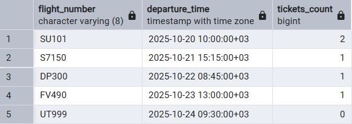

1.2. **Клиенты с количеством их бронирований**
```sql
SELECT 
    first_name,
    last_name,
    email,
    (
        SELECT COUNT(*) 
        FROM booking b 
        WHERE b.client_id = c.id
    ) as bookings_count
FROM client c;
```


1.3. **Аэропорты с количеством вылетающих рейсов**
```sql
SELECT 
    a.iata_code,
    a.name as airport_name,
    (
        SELECT COUNT(*) 
        FROM flight_number fn 
        WHERE fn.departure_airport_id = a.iata_code
    ) as departing_flights
FROM airport a;
```
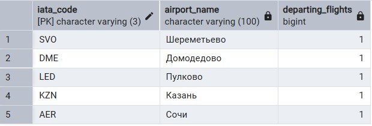


2. FROM

2.1. **Средняя стоимость бронирований по каждому клиенту**
```sql
SELECT 
    client_info.first_name,
    client_info.last_name,
    client_info.avg_booking_cost
FROM (
    SELECT 
        c.first_name,
        c.last_name,
        AVG(b.total_cost) as avg_booking_cost
    FROM client c
    JOIN booking b ON c.id = b.client_id
    GROUP BY c.id, c.first_name, c.last_name
) as client_info;
```


2.2. **Рейсы с количеством доступных тарифов**
```sql
SELECT 
    flight_data.flight_number,
    flight_data.departure_time,
    flight_data.fare_classes_count
FROM (
    SELECT 
        fn.number as flight_number,
        f.departure_time,
        COUNT(fare.fare_class_id) as fare_classes_count
    FROM flight f
    JOIN flight_number fn ON f.flight_number = fn.number
    JOIN fare ON f.id = fare.flight_id
    GROUP BY fn.number, f.departure_time
) as flight_data;
```


2.3. **Авиакомпании и количество их самолетов**
```sql
SELECT 
    airline_stats.airline_name,
    airline_stats.aircraft_count
FROM (
    SELECT 
        a.name as airline_name,
        COUNT(ac.id) as aircraft_count
    FROM airline a
    LEFT JOIN aircraft ac ON a.iata_code = ac.airline_iata_code
    GROUP BY a.name
) as airline_stats;
```
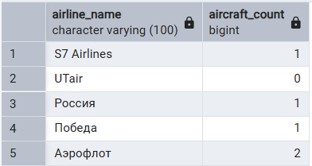


3. WHERE

3.1. **Рейсы, на которые есть билеты дороже 30000 рублей**
```sql
SELECT 
    fn.number as flight_number,
    f.departure_time,
    f.arrival_time
FROM flight f
JOIN flight_number fn ON f.flight_number = fn.number
WHERE f.id IN (
    SELECT flight_id 
    FROM fare 
    WHERE price > 30000
);
```
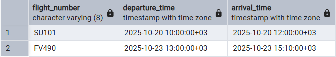

3.2. **Клиенты, у которых есть бронирования**
```sql
SELECT 
    first_name,
    last_name,
    email
FROM client
WHERE id IN (
    SELECT DISTINCT client_id 
    FROM booking
);
```


3.3. **Пассажиры, которые летали бизнес-классом**
```sql
SELECT 
    first_name,
    last_name,
    passport_series,
    passport_number
FROM passenger
WHERE id IN (
    SELECT t.passenger_id
    FROM ticket t
    JOIN fare f ON t.fare_id = f.id
    WHERE f.fare_class_id = 3
);
```


4. HAVING

4.1. **Клиенты, у которых средняя стоимость бронирований выше общей средней**
```sql
SELECT 
    c.first_name,
    c.last_name,
    AVG(b.total_cost) as avg_booking_cost
FROM client c
JOIN booking b ON c.id = b.client_id
GROUP BY c.id, c.first_name, c.last_name
HAVING AVG(b.total_cost) > (
    SELECT AVG(total_cost) 
    FROM booking
);
```
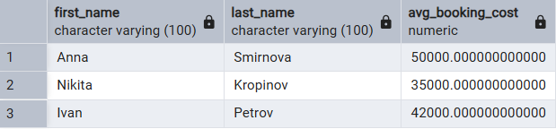

4.2. **Авиакомпании, у которых количество самолетов больше среднего**
```sql
SELECT 
    a.name as airline_name,
    COUNT(ac.id) as aircraft_count
FROM airline a
LEFT JOIN aircraft ac ON a.iata_code = ac.airline_iata_code
GROUP BY a.name
HAVING COUNT(ac.id) > (
    SELECT AVG(aircraft_count) 
    FROM (
        SELECT COUNT(id) as aircraft_count
        FROM aircraft
        GROUP BY airline_iata_code
    ) as avg_table
);
```
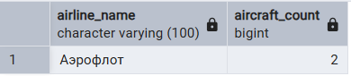

4.3. **Рейсы, на которые продано билетов больше среднего**
```sql
SELECT 
    f.id,
    fn.number as flight_number,
    COUNT(t.id) as tickets_sold
FROM flight f
JOIN flight_number fn ON f.flight_number = fn.number
LEFT JOIN ticket t ON f.id = t.flight_id
GROUP BY f.id, fn.number
HAVING COUNT(t.id) > (
    SELECT AVG(ticket_count) 
    FROM (
        SELECT COUNT(id) as ticket_count
        FROM ticket
        GROUP BY flight_id
    ) as ticket_stats
);
```
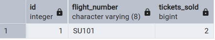


5. ALL

5.1. **Самый дорогой тариф**
```sql
SELECT 
    fc.description as fare_class,
    f.price
FROM fare f
JOIN fare_class fc ON f.fare_class_id = fc.id
WHERE f.price >= ALL (
    SELECT price 
    FROM fare
);
```
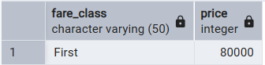

5.2. **Рейсы с самой низкой ценой в эконом-классе**
```sql
SELECT 
    fn.number as flight_number,
    f.price
FROM fare f
JOIN flight fl ON f.flight_id = fl.id
JOIN flight_number fn ON fl.flight_number = fn.number
WHERE f.fare_class_id = 1
AND f.price <= ALL (
    SELECT price 
    FROM fare 
    WHERE fare_class_id = 1
);
```


5.3. **Самое дешевое бронирование**
```sql
SELECT 
    c.first_name,
    c.last_name,
    b.total_cost
FROM booking b
JOIN client c ON b.client_id = c.id
WHERE b.total_cost <= ALL (
    SELECT total_cost 
    FROM booking
);
```
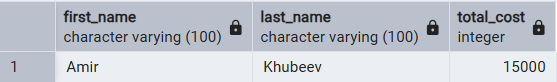


6. IN

6.1. **Рейсы, которые вылетают из Шереметьево**
```sql
SELECT 
    fn.number as flight_number,
    f.departure_time
FROM flight f
JOIN flight_number fn ON f.flight_number = fn.number
WHERE fn.departure_airport_id IN (
    SELECT iata_code 
    FROM airport 
    WHERE name = 'Шереметьево'
);
```
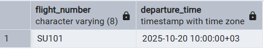

6.2. **Пассажиры, у которых есть билеты**
```sql
SELECT 
    first_name,
    last_name,
    passport_series
FROM passenger
WHERE id IN (
    SELECT passenger_id 
    FROM ticket
);
```
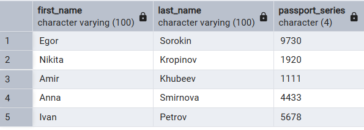

6.3. **Авиакомпании, у которых есть самолеты**
```sql
SELECT 
    name as airline_name,
    iata_code
FROM airline
WHERE iata_code IN (
    SELECT DISTINCT airline_iata_code 
    FROM aircraft
);
```


7. ANY

7.1. **Рейсы с ценами выше некоторых эконом-тарифов**
```sql
SELECT 
    fn.number as flight_number,
    f.departure_time,
    fare.price
FROM flight f
JOIN flight_number fn ON f.flight_number = fn.number
JOIN fare ON f.id = fare.flight_id
WHERE fare.price > ANY (
    SELECT price 
    FROM fare 
    WHERE fare_class_id = 1
);
```
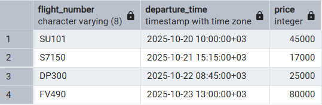

7.2. **Клиенты с бронированиями дешевле некоторых отмененных**
```sql
SELECT 
    first_name,
    last_name,
    b.total_cost
FROM client c
JOIN booking b ON c.id = b.client_id
WHERE b.total_cost < ANY (
    SELECT total_cost 
    FROM booking 
    WHERE status_id = 3
);
```


7.3. **Тарифы дешевле некоторых бизнес-классов**
```sql
SELECT 
    fc.description as fare_class,
    f.price
FROM fare f
JOIN fare_class fc ON f.fare_class_id = fc.id
WHERE f.price < ANY (
    SELECT price 
    FROM fare 
    WHERE fare_class_id = 3
);
```


8. EXIST

8.1. **Клиенты, у которых есть бронирования**
```sql
SELECT 
    first_name,
    last_name,
    email
FROM client c
WHERE EXISTS (
    SELECT 1 
    FROM booking b 
    WHERE b.client_id = c.id
);
```


8.2. **Рейсы, на которые проданы билеты**
```sql
SELECT 
    fn.number as flight_number,
    f.departure_time
FROM flight f
JOIN flight_number fn ON f.flight_number = fn.number
WHERE EXISTS (
    SELECT 1 
    FROM ticket t 
    WHERE t.flight_id = f.id
);
```
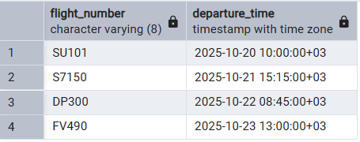

8.3. **Авиакомпании, у которых есть самолеты**
```sql
SELECT 
    name as airline_name,
    iata_code
FROM airline a
WHERE EXISTS (
    SELECT 1 
    FROM aircraft ac 
    WHERE ac.airline_iata_code = a.iata_code
);
```


9. Подзапрос с несколькими столбцами

9.1. **Билеты с такими же данными пассажира, как в определенном бронировании**
```sql
SELECT 
    t.seat_number,
    t.flight_id
FROM ticket t
WHERE (t.passenger_id, t.booking_id) IN (
    SELECT passenger_id, booking_id 
    FROM ticket 
    WHERE seat_number = 'A1'
);
```
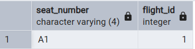

9.2. **Рейсы с таким же маршрутом, как определенный рейс**
```sql
SELECT 
    fn.number as flight_number,
    fn.departure_airport_id,
    fn.arrival_airport_id
FROM flight_number fn
WHERE (fn.departure_airport_id, fn.arrival_airport_id) IN (
    SELECT departure_airport_id, arrival_airport_id 
    FROM flight_number 
    WHERE number = 'SU101'
);
```
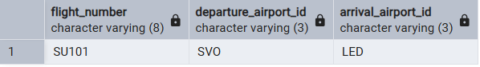

9.3. **Тарифы с такой же комбинацией рейса и класса, как у самых дорогих**
```sql
SELECT 
    f.flight_id,
    fc.description as fare_class,
    f.price
FROM fare f
JOIN fare_class fc ON f.fare_class_id = fc.id
WHERE (f.flight_id, f.fare_class_id) IN (
    SELECT flight_id, fare_class_id 
    FROM fare 
    WHERE price > 40000
);
```


10. Коррелированные подзапросы

10.1. **Клиенты с количеством их бронирований**
```sql
SELECT 
    first_name,
    last_name,
    email,
    (
        SELECT COUNT(*) 
        FROM booking b 
        WHERE b.client_id = c.id
    ) as bookings_count
FROM client c;
```
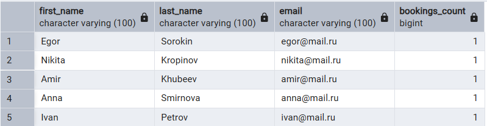

10.2. **Рейсы с количеством проданных билетов**
```sql
SELECT 
    fn.number as flight_number,
    f.departure_time,
    (
        SELECT COUNT(*) 
        FROM ticket t 
        WHERE t.flight_id = f.id
    ) as tickets_sold
FROM flight f
JOIN flight_number fn ON f.flight_number = fn.number;
```
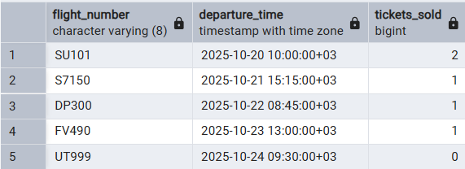

10.3. **Аэропорты с количеством вылетающих рейсов**
```sql
SELECT 
    a.iata_code,
    a.name as airport_name,
    (
        SELECT COUNT(*) 
        FROM flight_number fn 
        WHERE fn.departure_airport_id = a.iata_code
    ) as departing_flights_count
FROM airport a;
```


10.4. **Авиакомпании с количеством их самолетов**
```sql
SELECT 
    name as airline_name,
    iata_code,
    (
        SELECT COUNT(*) 
        FROM aircraft ac 
        WHERE ac.airline_iata_code = a.iata_code
    ) as aircraft_count
FROM airline a;
```


10.5. **Пассажиры с количеством их билетов**
```sql
SELECT 
    first_name,
    last_name,
    passport_series,
    (
        SELECT COUNT(*) 
        FROM ticket t 
        WHERE t.passenger_id = p.id
    ) as tickets_count
FROM passenger p;
```
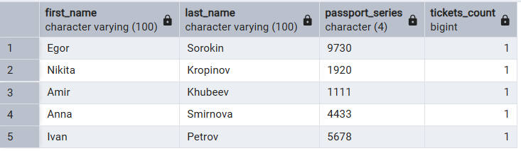
