# Отчёт: Airflow ETL + Analytics Pipeline

## 1. Выбранные источники данных

Для ETL-сценария выбраны два источника разного типа:

| Источник | Тип | Файл | Целевая таблица |
|---|---|---|---|
| Новые авиакомпании | CSV | `data/airlines_new.csv` | `airline` |
| Новые рейсы | JSON | `data/flights_new.json` | `flight` |

**CSV-файл** содержит 7 новых авиакомпаний (Emirates, British Airways, Lufthansa, Air France, Turkish Airlines, Qatar Airways, Etihad Airways). Структура: `iata_code`, `name`.

**JSON-файл** содержит 10 новых рейсов. Каждый рейс ссылается на существующие в БД `flight_number`, `aircraft_id`, `status_id`. Даты вылета — июнь 2026 года.

## 2. Таблицы проекта, которые пополняются

- **`airline`** — пополняется из CSV. Первичный ключ: `iata_code`. Добавлено 7 новых строк.
- **`flight`** — пополняется из JSON. Первичный ключ: `id`. Добавлено 10 новых строк (id с 999901 по 999910).

Проверка после загрузки:

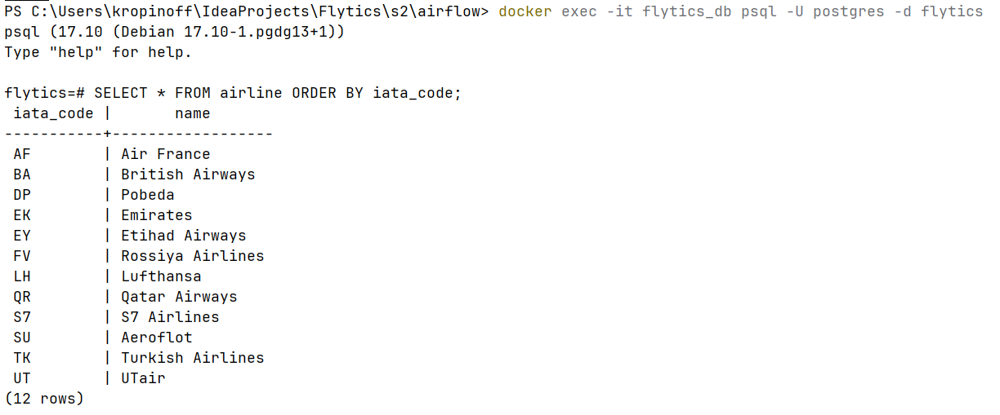

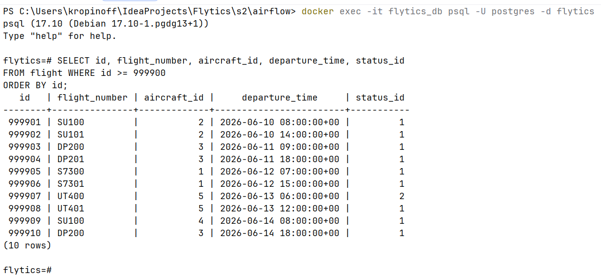

## 3. Как устроен DAG 1 (ETL)

Файл: `dags/dag1_etl.py`

DAG `etl_load_external_data` — запускается вручную (`schedule_interval=None`). Состоит из четырёх задач:

```
extract_csv ──> load_airlines
extract_json ─> load_flights
```

### extract_csv
Читает `data/airlines_new.csv`, валидирует каждую строку:
- `iata_code` — не пустой, 2-3 символа, приводится к верхнему регистру
- `name` — не пустой

Результат передаётся через XCom (механизм обмена данными между задачами внутри DAG: одна задача кладёт данные через `xcom_push`, другая забирает через `xcom_pull`) в задачу `load_airlines`.

### load_airlines
Принимает данные через XCom, подключается к PostgreSQL и выполняет upsert:

```sql
INSERT INTO airline (iata_code, name) VALUES (%s, %s)
ON CONFLICT (iata_code) DO UPDATE SET name = EXCLUDED.name
```

### extract_json
Читает `data/flights_new.json`, валидирует:
- `flight_number` и `aircraft_id` — обязательные поля
- `departure_time < arrival_time` — проверка логичности дат

### load_flights
Подключается к PostgreSQL, проверяет существование `aircraft_id` в таблице `aircraft`, затем вставляет:

```sql
INSERT INTO flight (...) VALUES (...)
ON CONFLICT (id) DO NOTHING
```

Граф после успешного выполнения — все четыре задачи зелёные, зависимости соблюдены:

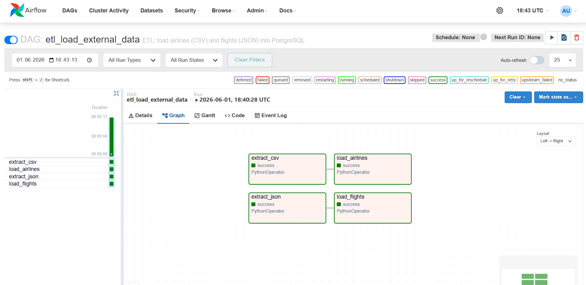

Лог задачи `load_airlines` — видно количество загруженных строк (7 авиакомпаний):

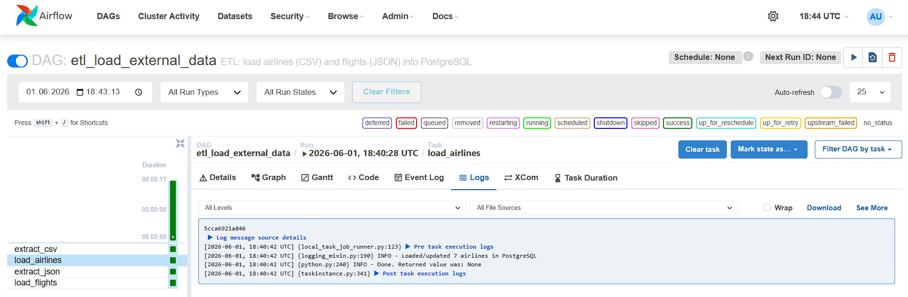

Лог задачи `load_flights` — 10 рейсов загружено, ни один не пропущен по `aircraft_id`:

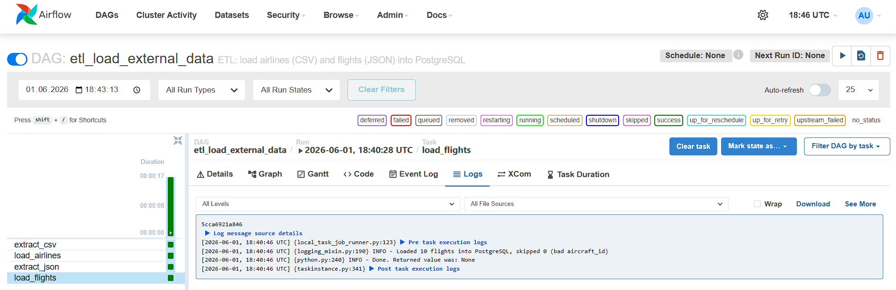

## 4. Как устроен DAG 2 (Analytics)

Файл: `dags/dag2_analytics.py`

DAG `analytics_to_clickhouse` — запускается вручную. Состоит из четырёх задач:

```
create_clickhouse_tables ──> load_to_clickhouse ──> build_datamart ──> check_data_quality
```

### create_clickhouse_tables
Создаёт в ClickHouse таблицы-зеркала PostgreSQL:
- `airline` (iata_code, name)
- `flight` (id, flight_number, aircraft_id, departure_time, arrival_time, status_id, flight_tags, actual_departure)
- `booking` (id, client_id, booking_date, total_cost, status_id, channel)

### load_to_clickhouse
Читает данные из PostgreSQL и вставляет в ClickHouse через библиотеку `clickhouse-connect`. Перед вставкой обрабатывает NULL-значения:
- `flight_tags = NULL` → `[]` (пустой массив)
- `channel = NULL` → `''` (пустая строка)

### build_datamart
Создаёт и заполняет аналитическую витрину `daily_flight_stats`:

1. Загружает из PostgreSQL маппинг `aircraft_id → airline_iata_code`
2. Извлекает все рейсы (`departure_time::date`, `aircraft_id`, `flight_number`)
3. Группирует в Python: по дате и авиакомпании, считает количество рейсов и уникальных маршрутов
4. Вставляет результат в ClickHouse

Витрина пересоздаётся при каждом запуске (`TRUNCATE + INSERT`) — это гарантирует идемпотентность.

### check_data_quality
Сравнивает количество строк в PostgreSQL и ClickHouse для таблиц `airline`, `flight`, `booking`. Проверяет что витрина не пустая.

Граф DAG 2 после успешного выполнения — видно цепочку из четырёх задач:

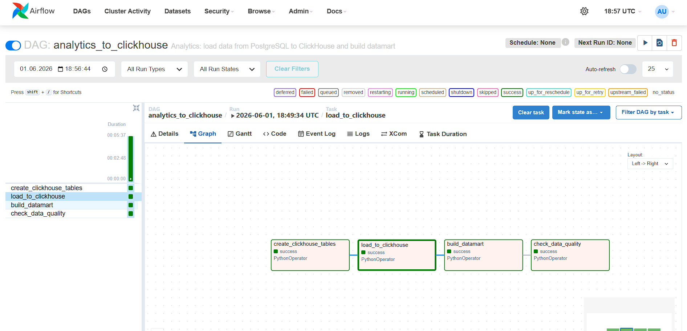

Лог задачи `build_datamart` — сколько строк попало в витрину `daily_flight_stats`:

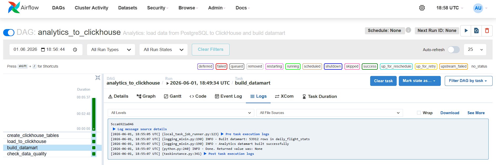

## 5. Таблицы, создаваемые в ClickHouse

| Таблица | Движок | Ключ сортировки | Источник |
|---|---|---|---|
| `airline` | MergeTree | iata_code | PostgreSQL airline |
| `flight` | MergeTree | (departure_time, id) | PostgreSQL flight |
| `booking` | MergeTree | (booking_date, id) | PostgreSQL booking |
| `daily_flight_stats` | SummingMergeTree | (date, airline_iata) | Агрегация flight |

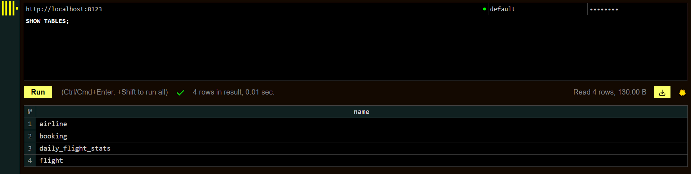

Общее количество строк в таблице `flight` в ClickHouse:

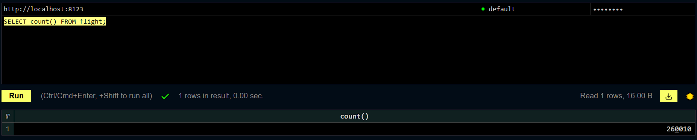

## 6. Аналитическая витрина

Витрина `daily_flight_stats`:

```sql
CREATE TABLE daily_flight_stats (
    date Date,
    airline_iata String,
    flights_count UInt32,
    unique_routes UInt32
) ENGINE = SummingMergeTree()
ORDER BY (date, airline_iata)
```

Движок `SummingMergeTree` выбран для возможности дальнейшей агрегации: при вставке строк с одинаковым ключом `(date, airline_iata)` числовые колонки автоматически суммируются.

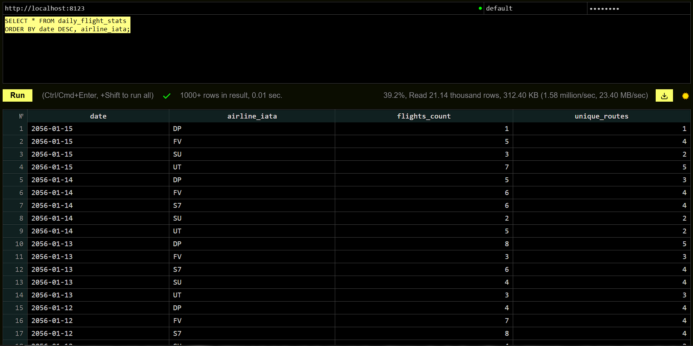

## 7. Какие метрики считаются

- **`flights_count`** — количество рейсов за день по каждой авиакомпании
- **`unique_routes`** — количество уникальных маршрутов (flight_number) за день по авиакомпании

Пример аналитического запроса — суммарные показатели по авиакомпаниям за всё время:

```sql
SELECT
    airline_iata,
    sum(flights_count) AS total_flights,
    sum(unique_routes) AS total_routes
FROM daily_flight_stats
GROUP BY airline_iata
ORDER BY total_flights DESC
```

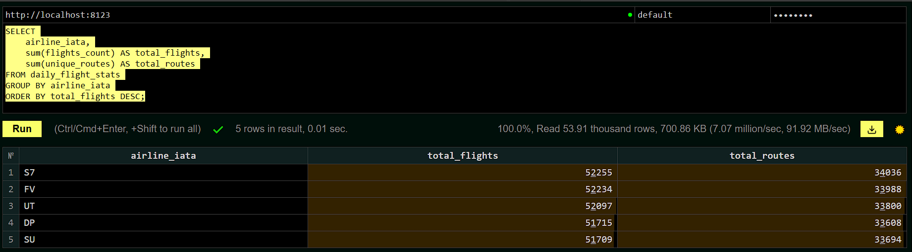

## 8. Как обеспечена идемпотентность

**DAG 1:**
- `airline`: `INSERT ... ON CONFLICT (iata_code) DO UPDATE` — при повторном запуске данные обновляются, дубликатов не появляется
- `flight`: `INSERT ... ON CONFLICT (id) DO NOTHING` — при повторном запуске существующие рейсы пропускаются

**DAG 2:**
- ClickHouse таблицы создаются через `CREATE TABLE IF NOT EXISTS`
- Витрина `daily_flight_stats` очищается через `TRUNCATE` и заполняется заново

**Проверка:** после повторного запуска DAG 1 в таблице `flight` по-прежнему 10 строк с id >= 999900:

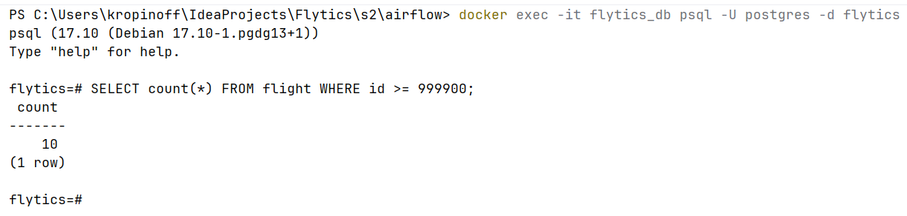

## 9. Проверки качества данных

**В DAG 1:**
- Валидация CSV: `iata_code` не пустой, длина 2-3 символа; `name` не пустой
- Валидация JSON: обязательные поля (`flight_number`, `aircraft_id`); `departure_time < arrival_time`
- Проверка существования `aircraft_id` в справочнике перед вставкой
- Логирование количества загруженных/пропущенных строк

**В DAG 2:**
- `check_data_quality` сравнивает количество строк PostgreSQL vs ClickHouse для каждой таблицы
- Статус `OK` / `MISMATCH` по каждой таблице
- Проверка что витрина не пустая (если пустая — ошибка)

Лог задачи `check_data_quality` — по всем трём таблицам статус OK, количество строк совпадает:

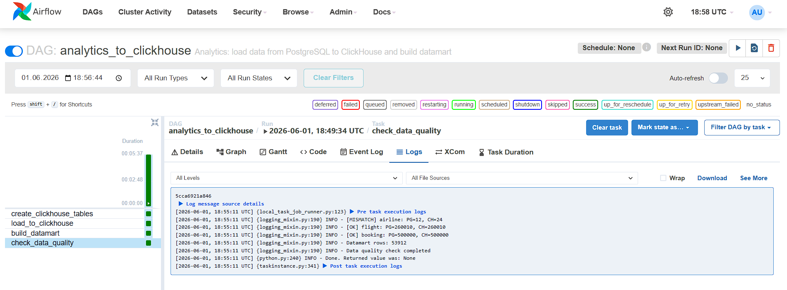

## 10. Как запустить проект

### Предварительные требования
- Docker Desktop
- Свободные порты: 54322 (PostgreSQL), 8080 (Airflow), 8123 (ClickHouse HTTP)

### Запуск

```bash
# 1. Основной PostgreSQL проекта
cd s2
docker compose up -d

# 2. Airflow + ClickHouse
cd s2/airflow
docker compose up -d
```

### Доступ к сервисам

| Сервис | URL | Логин / Пароль |
|---|---|---|
| Airflow UI | http://localhost:8080 | admin / admin |
| ClickHouse HTTP | http://localhost:8123/play | default / password |
| PostgreSQL | localhost:54322 | postgres / postgres |

### Запуск DAG'ов

В Airflow UI после запуска видны оба DAG'а:

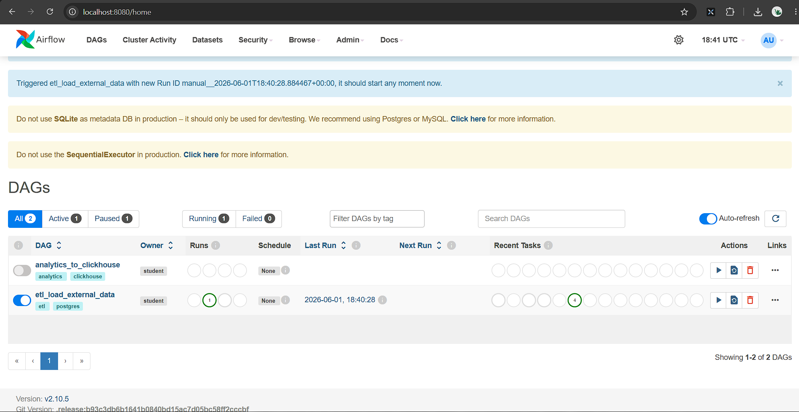

1. Открыть Airflow UI (http://localhost:8080, admin / admin)
2. В списке DAG'ов найти `etl_load_external_data`, нажать ▶ → Trigger DAG
3. Дождаться успешного выполнения всех задач (зелёные квадраты)
4. Найти `analytics_to_clickhouse`, нажать ▶ → Trigger DAG
5. Дождаться выполнения всех четырёх задач
6. Проверить результат в ClickHouse: http://localhost:8123/play → `SELECT * FROM daily_flight_stats`

### Структура файлов

```
s2/airflow/
  docker-compose.yaml          # Airflow + ClickHouse
  dags/
    dag1_etl.py                 # ETL DAG (CSV + JSON → PostgreSQL)
    dag2_analytics.py           # Analytics DAG (PostgreSQL → ClickHouse)
  data/
    airlines_new.csv            # Входной CSV с авиакомпаниями
    flights_new.json            # Входной JSON с рейсами
  config/
    requirements.txt            # Python-зависимости (clickhouse-connect)
  report.md                    # Этот отчёт
  images/                      # Скриншоты
```

