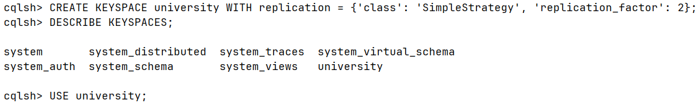
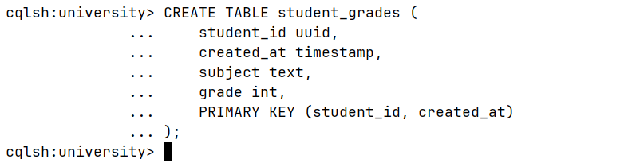
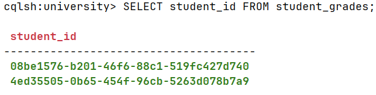
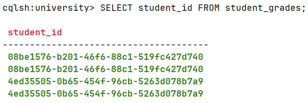
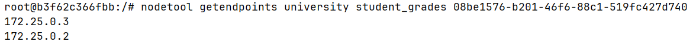
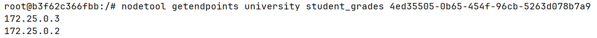
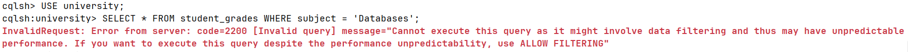
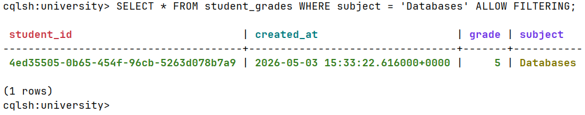

## Подготовка
`docker compose up -d`
`docker exec -it cassandra-node1 cqlsh` - работа через консоль

## Задания
- Создайте Keyspace `university` с фактором репликации **2** (чтобы данные дублировались на обе ноды).

```cassandraql
CREATE KEYSPACE university WITH replication = {'class': 'SimpleStrategy', 'replication_factor': 2};
USE university;
```


- Создайте таблицу `student_grades`: `student_id(uuid)`, `created_at`, `subject`, `grade`.
- Настройте ключи: **Partition Key** — `student_id`, **Clustering Key** — `created_at`.
```cassandraql
CREATE TABLE student_grades (
    student_id uuid,
    created_at timestamp,
    subject text,
    grade int,
    PRIMARY KEY (student_id, created_at)
);
```


- Выполните по 2 вставки  для двух разных студентов. Для генерации ID используйте функцию `uuid()`.
```cassandraql
INSERT INTO student_grades (student_id, created_at, subject, grade) 
VALUES (uuid(), toTimestamp(now()), 'Databases', 5);

INSERT INTO student_grades (student_id, created_at, subject, grade) 
VALUES (uuid(), toTimestamp(now()), 'Software Engineering', 5);
```
Это первая вставка для каждого из 2 студентов.
Берем их id:

```
cqlsh:university> SELECT student_id FROM student_grades;

 student_id
--------------------------------------
 08be1576-b201-46f6-88c1-519fc427d740
 4ed35505-0b65-454f-96cb-5263d078b7a9
```

Вторая вставка для каждого студента:
```cassandraql
INSERT INTO student_grades (student_id, created_at, subject, grade) 
VALUES (08be1576-b201-46f6-88c1-519fc427d740, toTimestamp(now()), 'Math', 4);

INSERT INTO student_grades (student_id, created_at, subject, grade) 
VALUES (4ed35505-0b65-454f-96cb-5263d078b7a9, toTimestamp(now()), 'Computer Science', 5);
```


- Найдите UUID ваших студентов: `SELECT student_id FROM student_grades;`.
- В терминале выполните команду для получения ip нод с данными каждого UUID: `nodetool getendpoints keyspace table_name <UUID>`,


`docker exec -it cassandra-node1 bash`
```
nodetool getendpoints university student_grades 08be1576-b201-46f6-88c1-519fc427d740
nodetool getendpoints university student_grades 4ed35505-0b65-454f-96cb-5263d078b7a9
```



- Попробуйте выполнить поиск по предмету (не ключевое поле), зафиксируйте ошибку
```cassandraql
SELECT * FROM student_grades WHERE subject = 'Databases';
```


- Выполните этот же запрос, добавив `ALLOW FILTERING` (Полное сканирование - медленная операция).  Посмотрите результаты.
```cassandraql
SELECT * FROM student_grades WHERE subject = 'Databases' ALLOW FILTERING;
```
