## Подготовка
`docker compose up -d` - Запуск контейнеров

Подключение к контейнеру
```
docker exec -it clickhouse-lab clickhouse-client --password password
docker exec -it postgres-lab psql -U postgres -d postgres
```

## Задания

### 1
Готовая таблица + данные
```clickhouse
	CREATE TABLE web_logs (
    log_time DateTime,
    ip String,
    url String,
    status_code UInt16,
    response_size UInt64
	) ENGINE = MergeTree()
	ORDER BY (log_time, status_code);
```

```clickhouse
	INSERT INTO web_logs
	SELECT
    toDateTime('2024-03-01 00:00:00') + INTERVAL number SECOND,
    concat('192.168.0.', toString(number % 50)),
    arrayElement(['/home', '/api/users', '/api/orders', '/admin', '/products'], number % 5 + 1),
    arrayElement([200, 200, 200, 404, 500, 301, 200], number % 7 + 1),
    rand() % 1000000
	FROM numbers(500000);
```

1. Найдите топ-10 IP-адресов по количеству запросов.
```clickhouse
SELECT 
    ip,
    count() AS request_count
FROM web_logs
GROUP BY ip
ORDER BY request_count DESC
LIMIT 10;
```
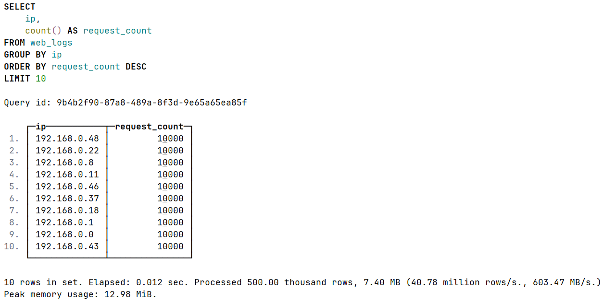

2. Посчитайте процент успешных запросов (2xx) и ошибочных (4xx, 5xx).
```clickhouse
SELECT
    countIf(status_code >= 200 AND status_code < 300) AS success_2xx,
    countIf(status_code >= 400 AND status_code < 500) AS client_errors_4xx,
    countIf(status_code >= 500 AND status_code < 600) AS server_errors_5xx,
    count() AS total_requests,
    round(countIf(status_code >= 200 AND status_code < 300) * 100.0 / count(), 2) AS success_pct,
    round(countIf(status_code >= 400 AND status_code < 500) * 100.0 / count(), 2) AS client_error_pct,
    round(countIf(status_code >= 500 AND status_code < 600) * 100.0 / count(), 2) AS server_error_pct
FROM web_logs;
```
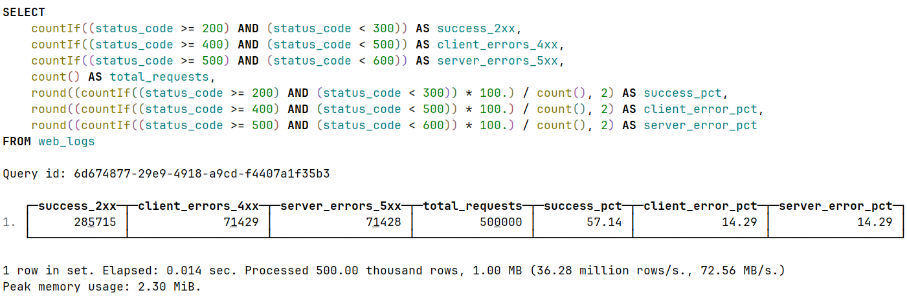

3. Найдите самый популярный URL и средний размер ответа для него.
```clickhouse
SELECT 
    url,
    count() AS request_count,
    avg(response_size) AS avg_response_size
FROM web_logs
GROUP BY url
ORDER BY request_count DESC
LIMIT 1;
```
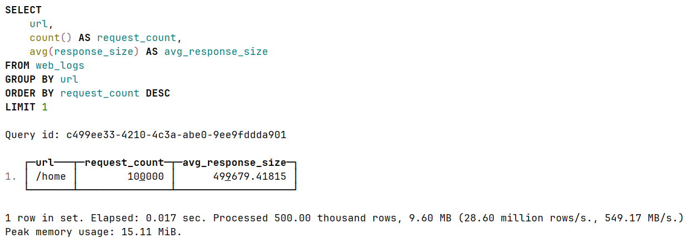

4. Определите час с наибольшим количеством ошибок 500.
```clickhouse
SELECT 
    toStartOfHour(log_time) AS hour,
    countIf(status_code = 500) AS error_500_count
FROM web_logs
GROUP BY hour
ORDER BY error_500_count DESC
LIMIT 1;
```
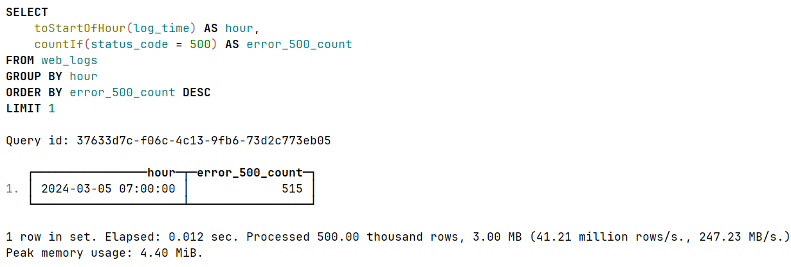

### 2
ClickHouse:
```clickhouse
	CREATE TABLE sales_ch (
    sale_date DateTime,
    product_id UInt64,
    category String,
    quantity UInt32,
    price Float64,
    customer_id UInt64
	) ENGINE = MergeTree()
	ORDER BY (sale_date);
```

```clickhouse
	INSERT INTO sales_ch
	SELECT
    toDateTime('2024-01-01 00:00:00') + INTERVAL number MINUTE,
    number % 1000,
    arrayElement(['Electronics', 'Clothing', 'Food', 'Books'], number % 4 + 1),
    rand() % 10 + 1,
    round(rand() % 10000 / 100, 2),
    number % 50000
	FROM numbers(1000000);
```
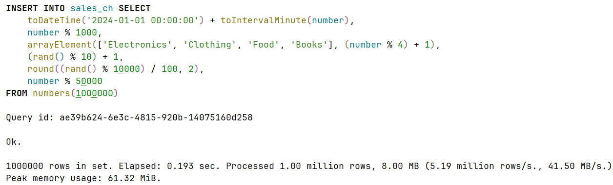

Продажи за последний месяц:
`SET send_progress_in_http_headers = 1;` - отображение времени выполнения

```clickhouse
SELECT 
    category,
    count() AS total_sales,
    sum(quantity * price) AS total_revenue,
    avg(price) AS avg_price
FROM sales_ch
WHERE sale_date >= toDateTime('2024-01-01') + INTERVAL 1000000 - 43200 MINUTE
GROUP BY category
ORDER BY total_revenue DESC;
```
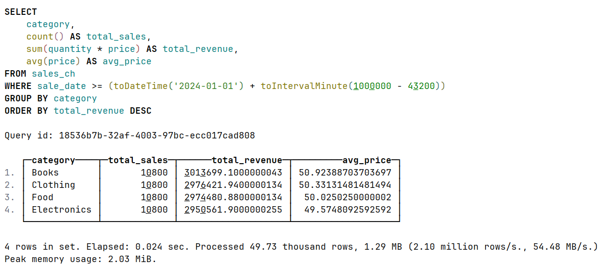

Замер размера данных
```clickhouse
SELECT 
    table,
    formatReadableSize(sum(data_compressed_bytes)) AS compressed_size,
    formatReadableSize(sum(data_uncompressed_bytes)) AS uncompressed_size,
    round(sum(data_uncompressed_bytes) / sum(data_compressed_bytes), 2) AS compression_ratio
FROM system.parts
WHERE table = 'sales_ch' AND active
GROUP BY table;
```
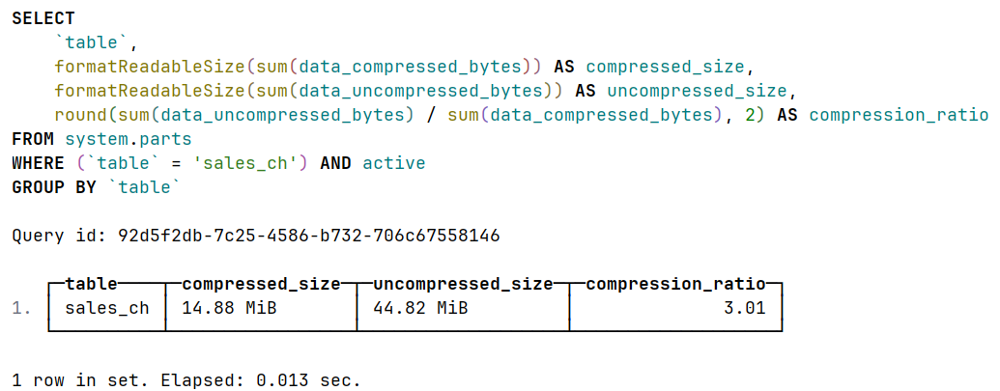


PostgreSQL:
```postgresql
CREATE TABLE sales_pg (
    sale_date timestamp,
    product_id bigint,
    category text,
    quantity integer,
    price float8,
    customer_id bigint
);

CREATE INDEX idx_sales_pg_date ON sales_pg(sale_date);
CREATE INDEX idx_sales_pg_product ON sales_pg(product_id);
```

`\timing on` - включение замера времени

```postgresql
	INSERT INTO sales_pg
    SELECT
        '2024-01-01 00:00:00'::timestamp + (n || ' minutes')::interval,
        n % 1000,
        CASE (n % 4)
            WHEN 0 THEN 'Electronics'
            WHEN 1 THEN 'Clothing'
            WHEN 2 THEN 'Food'
            ELSE 'Books'
            END,
        (random() * 9 + 1)::integer,
        round((random() * 100)::numeric, 2),
        n % 50000
    FROM generate_series(1, 1000000) AS n;
```
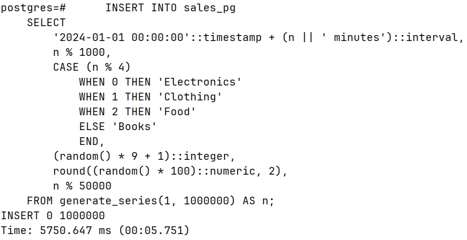

Продажи за последний месяц:
```postgresql
SELECT 
    category,
    count(*) AS total_sales,
    sum(quantity * price) AS total_revenue,
    avg(price) AS avg_price
FROM sales_pg
WHERE sale_date >= '2024-01-01'::timestamp + interval '957200 minutes'
GROUP BY category
ORDER BY total_revenue DESC;
```
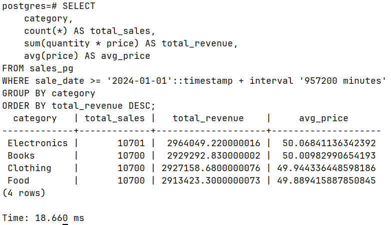

Замеры размера данных:
```postgresql
SELECT 
    pg_size_pretty(pg_total_relation_size('sales_pg')) AS total_size,
    pg_size_pretty(pg_table_size('sales_pg')) AS table_size,
    pg_size_pretty(pg_indexes_size('sales_pg')) AS indexes_size;
```
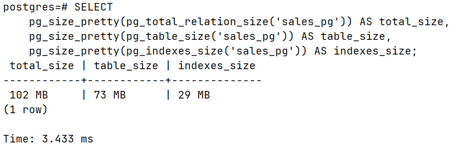

Результаты:
1. Какая СУБД быстрее вставила 1 млн строк?
ClickHouse быстрее вставил 1 млн строк в 29.8 раз (5.751 сек / 0.193 сек ≈ 29.8).
PostgreSQL потребовалось 5.75 секунды, тогда как ClickHouse справился за 0.193 секунды.

2. Во сколько раз ClickHouse сжал данные эффективнее?
ClickHouse сжал данные эффективнее в 4.9 раз (73 МБ / 14.88 МiB ≈ 4.9).
При этом внутреннее сжатие самого ClickHouse составляет 3.01 раза (44.82 MiB / 14.88 MiB = 3.01).

3. Какой вывод можно сделать о выборе СУБД для аналитики?
ClickHouse превосходит PostgreSQL для аналитических задач по трем ключевым параметрам:
- Скорость агрегации: 777 раз быстрее (18.660 мс / 0.024 мс = 777.5)
- Скорость загрузки данных: 29.8 раз быстрее
- Эффективность хранения: 4.9 раз компактнее

Выбор СУБД зависит от задачи:
- Для аналитики больших данных (логи, метрики, события) → ClickHouse
- Для транзакционных систем с частыми UPDATE/DELETE → PostgreSQL

| Критерий                       | PostgreSQL                                               | ClickHouse                               |
|--------------------------------| -------------------------------------------------------- | ---------------------------------------- |
| Хранение данных                | Строковое (вся строка целиком)                           | Столбцовое (каждый столбец отдельно)     |
| Вставка 1 млн строк            | 5.75 секунд                                              | 0.19 секунд                              |
| Агрегация (запрос из дз)       | 18.66 мс                                                 | 0.024 мс                                 |
| Размер на диске (данные из дз) | 73 МБ                                                    | 14.88 МiB                                |
| Сжатие                         | Базовое                                                  | Агрессивное (3x внутри)                  |
| Обновление 1 строки            | Мгновенно (~0.5 мс)                                      | Медленно (перезапись Part)               |
| Назначение                     | OLTP (транзакции)                                        | OLAP (аналитика)                         |
| Оптимален для                  | Точечные запросы по ключу, UPDATE/DELETE отдельных строк | Массовые агрегации, временные ряды, логи |

## Dashboard
`http://localhost:8123`
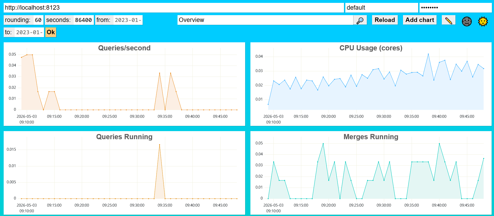
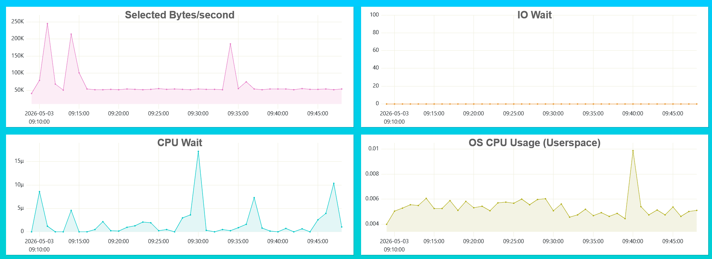
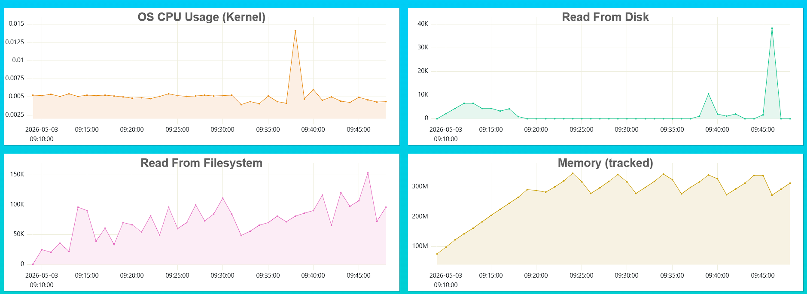