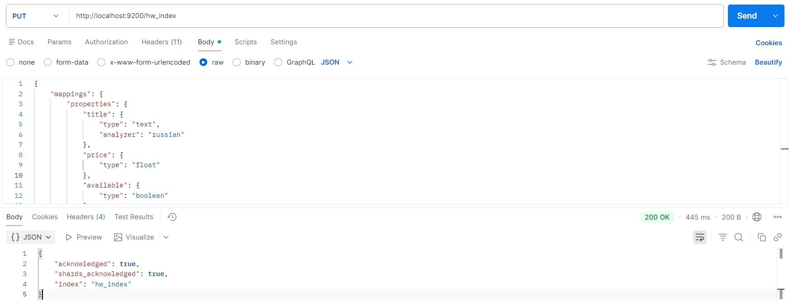
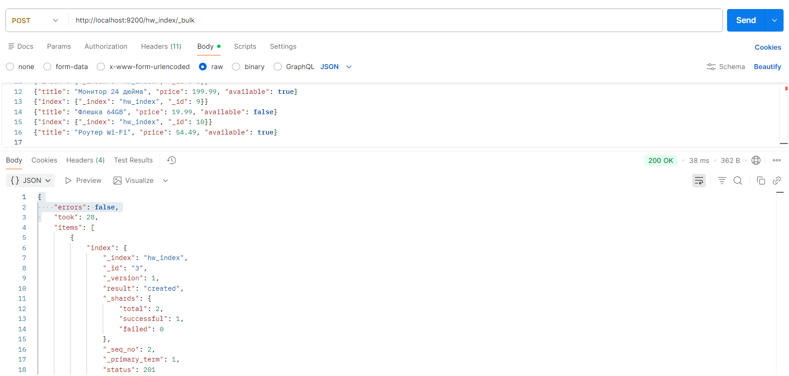
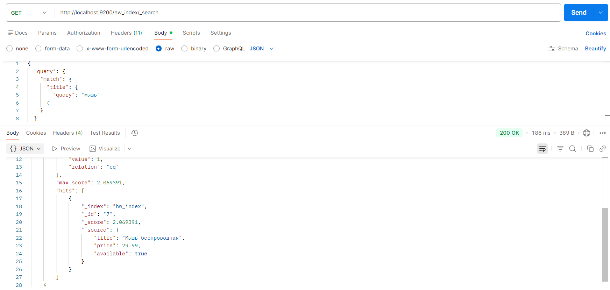

## Подготовка
`docker compose up -d`
Для ES API используем Postman.

## Задания
1. Создать индекс

PUT запрос на `http://localhost:9200/hw_index` с телом mappings
```json
{
  "mappings": {
    "properties": {
      "title": {
        "type": "text",
        "analyzer": "russian"
      },
      "price": {
        "type": "float"
      },
      "available": {
        "type": "boolean"
      }
    }
  }
}
```


2. Заполнить данными
Создание документа: PUT http://localhost:9200/hw_index/_doc/1/?op_type=create
`?op_type=create` вместо `_create` в новых версиях
```json
{
  "title": "Кабель USB",
  "price": 12.99,
  "available": true
}
```


Добавление документа: PUT http://localhost:9200/hw_index/_doc/2
```json
{
  "title": "Беспроводные наушники",
  "price": 59.99,
  "available": true
}
```


Bulk добавление: POST http://localhost:9200/hw_index/_bulk
```
{"index": {"_index": "hw_index", "_id": 3}}
{"title": "Смартфон", "price": 249.90, "available": true}
{"index": {"_index": "hw_index", "_id": 4}}
{"title": "Внешний аккумулятор 10000mAh", "price": 39.50, "available": false}
{"index": {"_index": "hw_index", "_id": 5}}
{"title": "Смарт-часы", "price": 179.00, "available": true}
{"index": {"_index": "hw_index", "_id": 6}}
{"title": "Игровая клавиатура", "price": 89.90, "available": false}
{"index": {"_index": "hw_index", "_id": 7}}
{"title": "Мышь беспроводная", "price": 29.99, "available": true}
{"index": {"_index": "hw_index", "_id": 8}}
{"title": "Монитор 24 дюйма", "price": 199.99, "available": true}
{"index": {"_index": "hw_index", "_id": 9}}
{"title": "Флешка 64GB", "price": 19.99, "available": false}
{"index": {"_index": "hw_index", "_id": 10}}
{"title": "Роутер Wi-Fi", "price": 54.49, "available": true}

```
В конце обязательно пустая строка


4. Запросы
Поиск по названию (match по title)
GET http://localhost:9200/hw_index/_search
```json
{
  "query": {
    "match": {
      "title": {
        "query": "мышь"
      }
    }
  }
}
```


Range по цене (price от 50 до 200)
GET http://localhost:9200/hw_index/_search
```json
{
  "query": {
    "range": {
      "price": {
        "gte": 50,
        "lte": 200
      }
    }
  }
}
```


term по доступности (available = true)
GET http://localhost:9200/hw_index/_search
```json
{
  "query": {
    "term": {
      "available": true
    }
  }
}
```


bool: match + range + term
GET http://localhost:9200/hw_index/_search
```json
{
  "query": {
    "bool": {
      "must": [
        {
          "match": {
            "title": {
              "query": "беспроводные"
            }
          }
        }
      ],
      "filter": [
        {
          "range": {
            "price": {
              "gte": 20,
              "lte": 100
            }
          }
        },
        {
          "term": {
            "available": true
          }
        }
      ]
    }
  }
}
```

