## GIN

### Создание индексов
Выполнено:
```postgresql
-- GIN --

-- 1. Создание GIN индекса по полю `flight_tags` (тип `TEXT[]`, массив) — теги рейса --
CREATE INDEX idx_flight_tags_gin ON flight USING gin (flight_tags);

-- 2. Создание GIN индекса по полю `profile_data` (тип `JSONB`) — предпочтения пассажира --
CREATE INDEX idx_passenger_profile_gin ON passenger USING gin (profile_data jsonb_path_ops);
```

### Сканирование
```postgresql
-- 3. Сканирование: ищем рейсы у которых есть тег 'wifi' (@> - contains)--
EXPLAIN ANALYZE
SELECT flight_number, departure_time
FROM flight
WHERE flight_tags @> ARRAY['wifi'];
```

Без индекса:
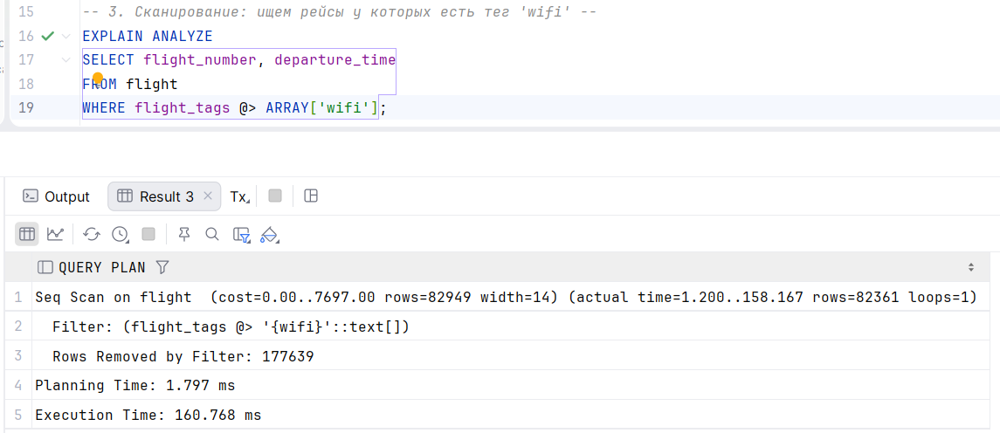

С индексом:
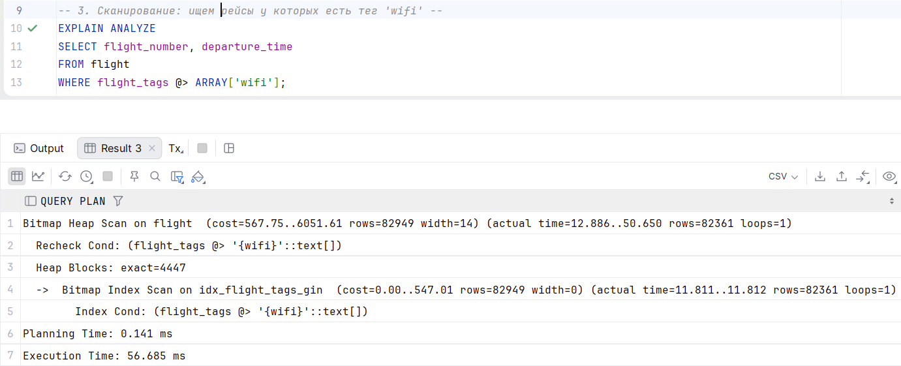

Все отработало как и предполагалось, был выбран более оптимальный и быстрый GIN вместо Seq Scan

```postgresql
-- 4. Сканирование: ищем пассажиров вегитарианцев (@> - contains)
EXPLAIN ANALYZE
SELECT first_name, last_name
FROM passenger
WHERE profile_data @> '{"meal": "vegan"}';
```

Без индекса:
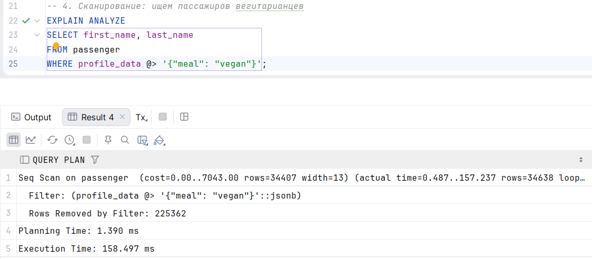

С индексом:
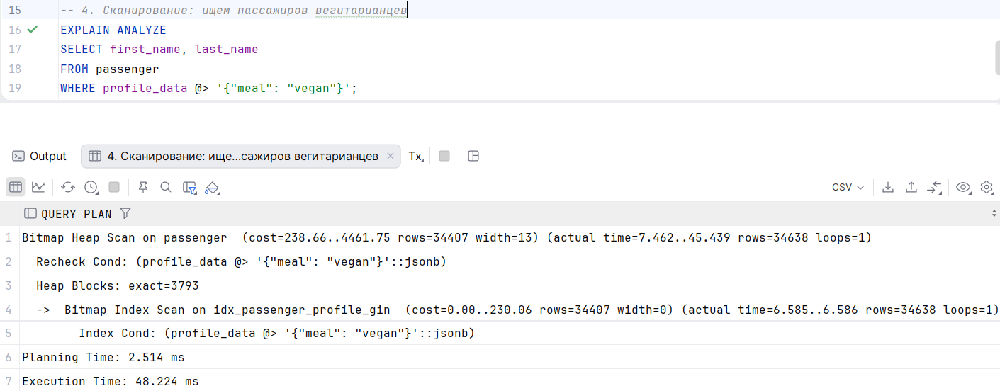

Все отработало как и предполагалось, был выбран более оптимальный и быстрый GIN вместо Seq Scan

```postgresql
-- 5. Сканирование: ищем рейсы у которых НЕТ тега 'wifi'
EXPLAIN ANALYZE
SELECT flight_number, departure_time
FROM flight
WHERE NOT (flight_tags @> ARRAY['wifi']);
```

Без индекса:
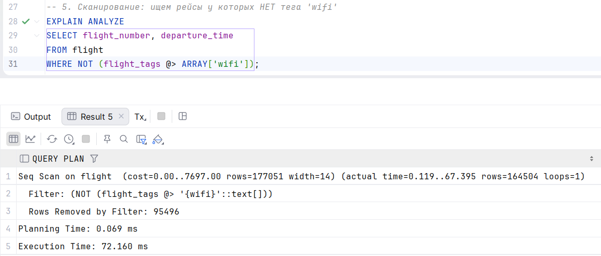

С индексом:
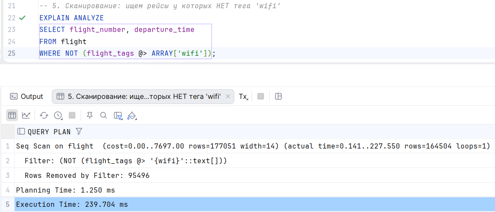

Был выбран Seq Scan, так как GIN не может быть использован для запросов с отрицанием (невхождением).

## GiST

### Создание индексов
Выполнено:
```postgresql
-- 1. Создание GiST индекса по полю `booking_window` (тип `TSTZRANGE`, range) — диапазон времени, когда открыта продажа билетов.
CREATE INDEX idx_flight_booking_window_gist ON flight USING gist (booking_window);

-- 2. Создание GiST индекса по полю `home_address_coords` (тип `POINT`) — геометрический тип
CREATE INDEX idx_client_coords_gist ON client USING gist (home_address_coords);
```

### Сканирование
```postgresql
-- 3. Сканирование: ищем рейсы чье окно продаж пересекается (&&) с выходными
EXPLAIN ANALYZE
SELECT flight_number
FROM flight
WHERE booking_window && tstzrange('2026-03-07 00:00:00+03', '2026-03-09 00:00:00+03');
```

Без индекса:
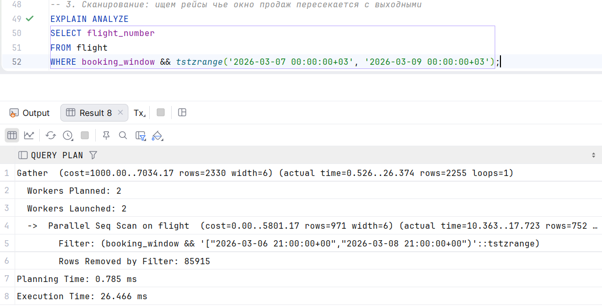

C индексом:
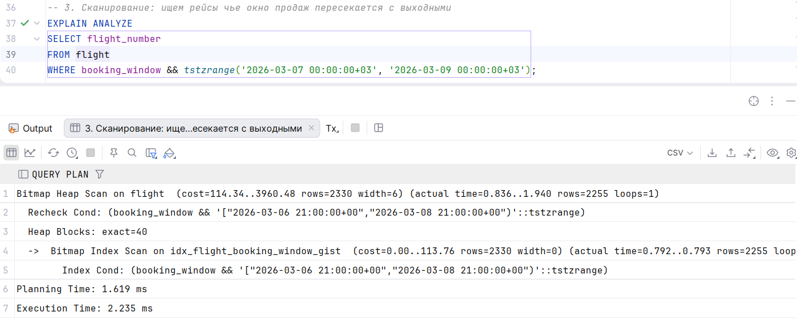

Вывод: был применен gist индекс, потому что он поддерживает операцию пересечения интервалов, и это быстрее чем seq scan

```postgresql
-- 4. Сканирование: ищем 5 клиентов которые живут ближе всего (<->) к аэропорту (55.97, 37.41)
EXPLAIN ANALYZE
SELECT id, first_name, home_address_coords <-> point(55.97, 37.41) AS distance
FROM client
ORDER BY home_address_coords <-> point(55.97, 37.41)
LIMIT 5;
```
Без индекса:
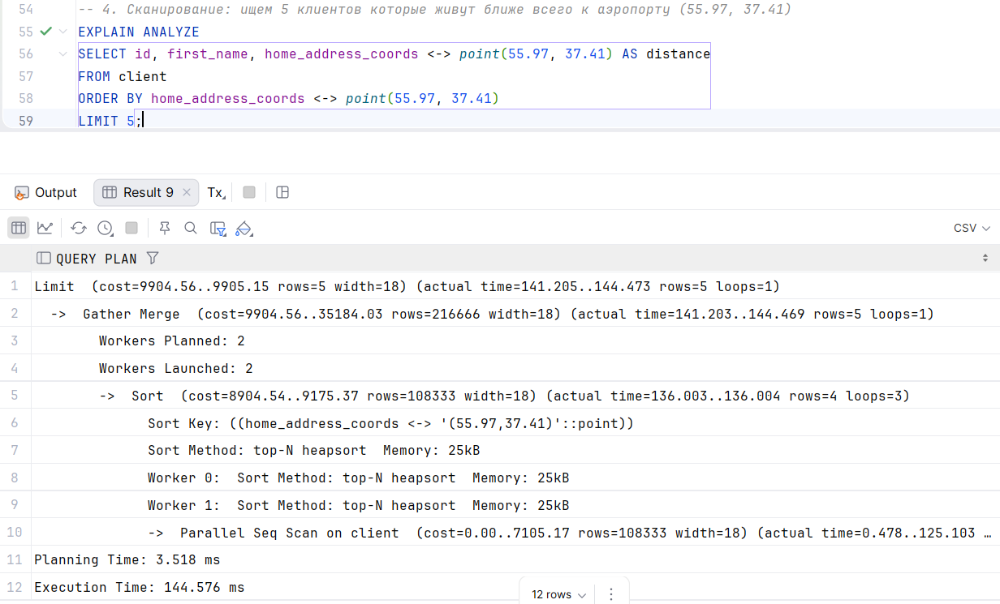

C индексом:
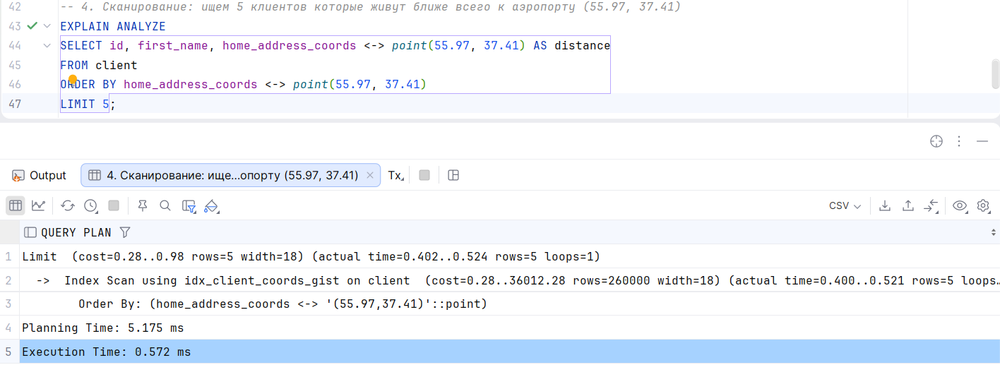

Вывод: был применен gist индекс, потому что он поддерживает операцию поиска ближайших соседей, и это быстрее чем seq scan

```postgresql

-- 5. Сканирование: Ищем рейсы чье окно продаж строго в марте (<@ включение)
EXPLAIN ANALYZE
SELECT flight_number
FROM flight
WHERE booking_window <@ tstzrange('2026-03-01 00:00:00+03', '2026-03-31 23:59:59+03');
```
Без индекса:
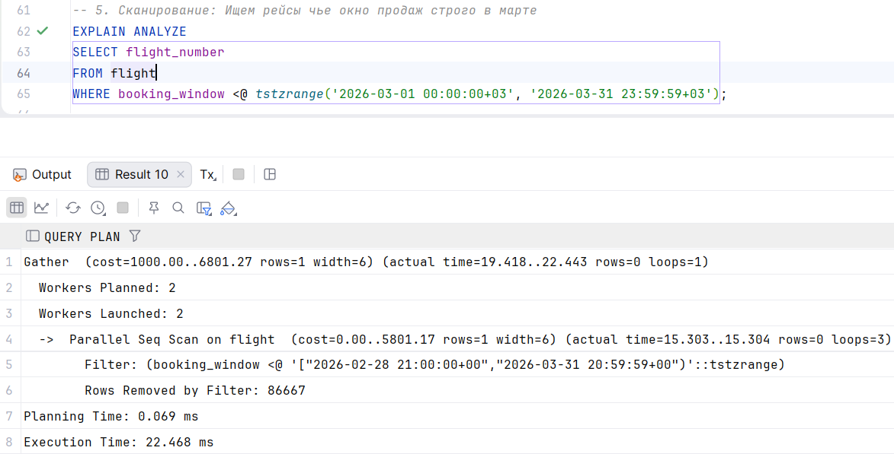

C индексом:
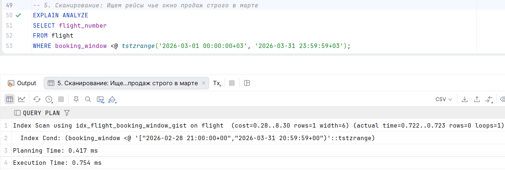

Вывод: был применен gist индекс, потому что он поддерживает операцию включения интервалов, и это быстрее чем seq scan


## JOIN

### Точечная выборка
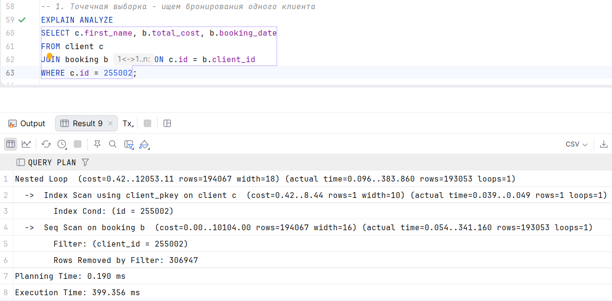

Анализ:
Поскольку нужен конкретный клиент (id=25502), и id клиента это pk (есть индекс),
то сначала идет просто поиск по индексу этой строки. После того как строка найдена,
происходит поиск подходящих строк в booking. Так как это клиент с огромным количеством бронирований,
то был применен Seq Scan.

### Hash JOIN
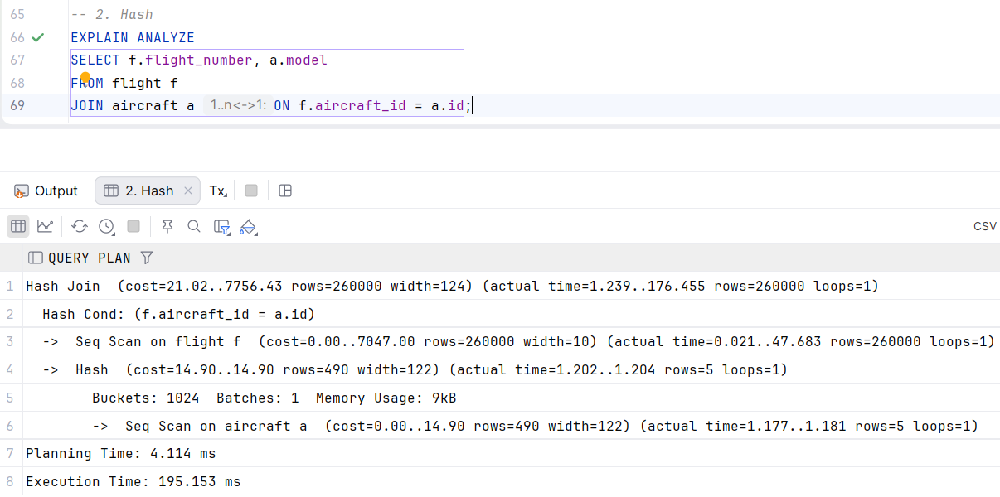

Анализ: сначала была просканирована маленькая таблица с самолетами, был вычислен hash для id каждого самолета (все уместилось в work_mem, всего 1 batch)
Далее идет seq scan по всем рейсам, и для каждой строки вычисляется hash для поля с самолетом, и сопоставляется
по хэшу самолет из маленькой таблицы

### Слияние отсортированных данных (попытка merge)
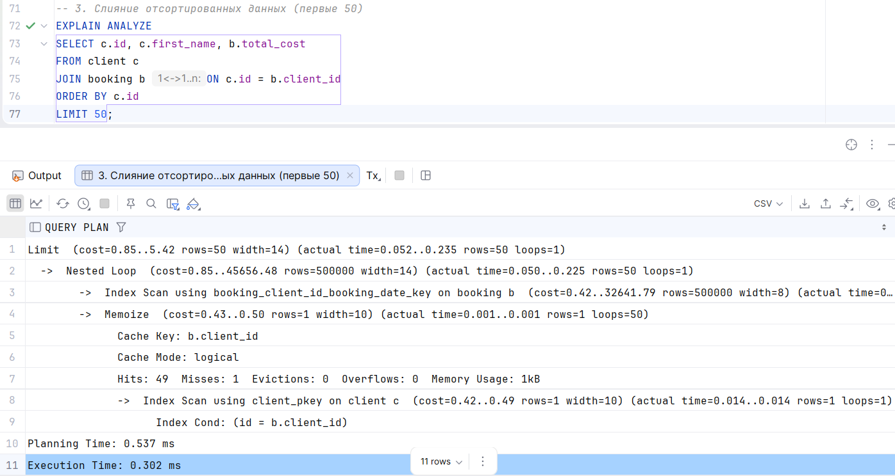

Анализ:
Идет Index Scan по booking (так там есть ограничение UNIQUE (client_id, booking_date)), поэтому 
там уже отсортировано по client_id (b-tree) - это сразу соответствует сортировке в запросе.
Для каждого id проверяется, есть ли уже данные о клиенет в кэше (hits:49 значит для 49 нашлись)
а для одного который не нашелся идет index scan в clients.

### Join больших таблиц
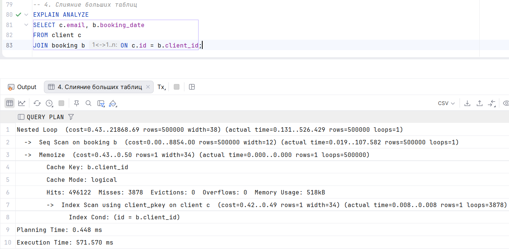

Анализ:
Снова отработало кэширование (так как в таблице с бронированием есть топ клиенты (распределение ципфа)).
Был nested loop, каждая строка booking просканирована с помощью seq scan (так как запрос был по всем бронированиям), но значения для клиентов по cient_id
брались из кэша.

### Join малых таблиц
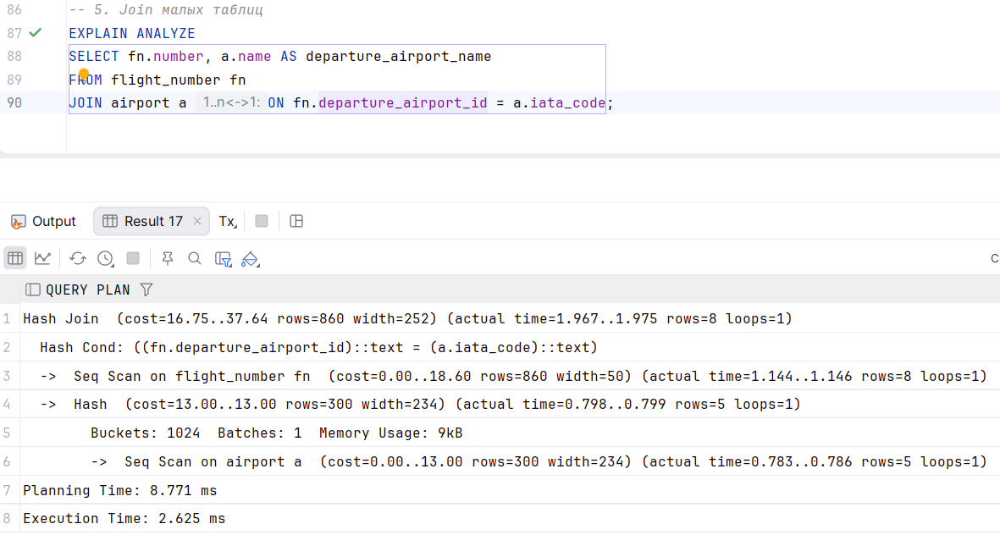

Анализ: обе таблицы небольшие. был seq scan по airport (меньше по ожиданиям планировщика таблице), для каждой строки по iata_code
был вычислен хэш, а дальше идет seq scan по flight_number (по ожиданиям большей таблице, хотя фактически нет)
и для каждой строки вычисляется departure_airport_id хэш и они сопоставляются.


## Grafana/Prometheus/postgres-exporter
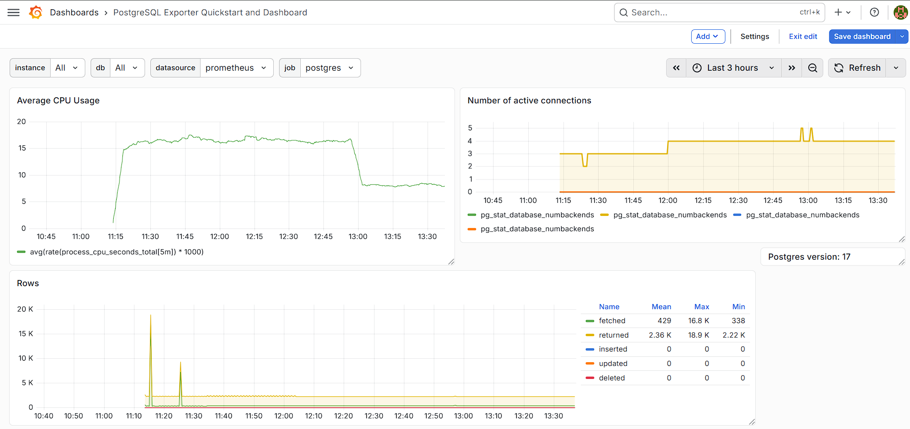

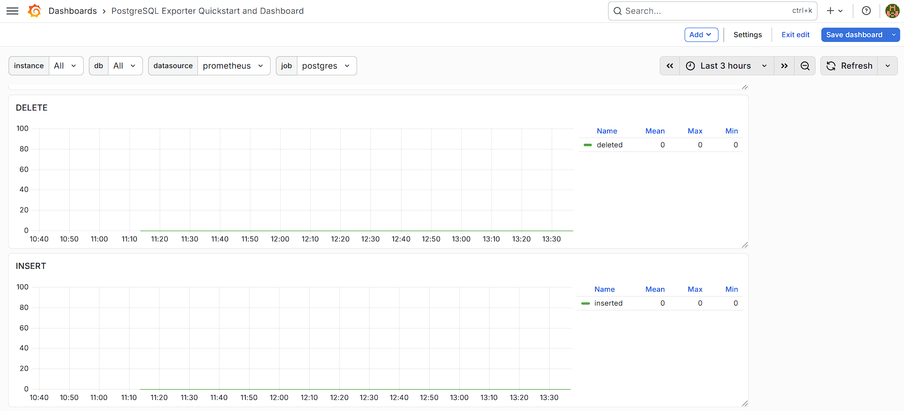

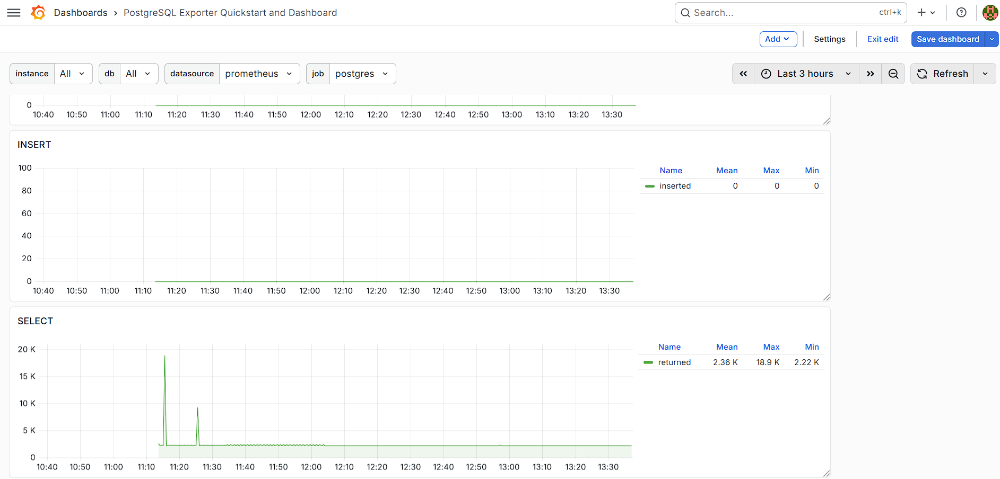