## Подготовка
`docker compose up -d` - запуск docker
`http://localhost:8086` - web gui

## Задания
- Создание базы через веб\-интерфейс - bucket `industrial_sensors`
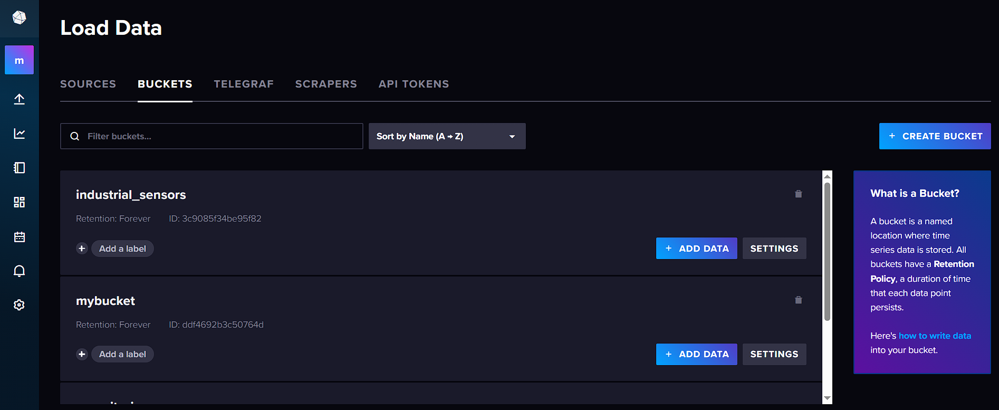

- Наполнение данными (промышленных) датчиков
```
current,motor_id=M-1001,type=induction,load=high value=145.5
current,motor_id=M-1001,type=induction,load=high value=148.2
current,motor_id=M-1002,type=synchronous,load=medium value=98.1
current,motor_id=M-1002,type=synchronous,load=medium value=102.4
pressure,pipe_id=MP-01,section=main,zone=A value=4.2
pressure,pipe_id=MP-01,section=main,zone=A value=4.5
pressure,pipe_id=MP-02,section=bypass,zone=B value=2.1
pressure,pipe_id=MP-02,section=bypass,zone=B value=2.3
```
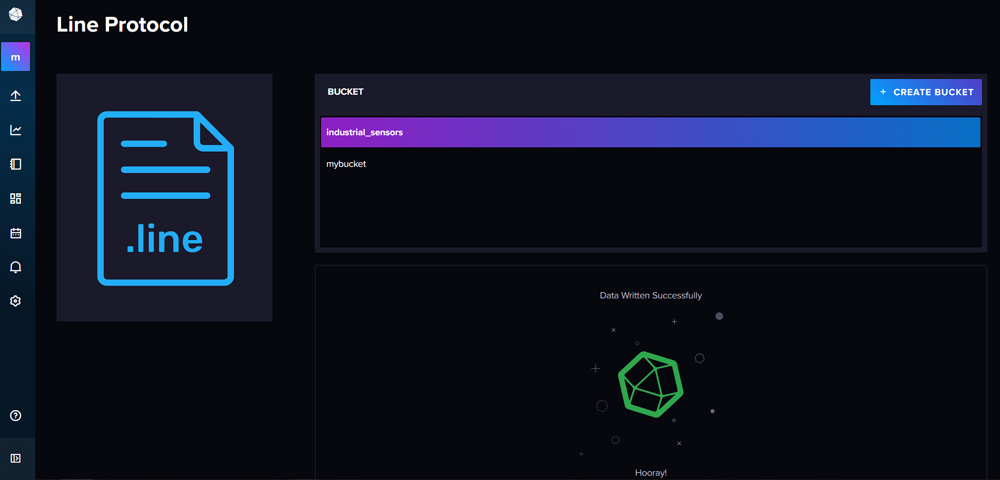

- Просмотреть все данные за последние 30 минут
```
from(bucket: "industrial_sensors")
  |> range(start: -30m)
```
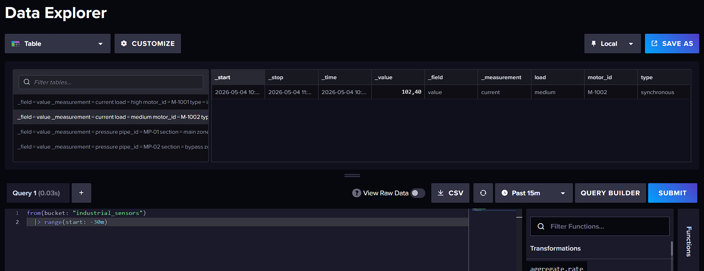
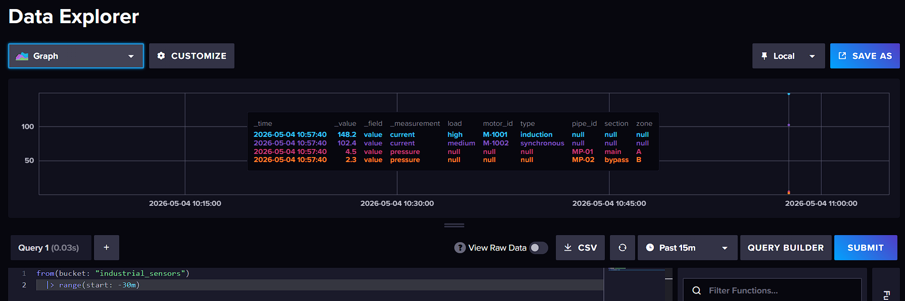

- Посмотреть измерения только 1 датчика
```
from(bucket: "industrial_sensors")
  |> range(start: -30m)
  |> filter(fn: (r) => r["_measurement"] == "current" and r["motor_id"] == "M-1001")
```
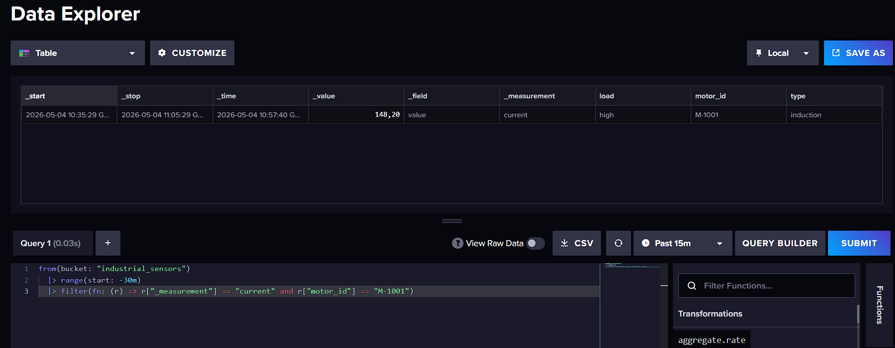

- Максимальное значение на 1 датчике
```
from(bucket: "industrial_sensors")
  |> range(start: -30m)
  |> filter(fn: (r) => r["_measurement"] == "current" and r["motor_id"] == "M-1001")
  |> max()
```
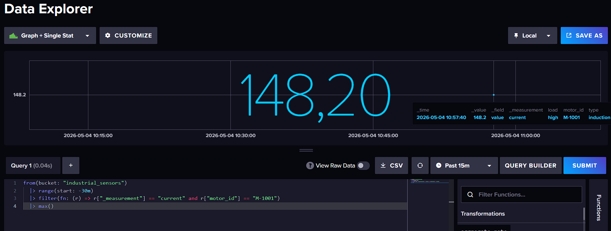

- Среднее значение на датчике
```
from(bucket: "industrial_sensors")
  |> range(start: -30m)
  |> filter(fn: (r) => r["_measurement"] == "pressure" and r["pipe_id"] == "MP-01")
  |> mean()
```
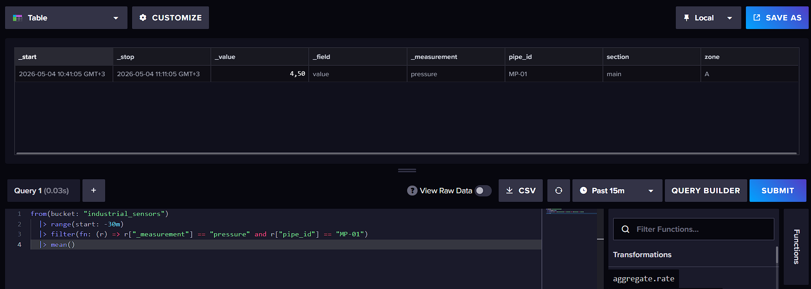

- 2-3 аналитических запроса с фильтром по значению

Ток > 100
```
from(bucket: "industrial_sensors")
  |> range(start: -30m)
  |> filter(fn: (r) => r["_measurement"] == "current")
  |> filter(fn: (r) => r["_value"] > 100.0)
```
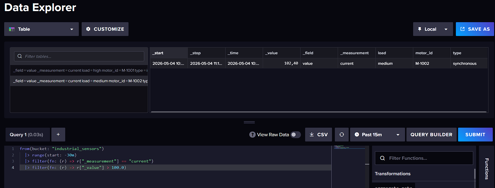

Давление < 3.0 в зоне B
```
from(bucket: "industrial_sensors")
  |> range(start: -30m)
  |> filter(fn: (r) => r["_measurement"] == "pressure" and r["zone"] == "B")
  |> filter(fn: (r) => r["_value"] < 3.0)
```
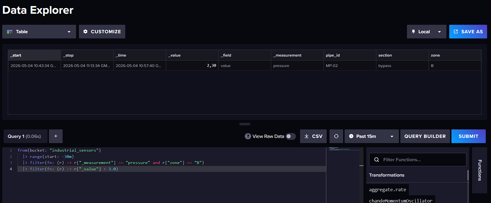

- Запрос на агрегацию данных
```
from(bucket: "industrial_sensors")
  |> range(start: -1h)
  |> filter(fn: (r) => r["_measurement"] == "current")
  |> aggregateWindow(every: 15m, fn: mean, createEmpty: false)
  |> yield(name: "mean_current_15m")
```
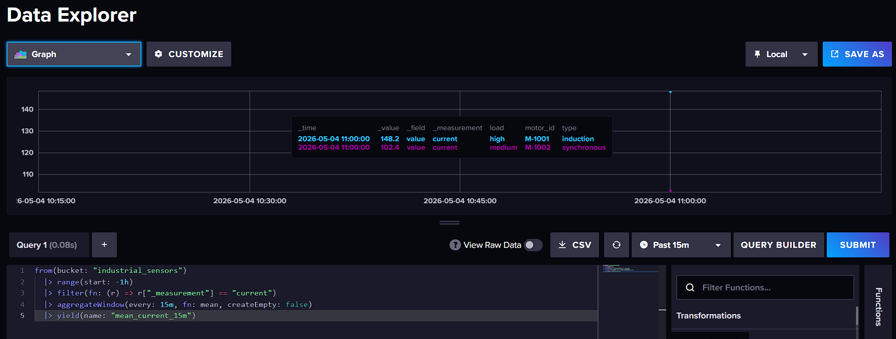


- создайте Dashboard с 1-2 графиками
Слева график с показаниями тока, а справа с давлением 
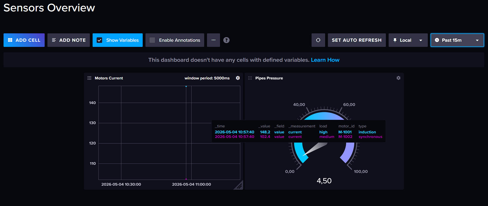