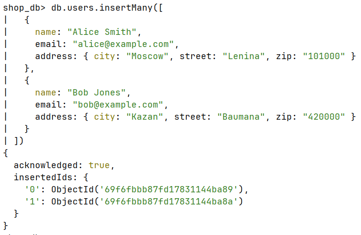
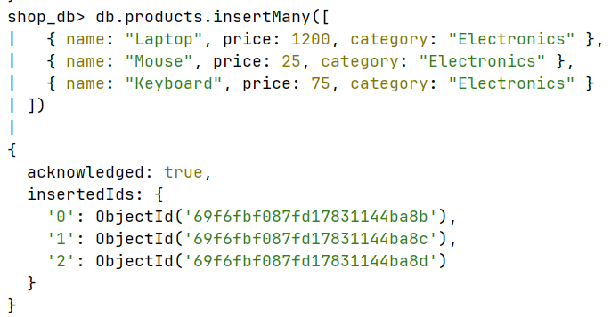
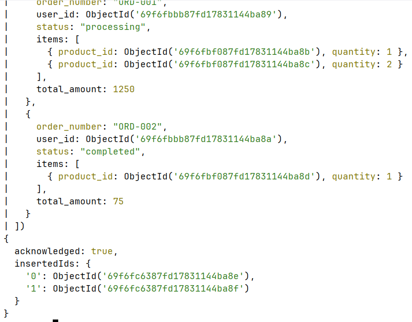
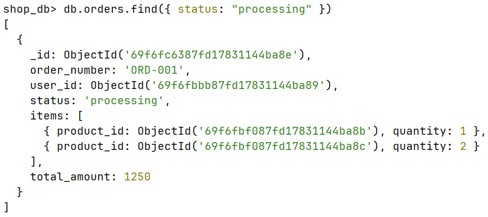
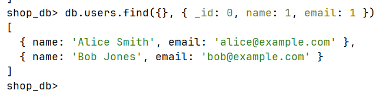
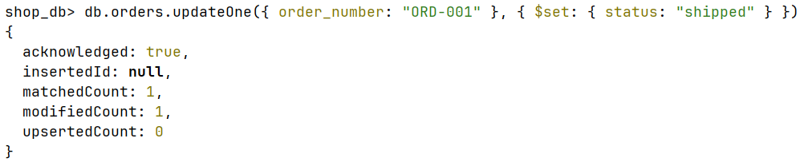
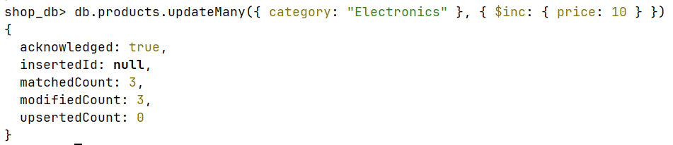
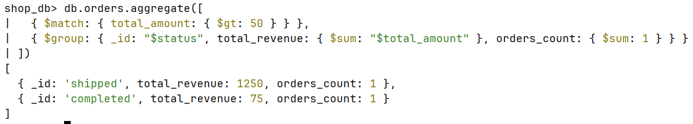

## Подготовка
`docker compose up -d` - поднятие docker
`docker ps` - узнать ID контейнера
`docker exec -it <container_id> mongosh -u root -p root` - подключиться к консоли

## Задачи
Создаем базу


1. Создать минимум 3 коллекции, хотя бы 2 из которых связаны ObjectId, хотя бы 1 из документов в коллекции хранят JSON объекты либо массивы
Наполнить каждую коллекцию необходимым количеством данных
```
db.users.insertMany([
  { 
    name: "Alice Smith", 
    email: "alice@example.com", 
    address: { city: "Moscow", street: "Lenina", zip: "101000" } 
  },
  { 
    name: "Bob Jones", 
    email: "bob@example.com", 
    address: { city: "Kazan", street: "Baumana", zip: "420000" } 
  }
])
```
```
{
  acknowledged: true,
  insertedIds: {
    '0': ObjectId('69f6fbbb87fd17831144ba89'),
    '1': ObjectId('69f6fbbb87fd17831144ba8a')
  }
}
```


```
db.products.insertMany([
  { name: "Laptop", price: 1200, category: "Electronics" },
  { name: "Mouse", price: 25, category: "Electronics" },
  { name: "Keyboard", price: 75, category: "Electronics" }
])
```
```
{
  acknowledged: true,
  insertedIds: {
    '0': ObjectId('69f6fbf087fd17831144ba8b'),
    '1': ObjectId('69f6fbf087fd17831144ba8c'),
    '2': ObjectId('69f6fbf087fd17831144ba8d')
  }
}
```

```
db.orders.insertMany([
  {
    order_number: "ORD-001",
    user_id: ObjectId('69f6fbbb87fd17831144ba89'),
    status: "processing",
    items: [
      { product_id: ObjectId('69f6fbf087fd17831144ba8b'), quantity: 1 },
      { product_id: ObjectId('69f6fbf087fd17831144ba8c'), quantity: 2 }
    ],
    total_amount: 1250
  },
  {
    order_number: "ORD-002",
    user_id: ObjectId('69f6fbbb87fd17831144ba8a'),
    status: "completed",
    items: [
      { product_id: ObjectId('69f6fbf087fd17831144ba8d'), quantity: 1 }
    ],
    total_amount: 75
  }
])
```
```
{
  acknowledged: true,
  insertedIds: {
    '0': ObjectId('69f6fc6387fd17831144ba8e'),
    '1': ObjectId('69f6fc6387fd17831144ba8f')
  }
}
```


2. Написать 2 find запроса, хотя бы 1 с projection ({ field1: 0, field2: 1})
`db.orders.find({ status: "processing" })`


`db.users.find({}, { _id: 0, name: 1, email: 1 })`


3. Написать 2 update запроса
`db.orders.updateOne({ order_number: "ORD-001" }, { $set: { status: "shipped" } })`


`db.products.updateMany({ category: "Electronics" }, { $inc: { price: 10 } })`


4. Написать 1 любой запрос с aggregate
```
db.orders.aggregate([
  { $match: { total_amount: { $gt: 50 } } },
  { $group: { _id: "$status", total_revenue: { $sum: "$total_amount" }, orders_count: { $sum: 1 } } }
])
```
