## Смоделировать обновление данных и посмотреть на xmin, xmax, ctid, t_infomask

#### Подготовка
```postgresql
-- 0. Добавим тестовую строку --
INSERT INTO city (name) VALUES ('Samara');
```

#### До обновления
```postgresql
-- 1. До обновления --
SELECT xmin, xmax, ctid, id, name
FROM city
WHERE name = 'Samara';
```
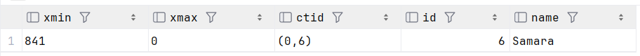

#### Обновление 1
```postgresql
-- 2. Обновление 1 --
UPDATE city
SET name = 'Samara_v2'
WHERE name = 'Samara';
```

#### После обновления 1
```postgresql
-- 3. После обновления 1 --
SELECT xmin, xmax, ctid, id, name
FROM city
WHERE name = 'Samara_v2';
```

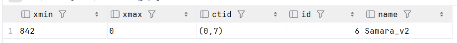

#### Обновление 2
```postgresql
-- 4. Обновление 2 --
UPDATE city
SET name = 'Samara_v3'
WHERE name = 'Samara_v2';
```

#### После обновления 2
```postgresql
-- 5. После обновления 2 --
SELECT xmin, xmax, ctid, id, name
FROM city
WHERE name = 'Samara_v3';
```

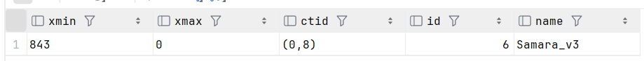

#### Анализ t_infomask
```postgresql
-- 6. Анализ t_infomask
SELECT
    t_ctid,
    t_xmin,
    t_xmax,
    t_infomask
FROM heap_page_items(get_raw_page('city', 0));
```

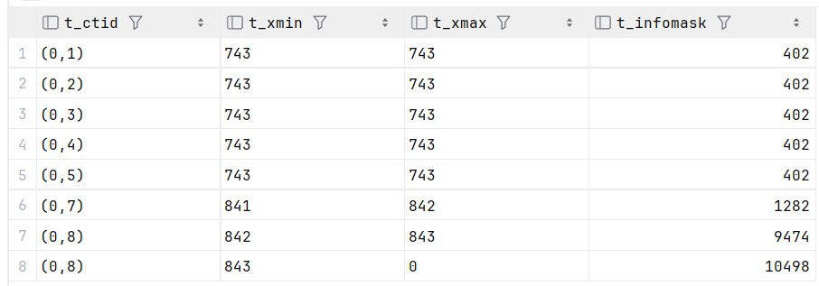

## Что хранит t_infomask?
`t_infomask` — это 16-битное число (битовая маска), в котором PostgreSQL хранит флаги состояния версии строки (tuple).
Оно нужно для того, чтобы база каждый раз не лазила в системные таблицы узнавать, завершилась транзакция или нет. Это называется Hint Bits.

Основные флаги, которые там "зашиты":
- 2 (HEAP_HASVARWIDTH) — в строке есть колонка переменной длины (VARCHAR).
- 256 (HEAP_XMIN_COMMITTED) — транзакция, которая создала строку (xmin), успешно закоммитилась.
- 1024 (HEAP_XMAX_COMMITTED) — транзакция, которая удалила/обновила строку (xmax), успешно закоммитилась (строка мертва).
- 2048 (HEAP_XMAX_INVALID) — xmax недействителен. Это значит, что строку никто не удалял, она живая.
- 8192 (HEAP_UPDATED) — эта версия строки появилась в результате UPDATE (а не просто INSERT).

В нашем случае например самая первая версия нашей строки: `(0,7), 841, 842` и `t_infomask` = 1282
1282 = 1024 + 256 + 2, значит есть VARCHAR, xmin тразнакция успешно закоммичена и xmax тоже.

## Посмотреть на параметры из п1 в разных транзакциях

Тразнация 1: еще не завершена
```postgresql
BEGIN;

UPDATE city SET name = 'City_In_Progress' WHERE id = 6;

SELECT xmin, xmax, ctid, id, name FROM city WHERE id = 6;
```

Результат:
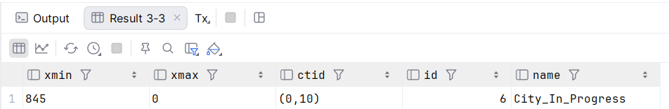


Транзакция 2: смотрим пока 1 не завершена
```postgresql
SELECT xmin, xmax, ctid, id, name FROM city WHERE id = 6;
```

Результат:
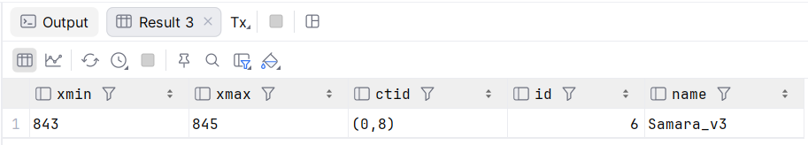

Название все еще старое, но xmax стал равен id транзакции 1

Подтверждаем 1 транзакцию:
```postgresql
COMMIT;
```

Еще раз смотрим транзакцию 2:
```postgresql
SELECT xmin, xmax, ctid, id, name FROM city WHERE id = 6;
```

Результат:
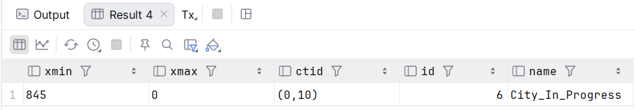

Название новое и xmin стал равен транзакции 1, так как для этой версии строки она создатель.

## Моделирование deadlock

Транзация 1 стартует:
```postgresql
BEGIN;
UPDATE city SET name = 'Kazan_Tx1' WHERE id = 1;
```
Строка id=1 заблокирована этой транзакцией

Транзакция 2 стартует:
```postgresql
BEGIN;
UPDATE city SET name = 'Moscow_Tx2' WHERE id = 2;
```
Строка id=2 заблокирована этой транзакцией

В транзакции 1:
```postgresql
UPDATE city SET name = 'Moscow_Tx1_Wants' WHERE id = 2;
```
Пытаемся захватить строку с id = 2

В транзакции 2:
```postgresql
UPDATE city SET name = 'Kazan_Tx2_Wants' WHERE id = 1;
```
Пытаемся захватить строку с id = 1

Результат:
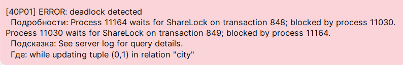

## Блокировки на уровне строк

#### Конфликт FOR UPDATE с любым другим уровнем:

Транзакция 1:
```postgresql
BEGIN;
SELECT * FROM city WHERE id = 1 FOR UPDATE;
```
Результат:
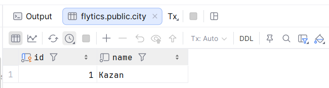

Транзакция 2:
```postgresql
BEGIN;
SELECT * FROM city WHERE id = 1 FOR SHARE;
```
Результат:
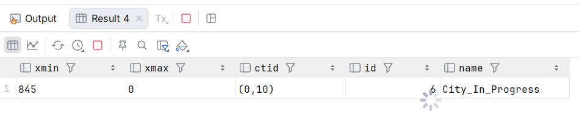
Результат не отображается, транзакция зависла и не может получить доступ к заблокированной строке.

#### Отсутствие конфликта
Транзакция 1:
```postgresql
BEGIN;
SELECT * FROM city WHERE id = 2 FOR NO KEY UPDATE;
```
Результат:
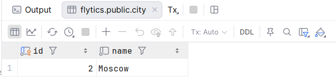

Транзакция 2:
```postgresql
BEGIN;
SELECT * FROM city WHERE id = 2 FOR KEY SHARE;
```
Результат:
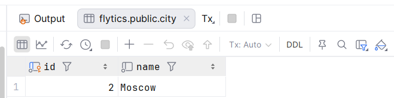
Запрос выполняется потому что FOR NO KEY UPDATE ограничивает изменение неключевых полей для других транзакций, но не блокирует 
ключевые поля потому что сама их не изменяет. А FOR KEY SHARE блокирует только ключ, чтобы его никто не изменил. Конфликта интересов нет.

### Конфликт по ключу

Транзакция 1:
```postgresql
BEGIN;
SELECT * FROM city WHERE id = 3 FOR UPDATE;
```
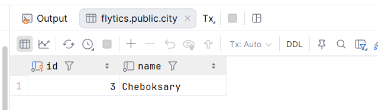

Транзакция 2:
```postgresql
BEGIN;
SELECT * FROM city WHERE id = 3 FOR KEY SHARE;
```


Повисла, так как ей нужна гарантия неизменяемости ключа, которую FOR UPDATE не дает.

## Отчистка
```postgresql
VACUUM;
```