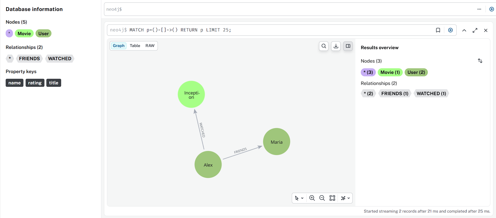
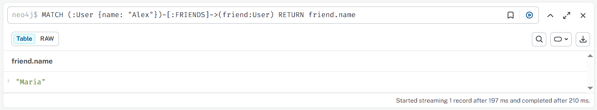
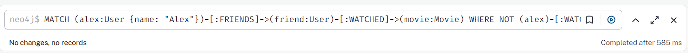
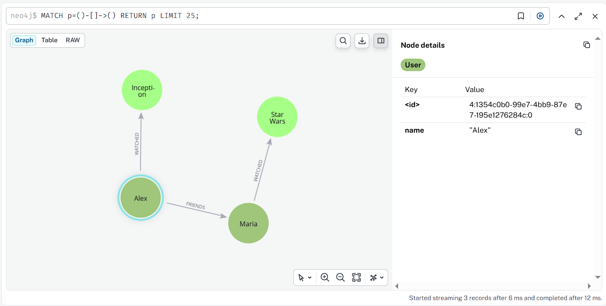
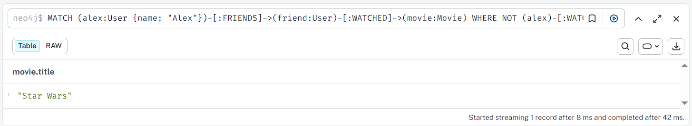

## Подготовка 
`docker compose up -d`

Просмотр:
Web GUI:
>Открыть http://localhost:7474

CLI:
>docker exec -it neo4j cypher-shell -u neo4j -p password123

HTTP API:
>curl -X POST http://localhost:7474/db/neo4j/tx/commit \
-H "Content-Type: application/json" \
-u neo4j:password123 \
-d '{"statements":[{"statement":"RETURN 1 AS result"}]}'


## Задания

Задать структуру:
```
CREATE (alex:User {name: "Alex"}),
       (maria:User {name: "Maria"}),
       (john:User {name: "John"})

CREATE (inception:Movie {title: "Inception"}),
       (matrix:Movie {title: "The Matrix"})
```

```
MATCH (a:User {name: "Alex"}), (m:User {name: "Maria"})
CREATE (a)-[:FRIENDS]->(m);

MATCH (a:User {name: "Alex"}), (i:Movie {title: "Inception"})
CREATE (a)-[:WATCHED {rating: 5}]->(i);
```


Выполнить запросы:
- Найти всех друзей Алекса
```
MATCH (:User {name: "Alex"})-[:FRIENDS]->(friend:User)
RETURN friend.name
```


- Найти фильмы, которые смотрели друзья Алекса, но не смотрел сам Алекс
```
MATCH (alex:User {name: "Alex"})-[:FRIENDS]->(friend:User)-[:WATCHED]->(movie:Movie)
WHERE NOT (alex)-[:WATCHED]->(movie)
RETURN movie.title
```

Таких фильмов нет.

Если добавить:
```
CREATE (starwars:Movie {title: "Star Wars"});

MATCH (m:User {name: "Maria"})
MATCH (sw:Movie {title: "Star Wars"})
CREATE (m)-[:WATCHED {rating: 10}]->(sw);
```


То ответ уже:



Сравнить:
```postgresql
CREATE TABLE users (
    id SERIAL PRIMARY KEY,
    name VARCHAR(50) NOT NULL
);

CREATE TABLE movies (
    id SERIAL PRIMARY KEY,
    title VARCHAR(100) NOT NULL
);

CREATE TABLE user_friends (
    user_id INT REFERENCES users(id),
    friend_id INT REFERENCES users(id),
    PRIMARY KEY (user_id, friend_id)
);

CREATE TABLE user_movies (
    user_id INT REFERENCES users(id),
    movie_id INT REFERENCES movies(id),
    rating INT,
    PRIMARY KEY (user_id, movie_id)
);

INSERT INTO users (id, name) VALUES (1, 'Alex'), (2, 'Maria');
INSERT INTO movies (id, title) VALUES (1, 'Inception'), (2, 'The Matrix'), (3, 'Star Wars');

INSERT INTO user_friends (user_id, friend_id) VALUES (1, 2);

INSERT INTO user_movies (user_id, movie_id, rating) VALUES (1, 1, 5);
INSERT INTO user_movies (user_id, movie_id, rating) VALUES (2, 3, 10);
```
- Написать аналогичный запрос на SQL
- Сравнить сложность запросов

Найти друзей Алекса:
```postgresql
SELECT friend.name
FROM users alex
JOIN user_friends uf ON alex.id = uf.user_id
JOIN users friend ON uf.friend_id = friend.id
WHERE alex.name = 'Alex';
```
Сложность: O(logN + logF + K*logN) - поиск Алекса (по индексу) + поиск связей + получение имен друзей
У neo4j: O(logN + K) - поиск Алекса (по индексу) + обход связей
 
Найти фильмы, которые смотрели друзья Алекса, но не смотрел сам Алекс:
```postgresql
SELECT DISTINCT m.title
FROM users alex
JOIN user_friends uf ON alex.id = uf.user_id           -- Находим записи о друзьях Алекса
JOIN users friend ON uf.friend_id = friend.id          -- Получаем профиль друга (Марии)
JOIN user_movies um ON friend.id = um.user_id          -- Находим записи о просмотрах Марии
JOIN movies m ON um.movie_id = m.id                    -- Получаем названия фильмов Марии
WHERE alex.name = 'Alex' 
  AND m.id NOT IN (                                    -- Исключаем те, что смотрел Алекс
      SELECT movie_id 
      FROM user_movies 
      WHERE user_id = alex.id
  );
```
Сложность: O(logN + K*logN + K*logW + K*P*logM) - поиск друзей Алекса, для каждого друга ищем его фильмы (K*logW + K*P), получение названий фильмов (K*P*logM)
и проверка подзапросом еще (logW для каждого фильма)
У neo4j: O(logN + K + K*P) - поиск Алекса, обход связей друзей, и для каждой связи обход связей фильмов

Neo4j эффективнее