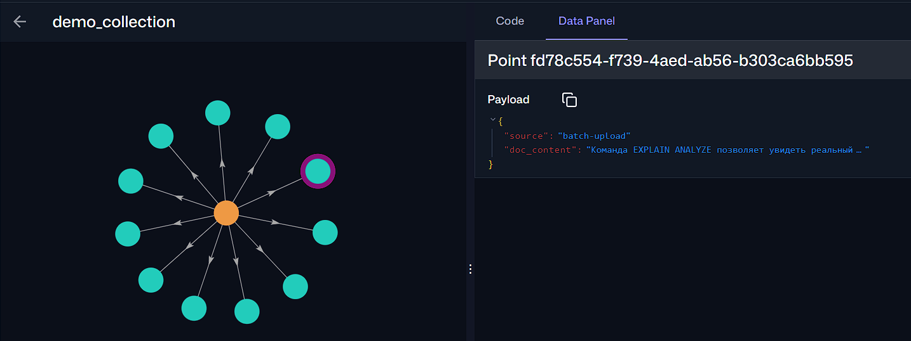
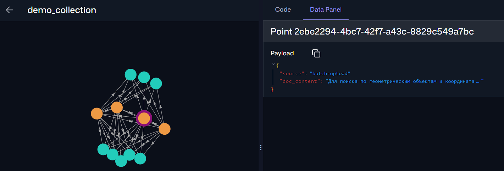

## Подготовка
В склонированном репозитории `docker compose up --build -d`

Вставил текст:
```text
Индексы B-Tree отлично подходят для поиска точных совпадений и сортировки данных.;VACUUM очищает таблицу от мертвых строк (dead tuples), предотвращая раздувание файлов.;Команда EXPLAIN ANALYZE позволяет увидеть реальный план выполнения запроса и затраченное время.;Использование пула соединений, такого как PgBouncer, снижает нагрузку на сервер при большом количестве клиентов.;Партицирование таблиц помогает ускорить удаление старых данных и улучшает производительность выборок.;Материализованные представления сохраняют результаты сложных агрегаций для быстрого чтения.;Увеличение параметра work_mem позволяет базе использовать больше оперативной памяти для сортировки и хеширования.;Write-Ahead Log (WAL) обеспечивает надежность данных и используется для репликации.;Для поиска по геометрическим объектам и координатам лучше всего использовать индекс GiST или SP-GiST.;Триггеры в базе данных позволяют автоматически выполнять функции при вставке или обновлении записей.;Тип данных JSONB хранит документы в бинарном формате, что ускоряет доступ к ключам.;Настройка shared_buffers критически важна, так как она определяет, сколько данных будет кэшироваться в памяти.
```

Запрос: `как искать по формам`
Ответ:
```text
Для поиска по геометрическим объектам и координатам лучше всего использовать индекс GiST или SP-GiST
```

Запрос: `как улучшить очистку данных`
Ответ:
```text
Партицирование таблиц помогает ускорить удаление старых данных и улучшает производительность выборок.
```

Запрос: `как увеличить настройку ОЗУ`
Ответ:
```text
Увеличение параметра work_mem позволяет базе использовать больше оперативной памяти для сортировки и хеширования.
```

`http://localhost:6333/dashboard#/collections/demo_collection/graph` c limit: 15

