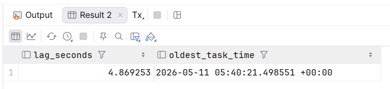
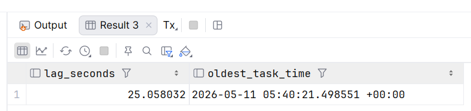
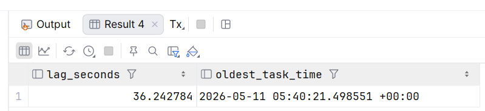
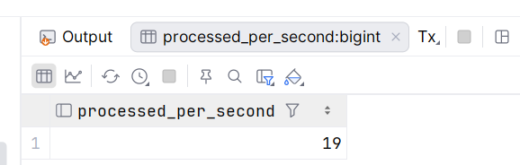
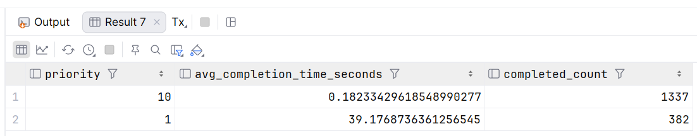
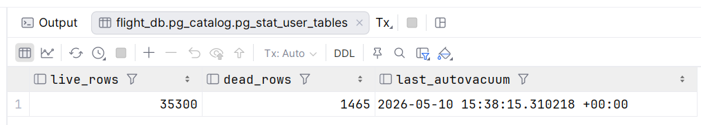
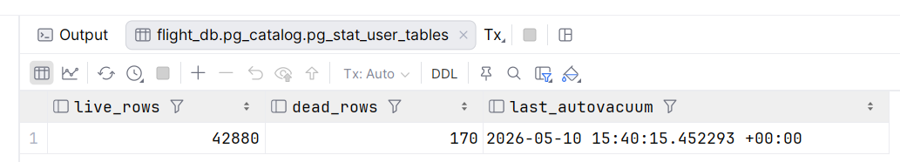

Запускаем `docker compose up --build`

## Схема бд
Предметная область и бизнес задача - бронирование авиабилетов
```postgresql
-- liquibase formatted sql
-- changeset author:queue-setup

CREATE TABLE tasks (
    id           BIGSERIAL PRIMARY KEY,
    payload      JSONB NOT NULL,
    status       VARCHAR(20) NOT NULL DEFAULT 'Ready',
    priority     INT NOT NULL DEFAULT 1,
    attempts     INT NOT NULL DEFAULT 0,
    created_at   TIMESTAMPTZ NOT NULL DEFAULT now(),
    scheduled_at TIMESTAMPTZ NOT NULL DEFAULT now(),
    updated_at   TIMESTAMPTZ NOT NULL DEFAULT now(),
    worker_id    VARCHAR(50)
) WITH (
    autovacuum_vacuum_scale_factor = 0.02,
    -- какая доля таблицы должна быть из мертвых строк чтобы запустился autovacuum
    autovacuum_analyze_scale_factor = 0.01
    -- доля измененных строк необходимая для запуска обновления статистика планировщика
    );

CREATE INDEX idx_tasks_poll ON tasks (priority DESC, scheduled_at ASC) WHERE status = 'Ready';
CREATE INDEX idx_tasks_created_ready ON tasks (created_at) WHERE status = 'Ready';

-- changeset author:queue-setup-function splitStatements:false
CREATE OR REPLACE FUNCTION notify_new_task()
RETURNS TRIGGER AS
$$
BEGIN
    PERFORM pg_notify('new_tasks_channel', NEW.id::text);
    RETURN NEW;
END;
$$ LANGUAGE plpgsql;

-- changeset author:queue-setup-trigger
CREATE TRIGGER on_task_insert
AFTER INSERT ON tasks
FOR EACH ROW
EXECUTE PROCEDURE notify_new_task();
```

## Producer
Генерирует события
Транзакционно выполняет и бизнес логику (вставка нового бронирования) и добавление события в очередь
```java
@Scheduled(fixedDelay = 5)
@Transactional
public void generateEvent() {
    entityManager.createNativeQuery(
                    "INSERT INTO booking (client_id, booking_date, total_cost, status_id) " +
                            "VALUES (1, now(), :cost, 1)")
            .setParameter("cost", 5000 + random.nextInt(20000))
            .executeUpdate();

    Task task = new Task();
    task.setPayload("{\"action\": \"ISSUE_TICKET\"}");

    task.setPriority(random.nextInt(100) < 20 ? 10 : 1);
    // приоритет: с 20% приоритет 10, остальное 1.
    taskRepository.save(task);
}
```
При вставке работает NOTIFY триггер.


## Consumer (2 экзмепляра)
Слушает (LISTEN) канал `new_tasks_channel`, если получает уведомление,
то обрабатывает его со sleep и с шансом 90% успешно выполняет задачу,

```java
@PostConstruct
public void initListener() {
    Thread listenerThread = new Thread(() -> {
        try (Connection conn = dataSource.getConnection()) {
            PGConnection pgConn = conn.unwrap(PGConnection.class);
            try (Statement stmt = conn.createStatement()) {
                stmt.execute("LISTEN new_tasks_channel");
            }

            System.out.println(workerId + " started. Listening for tasks...");

            processAvailableTasks();

            while (!Thread.currentThread().isInterrupted()) {
                PGNotification[] notifications = pgConn.getNotifications(5000);

                if (notifications != null && notifications.length > 0) {
                    processAvailableTasks();
                } else {
                    processAvailableTasks();
                }
            }
        } catch (Exception e) {
            System.err.println(workerId + " listener error: " + e.getMessage());
        }
    });
    listenerThread.start();
}

private void processAvailableTasks() {
    Task task;
    while ((task = taskService.grabTask(workerId)) != null) {
        try {
            Thread.sleep(random.nextInt(50) + 50);

            boolean success = random.nextInt(100) >= 10;

            taskService.finalizeTask(task, success);
            System.out.println(workerId + " processed task " + task.getId() + " - Success: " + success);

        } catch (InterruptedException e) {
            Thread.currentThread().interrupt();
            break;
        } catch (Exception e) {
            taskService.finalizeTask(task, false);
        }
    }
}

@Transactional
public Task grabTask(String workerId) {
    Optional<Task> optTask = repository.findReadyTaskForUpdate();
    if (optTask.isPresent()) {
        Task task = optTask.get();
        task.setStatus("Running");
        task.setWorkerId(workerId);
        task.setUpdatedAt(OffsetDateTime.now());
        return repository.save(task);
    }
    return null;
}

@Transactional
public void finalizeTask(Task task, boolean success) {
    if (success) {
        task.setStatus("Completed");
    } else {
        task.setAttempts(task.getAttempts() + 1);
        if (task.getAttempts() >= 3) {
            task.setStatus("Failed");
        } else {
            task.setStatus("Ready");
            // экспоненциальный backoff
            long backoffMinutes = 5L * (1L << (task.getAttempts() - 1));
            task.setScheduledAt(OffsetDateTime.now().plusMinutes(backoffMinutes));
        }
    }
    task.setUpdatedAt(OffsetDateTime.now());
    repository.save(task);
}
```

## Мониторинг Лага
SQL-запрос, который показывает разницу между now() и временем created_at самой старой задачи в статусе Ready.
Это покажет, как долго задачи ждут выполнения.
```postgresql
SELECT
    EXTRACT(EPOCH FROM (now() - MIN(created_at))) AS lag_seconds,
    MIN(created_at) as oldest_task_time
FROM tasks
WHERE status = 'Ready';
```







Видим рост лага

### Пропускная способность
Считаем количество обработанных задач за секунду
```postgresql
SELECT
    COUNT(*) as processed_per_second
FROM tasks
WHERE status IN ('Completed', 'Failed')
  AND updated_at >= now() - INTERVAL '1 second';
```



## Статистика по приоритету
```postgresql
SELECT
    priority,
    AVG(EXTRACT(EPOCH FROM (updated_at - created_at))) as avg_completion_time_seconds,
    COUNT(*) as completed_count
FROM tasks
WHERE status = 'Completed'
GROUP BY priority
ORDER BY priority DESC;
```


## Агрессивный AutoVacuum
```postgresql
SELECT
    n_live_tup AS live_rows,
    n_dead_tup AS dead_rows,
    last_autovacuum
FROM pg_stat_user_tables
WHERE relname = 'tasks';
```
С интервалом в несколько секунд замеры:


