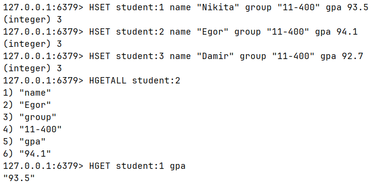
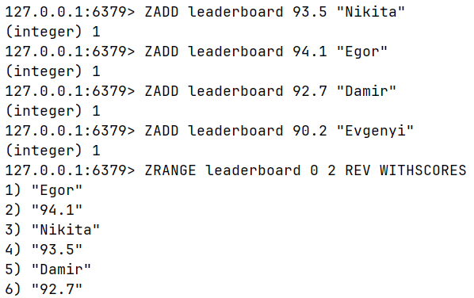
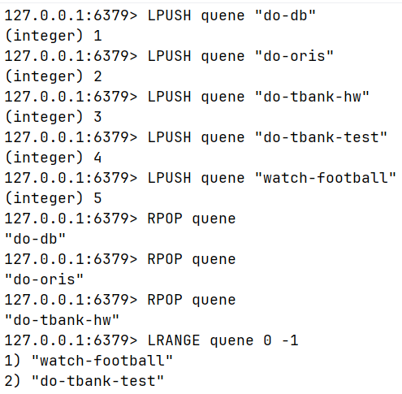
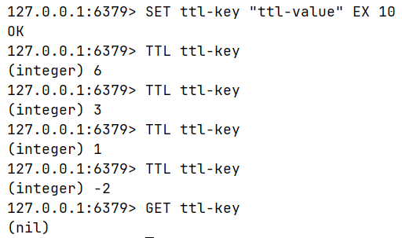
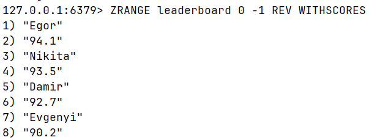
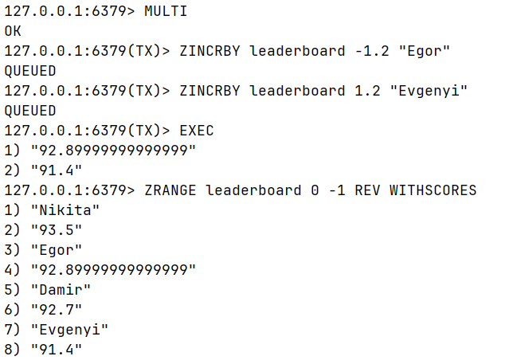

## Подготовка
`docker compose up -d` - запуск редис контейнера
`docker exec -it redis-redis-1 redis-cli` - подключение к контейнеру

## Задание
1. Создать Hash с данными о 3 студентах (имя, группа, средний балл).

2. Реализовать лидерборд (Sorted Set) по среднему баллу. Вывести топ-3.

3. Реализовать простую очередь задач (List): добавить 5 задач, забрать 3.

4. Установить TTL на один из ключей, убедиться, что он удалился.

5. Выполнить транзакцию MULTI/EXEC: перевод «баллов» между двумя студентами.

