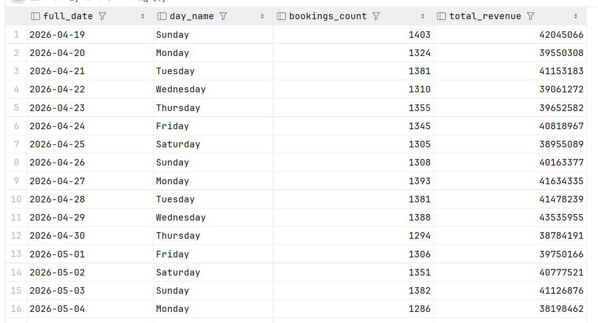
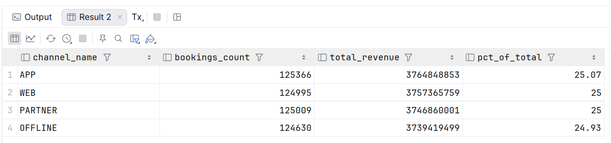
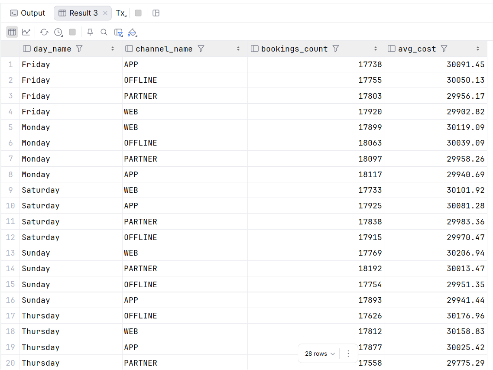

# OLAP-архитектура: Flytics

## 0. Контекст проекта

Flytics — система бронирования авиабилетов. OLTP-схема содержит следующие ключевые сущности:

- `booking` — центральная транзакционная таблица (500k строк): содержит `client_id`, `booking_date`, `total_cost`,
  `status_id`, `channel`
- `flight` — рейс с `departure_time`, `status_id`, маршрутом через `flight_number`
- `client` — покупатель
- `payment` — оплата бронирования

## 1. Аналитические вопросы

1. Какая динамика бронирований по дням?
2. Какой канал продаж приносит больше всего выручки? (WEB / APP / PARTNER / OFFLINE)

## 2. Главный факт

Главный факт — `fact_bookings`.

## 3. Зерно факта

1 строка = 1 бронирование

## 4. Измерения

| Измерение     | Обоснование                                                                    |
|---------------|--------------------------------------------------------------------------------|
| `dim_date`    | Нужна для вопроса 1 — динамика по дням. Стандартное измерение времени.         |
| `dim_channel` | Нужна для вопроса 2 — выручка по каналу. Атрибуты: WEB, APP, PARTNER, OFFLINE. |

## 5. Заполнение OLAP из OLTP

### 5.1 Новая схема

Новая миграция: `V4__olap_schema.sql`:

```postgresql
CREATE SCHEMA IF NOT EXISTS olap;

-- dim_date
CREATE TABLE olap.dim_date
(
    date_id   INT PRIMARY KEY, -- YYYYMMDD
    full_date DATE        NOT NULL,
    day_name  VARCHAR(15) NOT NULL
);

-- dim_channel
CREATE TABLE olap.dim_channel
(
    channel_id   SERIAL PRIMARY KEY,
    channel_name VARCHAR(10) NOT NULL UNIQUE
);

-- fact_bookings
CREATE TABLE olap.fact_bookings
(
    booking_id INT PRIMARY KEY,
    date_id    INT NOT NULL REFERENCES olap.dim_date (date_id),
    channel_id INT NOT NULL REFERENCES olap.dim_channel (channel_id),
    total_cost INT NOT NULL
);
```

### 5.2 Перелив данных

`transfer.sql`:

```postgresql
-- 1. dim_date
INSERT INTO olap.dim_date (date_id, full_date, day_name)
SELECT TO_CHAR(d, 'YYYYMMDD')::INT AS date_id,
       d::DATE                     AS full_date,
       TO_CHAR(d, 'Day')           AS day_name
FROM generate_series(
                     CURRENT_DATE - INTERVAL '5 years',
                     CURRENT_DATE + INTERVAL '1 year',
                     INTERVAL '1 day'
     ) AS d
ON CONFLICT (date_id) DO NOTHING;

-- 2. dim_channel
INSERT INTO olap.dim_channel (channel_name)
VALUES ('WEB'),
       ('APP'),
       ('PARTNER'),
       ('OFFLINE')
ON CONFLICT (channel_name) DO NOTHING;

-- 3. fact_bookings
INSERT INTO olap.fact_bookings (booking_id, date_id, channel_id, total_cost)
SELECT b.id                                     AS booking_id,
       TO_CHAR(b.booking_date, 'YYYYMMDD')::INT AS date_id,
       dc.channel_id,
       b.total_cost
FROM public.booking b
         JOIN olap.dim_channel dc ON dc.channel_name = b.channel
ON CONFLICT (booking_id) DO NOTHING;
```

## 6. Аналитические запросы

### Запрос 1 — Динамика бронирований по дням

```postgresql
SELECT d.full_date,
       d.day_name,
       COUNT(f.booking_id) AS bookings_count,
       SUM(f.total_cost)   AS total_revenue
FROM olap.fact_bookings f
         JOIN olap.dim_date d ON d.date_id = f.date_id
WHERE d.full_date >= CURRENT_DATE - INTERVAL '30 days'
GROUP BY d.full_date, d.day_name
ORDER BY d.full_date;
```



### Запрос 2 — Выручка по каналу продаж

```postgresql
SELECT c.channel_name,
       COUNT(f.booking_id)                                                      AS bookings_count,
       SUM(f.total_cost)                                                        AS total_revenue,
       ROUND(100.0 * COUNT(f.booking_id) / SUM(COUNT(f.booking_id)) OVER (), 2) AS pct_of_total
FROM olap.fact_bookings f
         JOIN olap.dim_channel c ON c.channel_id = f.channel_id
GROUP BY c.channel_name
ORDER BY total_revenue DESC;
```



### Запрос 3 - Средний чек бронирования по каналу и дню недели

```postgresql
SELECT d.day_name,
       c.channel_name,
       COUNT(f.booking_id)         AS bookings_count,
       ROUND(AVG(f.total_cost), 2) AS avg_cost
FROM olap.fact_bookings f
         JOIN olap.dim_date d ON d.date_id = f.date_id
         JOIN olap.dim_channel c ON c.channel_id = f.channel_id
GROUP BY d.day_name, c.channel_name
ORDER BY d.day_name, avg_cost DESC;
```

