# 1. Секционирование RANGE / LIST / HASH

```postgresql
-- 1. Секционирование RANGE / LIST / HASH --

-- 1.1 RANGE --

-- Создаем копию booking по секционирование
CREATE TABLE booking_range_part
(
    id               INT,
    client_id        INT         NOT NULL,
    booking_date     TIMESTAMPTZ NOT NULL,
    total_cost       INT         NOT NULL,
    status_id        INT         NOT NULL,
    discount_code    VARCHAR(50),
    channel          VARCHAR(10),
    insurance_amount NUMERIC(10, 2),
    PRIMARY KEY (id, booking_date) -- составной primary key
) PARTITION BY RANGE (booking_date);

-- Создаем секции по годам
CREATE TABLE booking_range_2024 PARTITION OF booking_range_part FOR VALUES FROM ('2024-01-01') TO ('2025-01-01');
CREATE TABLE booking_range_2025 PARTITION OF booking_range_part FOR VALUES FROM ('2025-01-01') TO ('2026-01-01');
CREATE TABLE booking_range_2026 PARTITION OF booking_range_part FOR VALUES FROM ('2026-01-01') TO ('2027-01-01');
CREATE TABLE booking_range_default PARTITION OF booking_range_part DEFAULT;

-- Индекс для поиска по дате
CREATE INDEX idx_booking_range_date ON booking_range_part(booking_date);

-- Копируем данные из оригинальной booking
INSERT INTO booking_range_part
SELECT id, client_id, booking_date, total_cost, status_id, discount_code, channel, insurance_amount FROM booking;

-- Запрос и его анализ
EXPLAIN ANALYZE
SELECT * FROM booking_range_part
WHERE booking_date >= '2025-05-01' AND booking_date < '2025-05-15';
```

Результат:
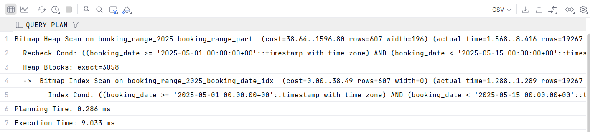

a. partition pruning есть - была сканирована только нужная секция с 2025 годом
b. 1 партиция
c. да, созданный индекс используется

```postgresql
-- 1.2 LIST

-- Создаем копию flight таблицы под секционирование
CREATE TABLE flight_list_part
(
    id               INT,
    flight_number    VARCHAR(8)  NOT NULL,
    aircraft_id      INT         NOT NULL,
    departure_time   TIMESTAMPTZ NOT NULL,
    arrival_time     TIMESTAMPTZ NOT NULL,
    status_id        INT         NOT NULL,
    flight_tags      TEXT[],
    booking_window   TSTZRANGE,
    actual_departure TIMESTAMPTZ,
    PRIMARY KEY (id, status_id) -- составной pk
) PARTITION BY LIST (status_id);

-- Создаем секции под статусы
CREATE TABLE flight_list_on_time PARTITION OF flight_list_part FOR VALUES IN (1);
CREATE TABLE flight_list_delayed PARTITION OF flight_list_part FOR VALUES IN (2);
CREATE TABLE flight_list_landed PARTITION OF flight_list_part FOR VALUES IN (3);
CREATE TABLE flight_list_cancelled PARTITION OF flight_list_part FOR VALUES IN (4);
CREATE TABLE flight_list_default PARTITION OF flight_list_part DEFAULT;

-- Индекс для поиска по статусу
CREATE INDEX idx_flight_list_status ON flight_list_part (status_id);

-- Копируем данные
INSERT INTO flight_list_part
SELECT id, flight_number, aircraft_id, departure_time, arrival_time, status_id, flight_tags, booking_window, actual_departure
FROM flight;

-- Запрос и его анализ
EXPLAIN ANALYZE
SELECT * FROM flight_list_part
WHERE status_id = 4;
```

Результат:
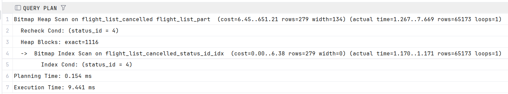

a. partition pruning есть - была сканирована только нужная секция cодержащия записи для отмененных рейсов
b. 1 партиция
c. да, созданный индекс используется

```postgresql
-- 1.3 HASH
CREATE TABLE client_hash_part
(
    id                  INT PRIMARY KEY,
    first_name          VARCHAR(100) NOT NULL,
    last_name           VARCHAR(100) NOT NULL,
    email               VARCHAR(100) NOT NULL,
    password_hash       VARCHAR(100) NOT NULL,
    phone_number        VARCHAR(20),
    registration_date   DATE,
    loyalty_points      INT,
    home_address_coords POINT,
    notes               TEXT
) PARTITION BY HASH (id);

CREATE TABLE client_hash_p0 PARTITION OF client_hash_part FOR VALUES WITH (MODULUS 4, REMAINDER 0);
CREATE TABLE client_hash_p1 PARTITION OF client_hash_part FOR VALUES WITH (MODULUS 4, REMAINDER 1);
CREATE TABLE client_hash_p2 PARTITION OF client_hash_part FOR VALUES WITH (MODULUS 4, REMAINDER 2);
CREATE TABLE client_hash_p3 PARTITION OF client_hash_part FOR VALUES WITH (MODULUS 4, REMAINDER 3);

INSERT INTO client_hash_part
SELECT id, first_name, last_name, email, password_hash, phone_number, registration_date, loyalty_points, home_address_coords, notes
FROM client;

-- Запрос и его анализ
EXPLAIN ANALYZE
SELECT * FROM client_hash_part
WHERE id = 1002;
```

Результат:
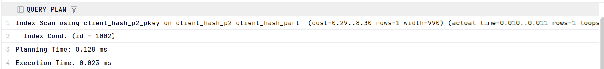
a. partition pruning есть - была сканирована только нужная секция
b. 1 партиция
c. да, использован индекс который по умолчанию создан для pk

# 2. Физическая репликация и секционирование
Поднимаем `docker-compose-replication.yaml`

В primary: `docker exec -it pg_primary psql -U postgres -d flytics`

Создаем секционируемую таблицу и секции
```postgresql
CREATE TABLE users_log (id INT, message TEXT) PARTITION BY RANGE (id);

CREATE TABLE users_log_p1 PARTITION OF users_log FOR VALUES FROM (1) TO (100);
CREATE TABLE users_log_p2 PARTITION OF users_log FOR VALUES FROM (100) TO (200);
```

Вставляем данные идущие в разные секции
```postgresql
INSERT INTO users_log (id, message) VALUES (10, 'Hello from partition 1'), (150, 'Hello from partition 2');
```

Выходим из primary и переходим в реплику: `docker exec -it pg_replica1 psql -U postgres -d flytics`

a.

Проверяем данные:
```postgresql
SELECT * FROM users_log;
```

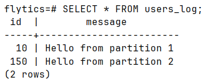
В родительской таблице есть.

Проверяем в секциях:
```postgresql
SELECT * FROM users_log_p1;
```
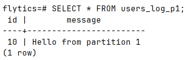

```postgresql
SELECT * FROM users_log_p2;
```
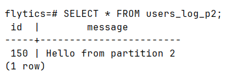

Все успешно распредело по секциям.

b. Почему репликация “не знает” про секции?
Физическая репликация "не знает" про секции (партиции), потому что она работает на уровне файловой системы и бинарного лога (WAL - Write-Ahead Log).
В нее поступает байтовый поток низкоуровненой информации о конкретных записях, любых изменениях, репликация не получается высокоуровневых запросов (в отличие от логической).

# 3. Логическая репликация
Поднимаем `docker-compose-logical.yaml`

Ранее была сделана подписка и публикация FOR ALL TABLES, чтобы не мешалась новым тестам, отключаем ее
`docker exec -it pg_subscriber psql -U postgres -d flytics -c "DROP SUBSCRIPTION IF EXISTS flytics_sub;"`
`docker exec -it pg_publisher psql -U postgres -d flytics -c "DROP PUBLICATION IF EXISTS flytics_pub;"`

Режим publish_via_partition_root = off (дефолтный)

В publisher: `docker exec -it pg_publisher psql -U postgres -d flytics`

Создаем секции и родительскую таблицу
```postgresql
CREATE TABLE sales_off (id INT, region TEXT, amount INT) PARTITION BY LIST (region);

CREATE TABLE sales_off_msk PARTITION OF sales_off FOR VALUES IN ('MSK');
CREATE TABLE sales_off_spb PARTITION OF sales_off FOR VALUES IN ('SPB');
```

Создаем публикацию:
```postgresql
CREATE PUBLICATION pub_off FOR TABLE sales_off WITH (publish_via_partition_root = off);
```

В subscriber: `docker exec -it pg_subscriber psql -U postgres -d flytics`

Так как репликация логическая, то необходимо перенести схему вручную:
Создаем таблицы-секции на подписчике (так как режим off, то будут идти запросы прямо на таблицы-секции, а не на родителя):
```postgresql
CREATE TABLE sales_off_msk (id INT, region TEXT, amount INT);
CREATE TABLE sales_off_spb (id INT, region TEXT, amount INT);
```
Подписываемся:
```postgresql
CREATE SUBSCRIPTION sub_off CONNECTION 'host=publisher port=5432 dbname=flytics user=postgres password=postgres' PUBLICATION pub_off;
```

В publisher вставляем данные в родителя:
`docker exec -it pg_publisher psql -U postgres -d flytics -c "INSERT INTO sales_off VALUES (1, 'MSK', 100), (2, 'SPB', 200);"`

В подписчике проверяем:
`docker exec -it pg_subscriber psql -U postgres -d flytics -c "SELECT * FROM sales_off_msk;"`
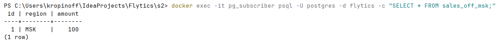

`docker exec -it pg_subscriber psql -U postgres -d flytics -c "SELECT * FROM sales_off_spb;"`
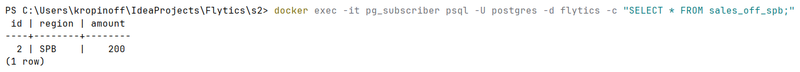


Режим publish_via_partition_root = on

В publisher: `docker exec -it pg_publisher psql -U postgres -d flytics`

Создаем секционирование
```postgresql
CREATE TABLE sales_on (id INT, region TEXT, amount INT) PARTITION BY LIST (region);
CREATE TABLE sales_on_msk PARTITION OF sales_on FOR VALUES IN ('MSK');
CREATE TABLE sales_on_spb PARTITION OF sales_on FOR VALUES IN ('SPB');
```

И публикацию:
`CREATE PUBLICATION pub_on FOR TABLE sales_on WITH (publish_via_partition_root = on);`

В subscriber: `docker exec -it pg_subscriber psql -U postgres -d flytics`
Создаем только таблицу родителя (потому что при on запросы приходят на родителя)
```postgresql
CREATE TABLE sales_on (id INT, region TEXT, amount INT);
```

Подписываемся
```postgresql
CREATE SUBSCRIPTION sub_on CONNECTION 'host=publisher port=5432 dbname=flytics user=postgres password=postgres' PUBLICATION pub_on;
```

Вставляем данные в publisher:
`docker exec -it pg_publisher psql -U postgres -d flytics -c "INSERT INTO sales_on VALUES (1, 'MSK', 500), (2, 'SPB', 600);"`

Проверяем на подписчике:
`docker exec -it pg_subscriber psql -U postgres -d flytics -c "SELECT * FROM sales_on;"`

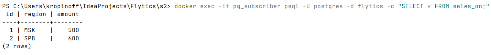

Вывод:
- В Сценарии 1 (publish_via_partition_root = off) вставка в родительскую таблицу на publisher транслировалась как вставки в конкретные секции. Поэтому на подписчике понадобилось создать отдельные таблицы с названиями секций (sales_off_msk, sales_off_spb).
- В Сценарии 2 (publish_via_partition_root = on) логическая репликация маршрутизировала все изменения через имя родительской таблицы (sales_on). Это позволило на стороне подписчика иметь другую структуру хранения - одну несекционированную таблицу sales_on.

# 4. Шардирование
Поднимаем отдельный `docker-compose-sharding.yaml`
Там 3 контейнера - роутер и 2 шарда

Создаем на шардах отдельные таблицы с ограничениями на id:
первый от 1 до 100, второй от 101 до 200

`docker exec -it fdw_shard1 psql -U postgres -d flytics -c "CREATE TABLE users (id INT PRIMARY KEY CHECK (id >= 1 AND id <= 100), name TEXT);"`
и 
`docker exec -it fdw_shard2 psql -U postgres -d flytics -c "CREATE TABLE users (id INT PRIMARY KEY CHECK (id >= 101 AND id <= 200), name TEXT);"`

В router создаем подключения к шардам, и объявляем их как партиции.
`docker exec -it fdw_router psql -U postgres -d flytics`

```postgresql
-- Включаем расширение
CREATE EXTENSION postgres_fdw;

-- Создаем подключения к контейнерам шардов (по их именам в docker-compose)
CREATE SERVER shard1_server FOREIGN DATA WRAPPER postgres_fdw OPTIONS (host 'pg_shard1', dbname 'flytics', port '5432');
CREATE SERVER shard2_server FOREIGN DATA WRAPPER postgres_fdw OPTIONS (host 'pg_shard2', dbname 'flytics', port '5432');

-- Даем права на подключение
CREATE USER MAPPING FOR postgres SERVER shard1_server OPTIONS (user 'postgres', password 'postgres');
CREATE USER MAPPING FOR postgres SERVER shard2_server OPTIONS (user 'postgres', password 'postgres');

-- Создаем таблицу-роутер (она сама не хранит данные)
CREATE TABLE users_router (id INT, name TEXT) PARTITION BY RANGE (id);

-- Привязываем таблицы из шардов как партиции (1-100 и 101-200)
CREATE FOREIGN TABLE users_shard1 PARTITION OF users_router FOR VALUES FROM (1) TO (101) SERVER shard1_server OPTIONS (table_name 'users');
CREATE FOREIGN TABLE users_shard2 PARTITION OF users_router FOR VALUES FROM (101) TO (201) SERVER shard2_server OPTIONS (table_name 'users');
```

Вставляем данные в router:
```postgresql
INSERT INTO users_router (id, name) VALUES (10, 'Alice_in_Shard1'), (150, 'Bob_in_Shard2');
```

Проверяем все данные:
```postgresql
EXPLAIN ANALYZE SELECT * FROM users_router;
```
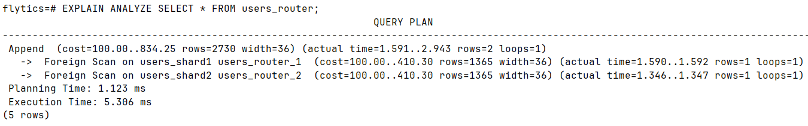
Видим, что запрос ушел на оба шарда.

Проверяем только часть данных, которые на одном из шардов:
```postgresql
EXPLAIN ANALYZE SELECT * FROM users_router WHERE id = 150;
```
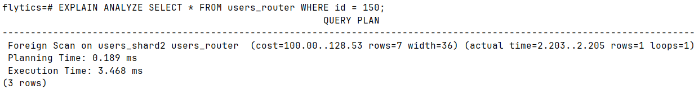
Запрос ушел только на второй шард, первый был отсчен по id