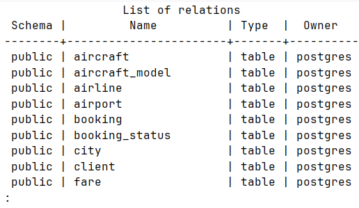
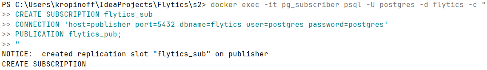
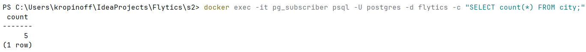
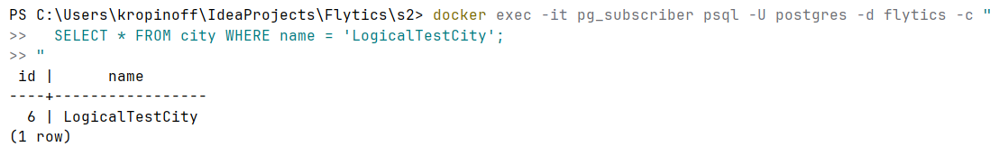
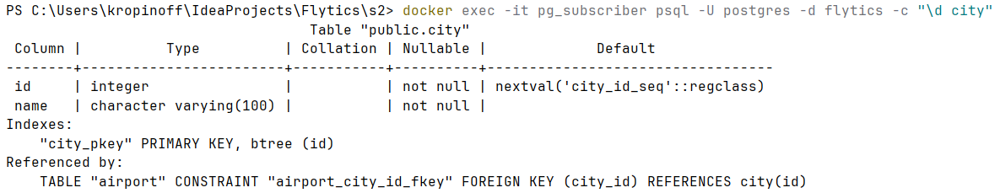
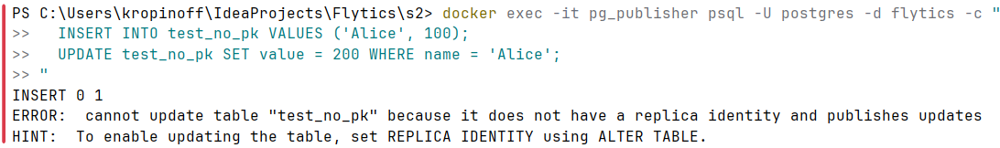
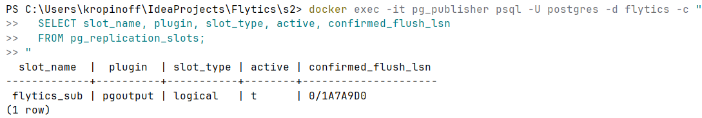
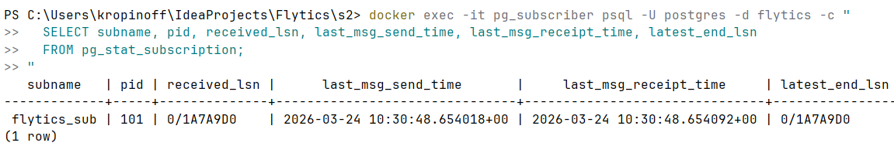

## Подготовка
Создаем отдельный `docker-compose-logical.yaml`
выделяем отдельный publisher и subscriber
устанавливаем wal_level = logical

Нужно перенести схему вручную, потому что логическая репликация только для переноса данных.
Используем pg_dump

```
# дамп схемы с publisher
docker exec -it pg_publisher pg_dump -U postgres -d flytics --schema-only -f /tmp/schema.sql

# копирование дампа на хост 
docker cp pg_publisher:/tmp/schema.sql ./schema.sql

# копирование с хоста в subscriber
docker cp ./schema.sql pg_subscriber:/tmp/schema.sql

# применение на subscriber
docker exec -it pg_subscriber psql -U postgres -d flytics -f /tmp/schema.sql
```

Проверка схемы: `docker exec -it pg_subscriber psql -U postgres -d flytics -c "\dt"`


## PUBLICATION / SUBSCRIPTION
Создаем PUBLICATION на publisher: `docker exec -it pg_publisher psql -U postgres -d flytics -c "CREATE PUBLICATION flytics_pub FOR ALL TABLES;"`

Создаем SUBSCRIPTION на subscriber: `docker exec -it pg_subscriber psql -U postgres -d flytics -c "
CREATE SUBSCRIPTION flytics_sub
CONNECTION 'host=publisher port=5432 dbname=flytics user=postgres password=postgres'
PUBLICATION flytics_pub;
"`


После создания, происходит перенос имеющихся данных, прежде чем начинается получние новых изменений.
Проверяем:
`docker exec -it pg_subscriber psql -U postgres -d flytics -c "SELECT count(*) FROM city;"`



## Проверка реплецирования данных
`docker exec -it pg_publisher psql -U postgres -d flytics -c "
  INSERT INTO city (name) VALUES ('LogicalTestCity');
"`

`docker exec -it pg_subscriber psql -U postgres -d flytics -c "
  SELECT * FROM city WHERE name = 'LogicalTestCity';
"`



## Проверка DDL не реплецируется
`docker exec -it pg_publisher psql -U postgres -d flytics -c "
  ALTER TABLE city ADD COLUMN region VARCHAR(100);
"`

`docker exec -it pg_subscriber psql -U postgres -d flytics -c "\d city"`


## Проверка REPLICA IDENTITY
Создаем таблицу без PK на обоих узлах
`docker exec -it pg_publisher psql -U postgres -d flytics -c "CREATE TABLE test_no_pk (name VARCHAR(100), value INT);"`

`docker exec -it pg_subscriber psql -U postgres -d flytics -c "CREATE TABLE test_no_pk (name VARCHAR(100), value INT);"`

Добавляем в PUBLICATION (на деле так как FOR ALL TABLES то она уже там)
`docker exec -it pg_publisher psql -U postgres -d flytics -c "ALTER PUBLICATION flytics_pub ADD TABLE test_no_pk;"`

Проверяем:
`docker exec -it pg_publisher psql -U postgres -d flytics -c "
  INSERT INTO test_no_pk VALUES ('Alice', 100);
  UPDATE test_no_pk SET value = 200 WHERE name = 'Alice';
"`




## Проверка replication status
`docker exec -it pg_publisher psql -U postgres -d flytics -c "
  SELECT slot_name, plugin, slot_type, active, confirmed_flush_lsn
  FROM pg_replication_slots;
"`



`docker exec -it pg_subscriber psql -U postgres -d flytics -c "
  SELECT subname, pid, received_lsn, last_msg_send_time, last_msg_receipt_time, latest_end_lsn
  FROM pg_stat_subscription;
"`



## Применение pg_dump
Используется для переноса схемы на ведомый узел при логической репликации (поскольку она может переносить только данные)