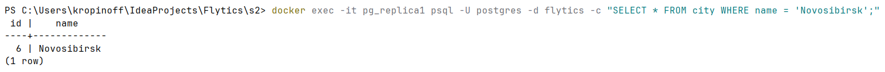
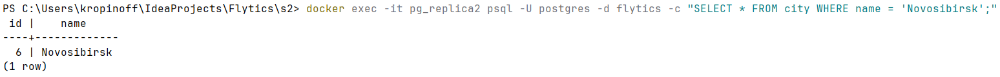
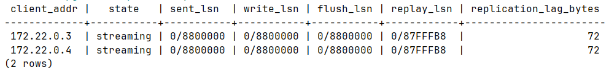

# Репликация

## Подготовка
Отдельный `docker-compose-replcation.yaml`, настройки для primary:
 - wal_level = replica
 - max_wal_senders = 10
 - max_replication_slots = 10
 - listen_addresses = '*'
переданы сразу в контейнер через command

Также, сразу переданы скрипты инициализации для создания пользователя репликации и настройки подключений в primary:
```
- ./db/init/init-replication.sql:/docker-entrypoint-initdb.d/01-init-replication.sql
- ./db/init/init-hba.sh:/docker-entrypoint-initdb.d/02-init-hba.sh
```

А в контейнеры реплик переданы скрипты для basebackup инициализации:
`- ./db/init/replica-init.sh:/replica-init.sh`

## Проверка физической репликации

Вставляем данные в primary: `docker exec -it pg_primary psql -U postgres -d flytics -c "INSERT INTO city (name) VALUES ('Novosibirsk');"`


Проверяем реплики:
`docker exec -it pg_replica1 psql -U postgres -d flytics -c "SELECT * FROM city WHERE name = 'Novosibirsk';"`


и `docker exec -it pg_replica2 psql -U postgres -d flytics -c "SELECT * FROM city WHERE name = 'Novosibirsk';"`



## Попытка вставить данные в реплику
`docker exec -it pg_replica1 psql -U postgres -d flytics -c "INSERT INTO city (name) VALUES ('TestWrite');"`


## Анализ replication lag
Создаем нагрузку на primary:
`docker exec -it pg_primary psql -U postgres -d flytics`
```postgresql
INSERT INTO city (name)
SELECT 'LoadTestCity_' || generate_series(1, 1000000);
```

Наблюдаем lag (во втором терминале параллельно):
```
docker exec -it pg_primary psql -U postgres -c "
  SELECT
    client_addr,
    state,
    sent_lsn,
    write_lsn,
    flush_lsn,
    replay_lsn,
    (sent_lsn - replay_lsn) AS replication_lag_bytes
  FROM pg_stat_replication;
"
```


write_lsn — WAL записан в буфер памяти реплики
flush_lsn — WAL сброшен на диск реплики
replay_lsn — WAL применён к файлам данных (таблицам)