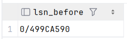
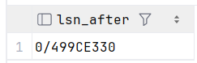
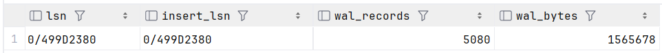
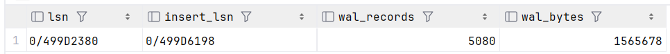
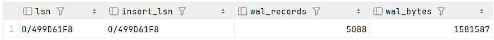
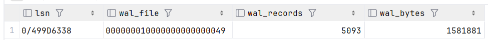
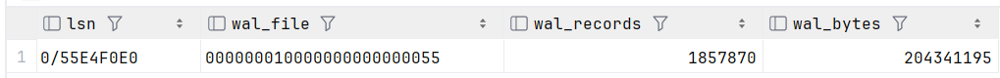

# WAL
## 1. Сравнение LSN до и после INSERT

```postgresql
-- 1.1 Текущий LSN --
SELECT pg_current_wal_lsn() as lsn_before;
```


```postgresql
-- 1.2 Вставка новой строки --
INSERT INTO booking (client_id, booking_date, total_cost, status_id, channel)
VALUES (25502, NOW(), 17000, 1, 'WEB');
```

```postgresql
-- 1.3 Новый LSN --
SELECT pg_current_wal_lsn() as lsn_after;
```


## 2. Сравнение WAL до и после COMMIT
```postgresql
-- 2.1 Состояние до транзакции --
SELECT
pg_current_wal_lsn() AS lsn,
pg_current_wal_insert_lsn() AS insert_lsn,
wal_records,
wal_bytes
FROM pg_stat_wal;
```


```postgresql
-- 2.2 Начало транзакции --
BEGIN;

INSERT INTO booking (client_id, booking_date, total_cost, status_id, channel)
VALUES (25501, NOW(), 18000, 1, 'WEB');

-- 2.3 Состояние в момент транзакции --
SELECT
pg_current_wal_lsn() AS lsn,
pg_current_wal_insert_lsn() AS insert_lsn,
wal_records,
wal_bytes
FROM pg_stat_wal;
```


```postgresql
-- 2.4 Commit --
COMMIT;

-- 2.5 Состояние после COMMIT --
SELECT
pg_current_wal_lsn() AS lsn,
pg_current_wal_insert_lsn() AS insert_lsn,
wal_records,
wal_bytes
FROM pg_stat_wal;
```


Вывод: pg_current_wal_lsn (текущий lsn на диске), wal_records (количество записей в wal) и wal_bytes (размер записей) меняются после коммита.
А pg_current_wal_insert_lsn (текущий lsn в wal_buffers) меняется сразу после изменения, а не после завершения транзакции.

## 3. Анализ WAL размера после массовой операции

```postgresql
-- 3.1 Состояние до операции --
SELECT
    pg_current_wal_lsn()            AS lsn,
    pg_walfile_name(pg_current_wal_lsn()) AS wal_file,
    wal_records,
    wal_bytes
FROM pg_stat_wal;
```


```postgresql
-- 3.2 Массовая операция (перезаписываем на имеющееся значение чтобы не сломать распределение)
UPDATE booking
SET total_cost = total_cost
WHERE booking_date >= NOW() - INTERVAL '1 year';
```

```postgresql
-- 3.3 Состояние после операции --
SELECT
    pg_current_wal_lsn() AS lsn,
    pg_walfile_name(pg_current_wal_lsn()) AS wal_file,
    wal_records,
    wal_bytes
FROM pg_stat_wal;
```


Вывод: файл изменился (+6 сегментов), значит вышли за установленный размер в 16МБ, видим, что размер действительно меняется.

# DUMP

1.1 Дамп только структуры
`docker exec flytics_db pg_dump -U postgres -d flytics -s > ./db/dumps/flytics_schema.sql`

1.2 Дамп только таблицы
`docker exec flytics_db pg_dump -U postgres -d flytics -t city > ./db/dumps/city.sql`

2.1 Создание новой бд
`docker exec flytics_db psql -U postgres -c "CREATE DATABASE flytics_restore;"`

2.2 Накатывание схемы (перед этим пришлось сменить кодировку дампов UTF-16LE -> UTF-8)
`docker exec -i flytics_db psql -U postgres -d flytics_restore < ./db/dumps/flytics_schema.sql`

2.3 Накатывание таблицы
`docker exec -i flytics_db psql -U postgres -d flytics_restore < ./db/dumps/city.sql`

2.4 Проверка
`docker exec flytics_db psql -U postgres -d flytics_restore -c "SELECT * FROM city;"`
```
 id |       name       
----+------------------
  1 | Kazan
  2 | Moscow
  3 | Cheboksary
  4 | Yoshkar-Ola
  5 | Sochi
  6 | City_In_Progress
(6 rows)
```

# Seeds
Лежат в db/migrations/seeds - 3 файла, каждый отвечает за заполнение определенных сущностей.

`EXCLUDED` - временная таблица с записью попытка вставить которую была не успешна и сработало `ON CONFLICT` условие
используя ее меняем данные в этом случае на те которые и хотели вставить