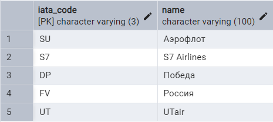

1. **Выборка всех данных из таблицы**
1.1. Все данные из таблицы `airlines`.
```sql
SELECT * FROM airline;
```
Результат выполнения запроса:


1.2. Все данные из таблицы `passenger`.
```sql
SELECT * FROM passenger;
```
Результат выполнения запроса:
![[images/Pasted image 20251012141613.png]]

4. **Выборка данных с созданием вычисляемого столбца**
4.1. Общую стоимость оставшихся доступных мест по классам в рейсах.
```sql
SELECT flight_id, fare_class_id, price, available_seats, price * available_seats AS total_price FROM fare;
```
Результат выполнения запроса:
![[images/Pasted image 20251012142407.png]]
4.2. Продолжительность полетов в часах
```sql
SELECT id, departure_time,arrival_time, arrival_time - departure_time AS flight_duration FROM flight;
```
Результат выполнения запроса:
![[images/Pasted image 20251012142943.png]]

7. **Выборка данных по условию**
7.1. Рейсы вылетающие позже чем 2025-10-22 00:00:00+03
```sql
SELECT id, departure_time FROM flight WHERE departure_time > '2025-10-22 00:00:00+03';
```
Результат выполнения запроса:
![[images/Pasted image 20251012143652.png]]

7.2. Модели самолетов с вместимостью более 100
```sql
SELECT model, capacity FROM aircraft_model WHERE capacity > 100;
```
Результат выполнения запроса:
![[images/Pasted image 20251012143936.png]]

10. **Выборка данных с сортировкой**
10.1. Модели самолетов упорядоченные по убыванию вместимости
```sql
SELECT model, capacity FROM aircraft_model ORDER BY capacity DESC;
```
Результат выполнения запроса:
![[images/Pasted image 20251012144317.png]]

10.2. Тарифы упорядоченные по возрастанию цены;
```sql
SELECT id, price, available_seats FROM fare ORDER BY price ASC;
```
Результат выполнения запроса:
![[images/Pasted image 20251012144644.png]]

13. **Выбор ограниченного количества возвращаемых строк.**
13.1. Самый вместительная модель самолета
```sql
SELECT model, capacity FROM aircraft_model ORDER BY capacity DESC LIMIT 1;
```
Результат выполнения запроса:
![[images/Pasted image 20251012145036.png]]

13.2. 3 рейса с самым ранним вылетом
```sql
SELECT id, flight_number, departure_time ORDER BY departure_time LIMIT 3;
```
Результат выполнения запроса:
![[images/Pasted image 20251012145530.png]]

16. **Выбор ограниченного количества возвращаемых строк.**
16.1. Объединение аэропорта и города в котором он находится.
```sql
SELECT city.name AS city_name, airport.name AS airport_name, airport.iata_code FROM city RIGHT JOIN airport ON city.id = airport.city_id;
```
Результат выполнения запроса:
![[images/Pasted image 20251012150342.png]]

16.2. Показать все рейсы и их статусы
```sql
SELECT flight.id AS flight_id, flight.departure_time, flight_status.description AS status_description FROM flight RIGHT JOIN flight_status ON flight.status_id = flight_status.id;
```
Результат выполнения запроса:
![[Pasted image 20251012150854.png]]
