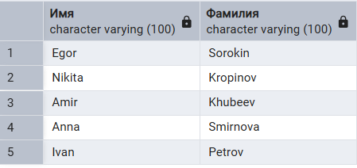
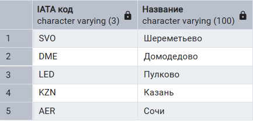
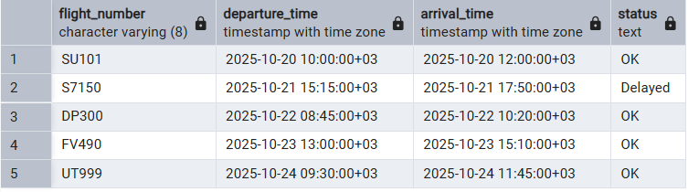
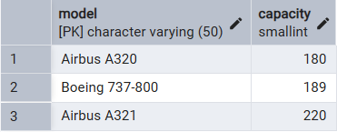
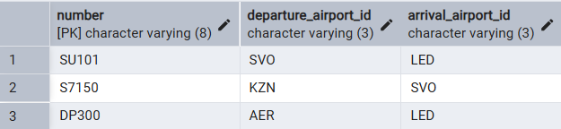
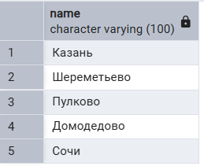
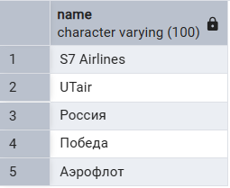
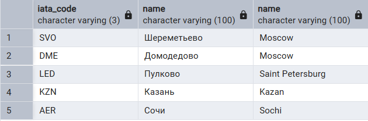
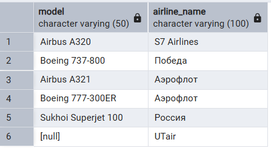

1. **Выборка всех данных из таблицы**
1.1. Все данные из таблицы `airlines`.
```sql
SELECT * FROM airline;
```
Результат выполнения запроса:


1.2. Все данные из таблицы `passenger`.
```sql
SELECT * FROM passenger;
```
Результат выполнения запроса:


2. **Выборка отдельных столбцов**

2.1. Хочу получить first_name и last_nameиз таблицы passenger

```sql
SELECT first_name, last_name FROM passenger;
```


2.2. Хочу получить price и available_seats таблицы fare

```sql
SELECT price, available_seats FROM fare;
```


3. **Присвоение новых имен столбцам при формировании выборки**

3.1. Присваиваем столбцам "first_name", "last_name" имена "имя", "фамилия"

```sql
SELECT first_name AS Имя, last_name AS Фамилия FROM passenger;
```



3.2. Присваиваем столбцам "iata_code", "name" имена "IATA код", "Название"

```sql
SELECT iata_code AS "IATA код", name AS "Название" FROM airport;
```



4. **Выборка данных с созданием вычисляемого столбца**
4.1. Общую стоимость оставшихся доступных мест по классам в рейсах.
```sql
SELECT flight_id, fare_class_id, price, available_seats, price * available_seats AS total_price FROM fare;
```
Результат выполнения запроса:


4.2. Продолжительность полетов в часах
```sql
SELECT id, departure_time,arrival_time, arrival_time - departure_time AS flight_duration FROM flight;
```
Результат выполнения запроса:


5. **Выборка данных с использованием вычисляемого столбца, математические функции**

5.1. Расчет скидки на билеты из таблицы fare

```sql
SELECT id, price, 
	price * 0.9 AS price_with_10_discount, 
	ROUND(price * 0.9) AS rounded_discount_price, 
	price - ROUND(price * 0.9) AS discount_amount 
FROM fare;
```


5.2. Количество бронирований и сумма стоимости всех бронирований

```sql
SELECT 
	COUNT(*) AS total_bookings, 
	SUM(total_cost) AS total_revenue 
FROM booking;
```


6. **Выборка данных, вычисляемые столбцы, логические функции**

6.1. Скидка, зависящая от цены

```sql
SELECT client_id, booking_date, total_cost,
CASE
	WHEN total_cost > 30000 THEN total_cost * 0.8
	ELSE total_cost * 0.95
END AS cost_with_discount
FROM booking;
```


6.2. Статус, зависящий от номера рейса

```sql
SELECT flight_number, departure_time, arrival_time, 
CASE
	WHEN flight_number = 'S7150' THEN 'Delayed'
	ELSE 'OK'
END AS status
FROM flight;
```


7. **Выборка данных по условию**

7.1. Рейсы вылетающие позже чем 2025-10-22 00:00:00+03
```sql
SELECT id, departure_time FROM flight WHERE departure_time > '2025-10-22 00:00:00+03';
```
Результат выполнения запроса:


7.2. Модели самолетов с вместимостью более 100
```sql
SELECT model, capacity FROM aircraft_model WHERE capacity > 100;
```
Результат выполнения запроса:


8. **Выборка данных, логические операции**

8.1. клиентов, которые **либо** зовут Егор, **либо** фамилия **не** Петров:

```sql
SELECT id, first_name, last_name, email FROM client 
WHERE first_name = 'Egor' OR NOT last_name = 'Petrov';
```


8.2. Пассажиров с датой рождения после определенной даты и с именем не Ivan

```sql
SELECT id, first_name, last_name, birthdate 
FROM passenger 
WHERE birthdate > '2000-01-01' AND NOT first_name = 'Ivan';
```


9. **Выборка данных, операторы BETWEEN, IN**

9.1. Самолеты, вместимость которых от 180 до 250

```sql
SELECT model, capacity
FROM aircraft_model
WHERE capacity BETWEEN 180 AND 250;
```


9.2. Рейсы, направляющиеся в Пулково или Шереметьево

```sql
SELECT number, departure_airport_id, arrival_airport_id
FROM flight_number 
WHERE arrival_airport_id IN ('LED', 'SVO');
```


10. **Выборка данных с сортировкой**

10.1. Модели самолетов упорядоченные по убыванию вместимости
```sql
SELECT model, capacity FROM aircraft_model ORDER BY capacity DESC;
```
Результат выполнения запроса:


10.2. Тарифы упорядоченные по возрастанию цены;
```sql
SELECT id, price, available_seats FROM fare ORDER BY price ASC;
```
Результат выполнения запроса:


11. **Выборка данных, оператор LIKE**

11.1. Клинты, у которых имя начинается на "A"

```sql
SELECT first_name, last_name, email
FROM client
WHERE first_name LIKE 'A%';
```


11.2. Авиакомпания у которой iata_code заканчивается на "7"

```sql
SELECT iata_code, name 
FROM airline 
WHERE iata_code LIKE '_7';
```


12. **Выбор уникальных элементов столбца**

12.1. Названия аэропортов

```sql
SELECT DISTINCT name FROM airport;
```


12.2. Названия авиакомпаний

```sql
SELECT DISTINCT name FROM airline;
```


13. **Выбор ограниченного количества возвращаемых строк.**
13.1. Самый вместительная модель самолета
```sql
SELECT model, capacity FROM aircraft_model ORDER BY capacity DESC LIMIT 1;
```
Результат выполнения запроса:


13.2. 3 рейса с самым ранним вылетом
```sql
SELECT id, flight_number, departure_time ORDER BY departure_time LIMIT 3;
```
Результат выполнения запроса:


14. **Соединение INNER JOIN**

14.1. Вывести количество и стоимость билетов для рейса с id = 1

```sql
SELECT description, price, available_seats
FROM fare INNER JOIN fare_class ON fare.fare_class_id = fare_class.id
WHERE flight_id = 1;
```


14.2. Oбъединение таблиц `flight` и `flight_status`

```sql
SELECT 
    flight.id,
    flight.departure_time,
    flight.arrival_time,
    flight_status.description AS flight_status
FROM flight INNER JOIN flight_status ON flight.status_id = flight_status.id;
```


15. **Внешнее соединение LEFT и RIGHT OUTER JOIN**

15.1. Город, в котором находится аэропорт по id

```sql
SELECT iata_code, airport.name, city.name
FROM airport LEFT JOIN city
ON airport.city_id = city.id;
```


15.2. Модель самолета и его авиакомпания

```sql
SELECT model, name as airline_name
FROM aircraft RIGHT JOIN airline
ON airline.iata_code = aircraft.airline_iata_code;
```


16. **Выбор ограниченного количества возвращаемых строк.**
16.1. Объединение аэропорта и города в котором он находится.
```sql
SELECT city.name AS city_name, airport.name AS airport_name, airport.iata_code FROM city RIGHT JOIN airport ON city.id = airport.city_id;
```
Результат выполнения запроса:


16.2. Показать все рейсы и их статусы
```sql
SELECT flight.id AS flight_id, flight.departure_time, flight_status.description AS status_description FROM flight RIGHT JOIN flight_status ON flight.status_id = flight_status.id;
```
Результат выполнения запроса:


17. **Перекрестное соединение CROSS JOIN**

17.1. Все комбинации авиакомпаний и моделей самолетов

```sql
SELECT 
    airline.iata_code AS airline_code,
    airline.name AS airline_name,
    aircraft_model.model AS aircraft_model,
    aircraft_model.capacity
FROM airline
CROSS JOIN aircraft_model
LIMIT 10;
```


17.2. Комбинации способов оплаты и статусов платежей

```sql
SELECT 
    payment_method.name AS payment_method,
    payment_status.description AS payment_status
FROM payment_method
CROSS JOIN payment_status
LIMIT 10;
```


