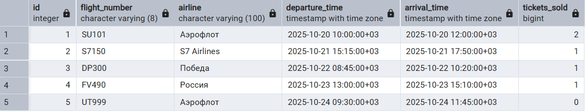
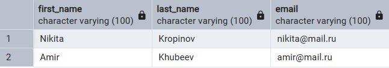
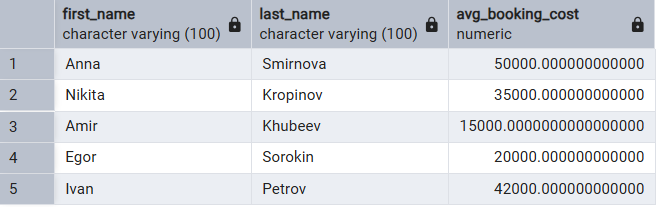
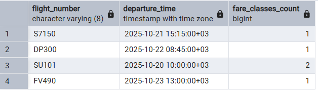
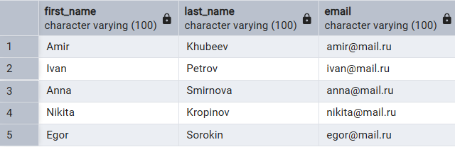

1. SELECT

1.1. **Все рейсы с количеством билетов на каждом рейсе**
```sql
SELECT 
    fn.number as flight_number,
    f.departure_time,
    (
        SELECT COUNT(*) 
        FROM ticket t 
        WHERE t.flight_id = f.id
    ) as tickets_count
FROM flight f
JOIN flight_number fn ON f.flight_number = fn.number;
```


1.2. **Клиенты с количеством их бронирований**
```sql
SELECT 
    first_name,
    last_name,
    email,
    (
        SELECT COUNT(*) 
        FROM booking b 
        WHERE b.client_id = c.id
    ) as bookings_count
FROM client c;
```


1.3. **Аэропорты с количеством вылетающих рейсов**
```sql
SELECT 
    a.iata_code,
    a.name as airport_name,
    (
        SELECT COUNT(*) 
        FROM flight_number fn 
        WHERE fn.departure_airport_id = a.iata_code
    ) as departing_flights
FROM airport a;
```



2. FROM

2.1. **Средняя стоимость бронирований по каждому клиенту**
```sql
SELECT 
    client_info.first_name,
    client_info.last_name,
    client_info.avg_booking_cost
FROM (
    SELECT 
        c.first_name,
        c.last_name,
        AVG(b.total_cost) as avg_booking_cost
    FROM client c
    JOIN booking b ON c.id = b.client_id
    GROUP BY c.id, c.first_name, c.last_name
) as client_info;
```


2.2. **Рейсы с количеством доступных тарифов**
```sql
SELECT 
    flight_data.flight_number,
    flight_data.departure_time,
    flight_data.fare_classes_count
FROM (
    SELECT 
        fn.number as flight_number,
        f.departure_time,
        COUNT(fare.fare_class_id) as fare_classes_count
    FROM flight f
    JOIN flight_number fn ON f.flight_number = fn.number
    JOIN fare ON f.id = fare.flight_id
    GROUP BY fn.number, f.departure_time
) as flight_data;
```


2.3. **Авиакомпании и количество их самолетов**
```sql
SELECT 
    airline_stats.airline_name,
    airline_stats.aircraft_count
FROM (
    SELECT 
        a.name as airline_name,
        COUNT(ac.id) as aircraft_count
    FROM airline a
    LEFT JOIN aircraft ac ON a.iata_code = ac.airline_iata_code
    GROUP BY a.name
) as airline_stats;
```


3. WHERE

3.1. **Рейсы, на которые есть билеты дороже 30000 рублей**
```sql
SELECT 
    fn.number as flight_number,
    f.departure_time,
    f.arrival_time
FROM flight f
JOIN flight_number fn ON f.flight_number = fn.number
WHERE f.id IN (
    SELECT flight_id 
    FROM fare 
    WHERE price > 30000
);
```


3.2. **Клиенты, у которых есть бронирования**
```sql
SELECT 
    first_name,
    last_name,
    email
FROM client
WHERE id IN (
    SELECT DISTINCT client_id 
    FROM booking
);
```


3.3. **Пассажиры, которые летали бизнес-классом**
```sql
SELECT 
    first_name,
    last_name,
    passport_series,
    passport_number
FROM passenger
WHERE id IN (
    SELECT t.passenger_id
    FROM ticket t
    JOIN fare f ON t.fare_id = f.id
    WHERE f.fare_class_id = 3
);
```

