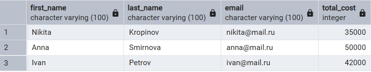

1. SELECT
1.1. **Клиенты, у которых стоимость бронирования выше средней**
```sql
SELECT 
    c.first_name,
    c.last_name,
    c.email,
    b.total_cost
FROM client c
JOIN booking b ON c.id = b.client_id
WHERE b.total_cost > (
    SELECT AVG(total_cost) 
    FROM booking
);
```

