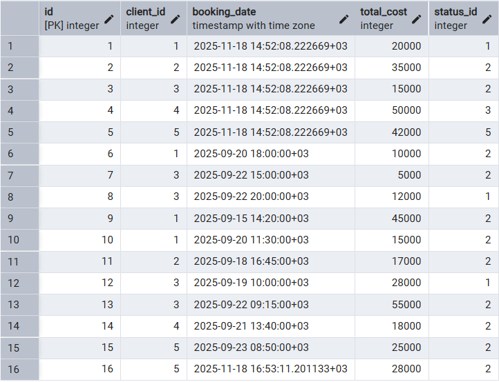
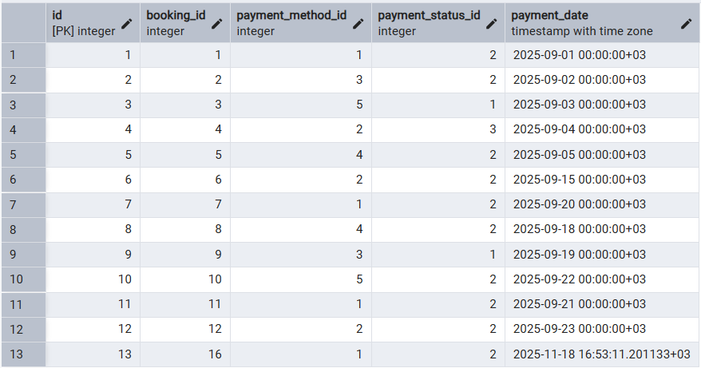
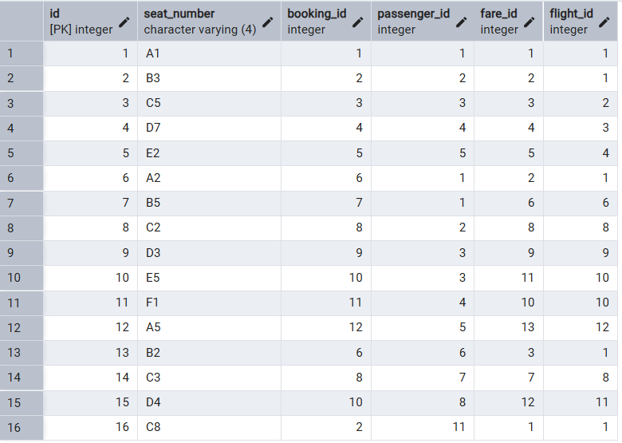
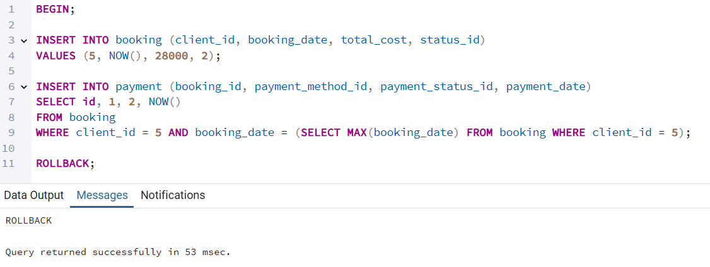
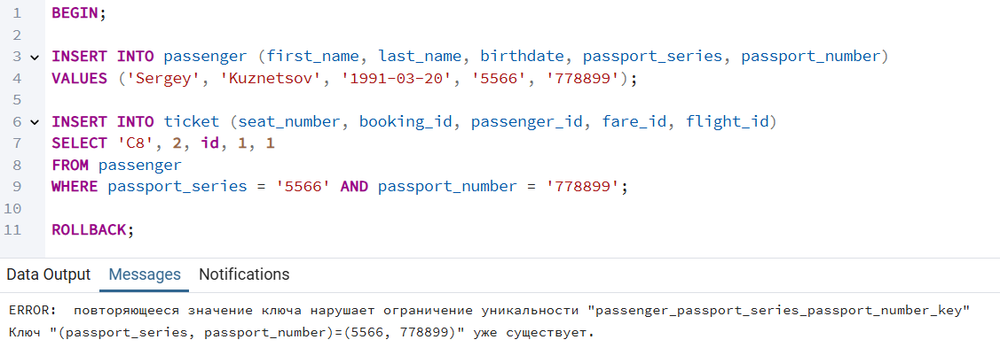

1. Базовые операции с транзакциями

1.1 BEGIN COMMIT

```sql
BEGIN;

INSERT INTO booking (client_id, booking_date, total_cost, status_id)
VALUES (5, NOW(), 28000, 2);

INSERT INTO payment (booking_id, payment_method_id, payment_status_id, payment_date)
SELECT id, 1, 2, NOW() 
FROM booking 
WHERE client_id = 5 AND booking_date = (SELECT MAX(booking_date) FROM booking WHERE client_id = 5);

COMMIT;
```
Создаем новое бронирование и записываем оплату для этого бронирования




1.2 BEGIN COMMIT
```sql
BEGIN;

INSERT INTO passenger (first_name, last_name, birthdate, passport_series, passport_number)
VALUES ('Sergey', 'Kuznetsov', '1991-03-20', '5566', '778899');

INSERT INTO ticket (seat_number, booking_id, passenger_id, fare_id, flight_id)
SELECT 'C8', 2, id, 1, 1
FROM passenger 
WHERE passport_series = '5566' AND passport_number = '778899';

COMMIT;
```
Создаем нового пассажира и создаем билет для него



2.1 ROLLBACK



2.2 ROLLBACK


