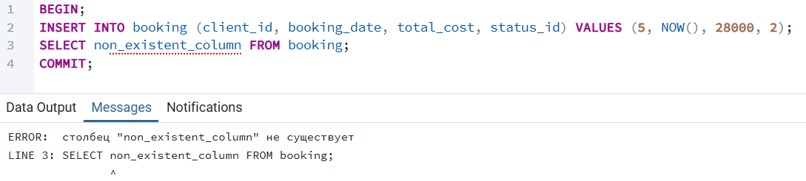

1. Базовые операции с транзакциями

1.1 BEGIN COMMIT

```sql
BEGIN;

INSERT INTO booking (client_id, booking_date, total_cost, status_id)
VALUES (5, NOW(), 28000, 2);

INSERT INTO payment (booking_id, payment_method_id, payment_status_id, payment_date)
SELECT id, 1, 2, NOW() 
FROM booking 
WHERE client_id = 5 AND booking_date = (SELECT MAX(booking_date) FROM booking WHERE client_id = 5);

COMMIT;
```
Создаем новое бронирование и записываем оплату для этого бронирования


1.2 BEGIN COMMIT
```sql
BEGIN;

INSERT INTO passenger (first_name, last_name, birthdate, passport_series, passport_number)
VALUES ('Sergey', 'Kuznetsov', '1991-03-20', '5566', '778899');

INSERT INTO ticket (seat_number, booking_id, passenger_id, fare_id, flight_id)
SELECT 'C8', 2, id, 1, 1
FROM passenger 
WHERE passport_series = '5566' AND passport_number = '778899';

COMMIT;
```
Создаем нового пассажира и создаем билет для него


2.1 ROLLBACK


2.2 ROLLBACK


3.1 Ошибка в транзакции

До транзакции:


Транзакция с ошибкой:


После транзакции с ошибкой ничего не изменилось:


3.2 Ошибка в транзакции

До транзакции:


Транзакция с ошибкой:



После транзакции с ошибкой ничего не изменилось:


4.1 SAVEPOINT

```sql
BEGIN;

INSERT INTO booking (client_id, booking_date, total_cost, status_id)
VALUES (5, NOW(), 30000, 2);

SAVEPOINT first_savepoint;

INSERT INTO passenger (first_name, last_name, birthdate, passport_series, passport_number)
VALUES ('Olga', 'Semenova', '1985-07-12', '1234', '999888');

COMMIT;

SELECT * FROM booking WHERE client_id = 5 ORDER BY booking_date DESC LIMIT 1;
SELECT * FROM passenger WHERE passport_series = '1234' AND passport_number = '999888';
```


4.2 SAVEPOINT

```sql
BEGIN;

-- Изменение 1
INSERT INTO booking (client_id, booking_date, total_cost, status_id)
VALUES (3, NOW(), 15000, 1);

SAVEPOINT sp1;

-- Изменение 2
INSERT INTO passenger (first_name, last_name, birthdate, passport_series, passport_number)
VALUES ('Dmitry', 'Volkov', '1992-11-05', '7777', '111222');

SAVEPOINT sp2;

-- Изменение 3
UPDATE booking SET total_cost = 50000 WHERE client_id = 3 AND booking_date = (SELECT MAX(booking_date) FROM booking WHERE client_id = 3);

SELECT * FROM booking WHERE client_id = 3 ORDER BY booking_date DESC LIMIT 1;
SELECT * FROM passenger WHERE passport_series = '7777' AND passport_number = '111222';

ROLLBACK TO SAVEPOINT sp2;

SELECT * FROM booking WHERE client_id = 3 ORDER BY booking_date DESC LIMIT 1;

ROLLBACK TO SAVEPOINT sp1;

SELECT * FROM passenger WHERE passport_series = '7777' AND passport_number = '111222';
SELECT * FROM booking WHERE client_id = 3 ORDER BY booking_date DESC LIMIT 1;

COMMIT;
```


## Задание 1: «Проверь, можно ли увидеть грязные данные»

### 1.1 Данные до транзакций:


**1.1 READ UNCOMMITED**
```sql
-- T1 --
BEGIN TRANSACTION ISOLATION LEVEL READ UNCOMMITTED;
UPDATE client
SET first_name = 'Uncommited Egor'
WHERE id = 1;
```

```sql
-- T2 --
BEGIN TRANSACTION ISOLATION LEVEL READ UNCOMMITTED;
SELECT id, first_name FROM client WHERE id = 1;
COMMIT;
```
#### Вывод второй транзакции


*В PostgreSQL грязные данные не читаются даже на уровне READ UNCOMMITED.*

**1.2 READ COMMITED**
```sql
-- T1 --
BEGIN TRANSACTION ISOLATION LEVEL READ COMMITTED;
UPDATE client
SET first_name = 'Another Uncommited Egor'
WHERE id = 1;
```

```sql
-- T2 --
BEGIN TRANSACTION ISOLATION LEVEL READ COMMITTED;
SELECT id, first_name FROM client WHERE id = 1;
COMMIT;
```
#### Вывод второй транзакции


*В PostgreSQL грязные данные не читаются на уровне READ COMMITED.*
## Задание 2: «Покажи неповторяющееся чтение»
### 2.1 
```sql
-- T1: 1 SELECT --
BEGIN TRANSACTION ISOLATION LEVEL READ COMMITTED;
SELECT payment_status_id
FROM payment
WHERE id = 1; 
```
#### После 1 SELECT в T1


```sql
-- T2 --
BEGIN TRANSACTION ISOLATION LEVEL READ COMMITTED;
UPDATE payment
SET payment_status_id = 3
WHERE id = 1;
COMMIT;
```

```sql
-- T1: 2 SELECT AFTER T2 --
SELECT payment_status_id
FROM payment
WHERE id = 1;
COMMIT;
```
#### После 2 SELECT в T1


*На уровне READ COMMITTED наблюдаем неповторяющееся чтение.*

## Задание 3: «Проверь, что T1 не видит изменений от T2, пока не завершится»

## 3.1
```sql
-- T1: START --
BEGIN TRANSACTION ISOLATION LEVEL REPEATABLE READ; 
SELECT available_seats 
FROM fare 
WHERE id = 3;
```
#### Вывод T1


```sql
-- T2 --
BEGIN TRANSACTION ISOLATION LEVEL READ COMMITTED;
UPDATE fare
SET available_seats = available_seats - 10
WHERE id = 3;
COMMIT;
-- IN DATABASE VALUE CURRENT VALUE IS 80
```

```sql
-- T1: END --
SELECT available_seats
FROM fare
WHERE id = 3;
COMMIT;
```
#### Вывод T1


*Видим, что на уровне REPEATABLE READ транзакция видит данные такими какие они были на момент ее начала (на момент снимка) до ее завершения.*
## Задание 4: «Покажи фантомное чтение через INSERT в T2»
## 4.1
```sql
-- T1: START --
BEGIN TRANSACTION ISOLATION LEVEL REPEATABLE READ;
SELECT COUNT(*) 
FROM client 
WHERE last_name LIKE 'Sorokin%';
```
#### После T1


```sql
-- T2 --
BEGIN TRANSACTION ISOLATION LEVEL READ COMMITTED;
INSERT INTO client (first_name, last_name, email, password_hash) 
VALUES ('test', 'SorokinNEW', 'test@example.com', 'x'); 
COMMIT;
```
#### В самой базе после T2


```sql
-- T1: END --
SELECT COUNT(*) 
FROM client 
WHERE last_name LIKE 'Sorokin%';
COMMIT;
```


*Количество останется тем же, что и в первом SELECT, потому что T1 не видит новые строки, вставленные после начала её транзакции — фантома в PostgreSQL на этом уровне нет*

## Задание 5: «Смоделируй конфликт: две транзакции вставляют одинаковые данные»

### 5.1

```sql
-- T1 -- 
BEGIN TRANSACTION ISOLATION LEVEL SERIALIZABLE;

INSERT INTO client (first_name, last_name, email, password_hash)
VALUES ('firstname', 'lastname', 'serializable@example.com', 'x');
```

```sql
-- T2 --
BEGIN TRANSACTION ISOLATION LEVEL SERIALIZABLE;

INSERT INTO client (first_name, last_name, email, password_hash)
VALUES ('firstname2', 'lastname2', 'serializable@example.com', 'x2');
-- waiting for the query to complete (because of uncommited T1)
```

```sql
-- T1 --
COMMIT;
```
#### После T1 данные вставлены


#### Во второй транзакции получаем ошибку


*В двух параллельных транзакциях на уровне SERIALIZABLE обе попытались вставить клиента с одинаковым уникальным `email`.  
После коммита первой транзакции вторая получила ошибку о нарушении уникального ограничения.*
## Задание 6: «Поймай ошибку could not serialize access due to concurrent update и повтори транзакцию»

### 6.1
#### До транзакций:


```sql
-- T1 --
BEGIN TRANSACTION ISOLATION LEVEL SERIALIZABLE;
SELECT available_seats FROM fare WHERE id = 1; -- 80
UPDATE fare
SET available_seats = available_seats - 1
WHERE id = 1;
```

```sql
-- T2 --
BEGIN TRANSACTION ISOLATION LEVEL SERIALIZABLE;
SELECT available_seats FROM fare WHERE id = 1; -- 80
UPDATE fare
SET available_seats = available_seats - 1
WHERE id = 1;
```

```sql
-- T1 --
COMMIT; -- success
```

```sql
-- T2 -- 
COMMIT; -- error
```

#### После попытки сделать коммит второй транзакции


```sql
-- T2: RETRY --
ROLLBACK;

BEGIN TRANSACTION ISOLATION LEVEL SERIALIZABLE;
SELECT available_seats FROM fare WHERE id = 1;
UPDATE fare
SET available_seats = available_seats - 1
WHERE id = 1;
COMMIT;
```
#### Имеем после повторной 2 транзакции


*Две транзакции T1 и T2 на уровне SERIALIZABLE одновременно прочитали одинаковое значение `available_seats` для `fare.id = 1` и обе попытались его уменьшить. T1 успешно закоммитилась, а T2 получила ошибку `could not serialize access due to concurrent update` . После повторного запуска T2 уже с учётом нового значения `available_seats` транзакция прошла успешно, то есть конфликт сериализации был решён повтором операции.*
