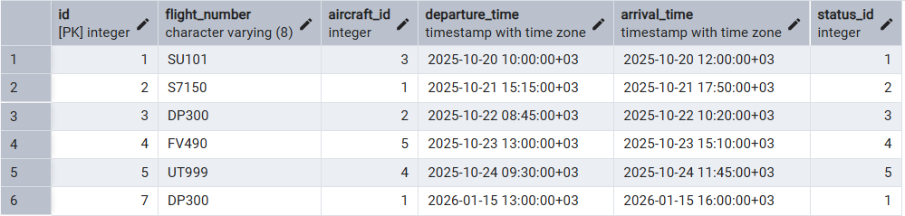
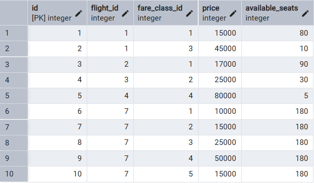

## 1
1. NEW

1.1. При создании рейса автоматически создаются тарифы для него.

```sql
CREATE OR REPLACE FUNCTION create_fares_for_new_flight()
RETURNS TRIGGER AS $$
BEGIN
    INSERT INTO fare (flight_id, fare_class_id, price, available_seats)
    SELECT 
        NEW.id,
        fc.id,
        CASE 
            WHEN fc.description = 'Economy' THEN 10000
            WHEN fc.description = 'Business' THEN 25000
            WHEN fc.description = 'First' THEN 50000
            ELSE 15000
        END,
        (SELECT capacity FROM aircraft_model am 
         JOIN aircraft a ON a.model = am.model 
         WHERE a.id = NEW.aircraft_id)
    FROM fare_class fc;
    
    RETURN NEW;
END;
$$ LANGUAGE plpgsql;
CREATE TRIGGER trigger_create_fares
    AFTER INSERT ON flight
    FOR EACH ROW
    EXECUTE FUNCTION create_fares_for_new_flight();

INSERT INTO flight (
    flight_number, 
    aircraft_id, 
    departure_time, 
    arrival_time, 
    status_id
) 
VALUES (
    'DP300',
    (SELECT id FROM aircraft LIMIT 1),
    '2026-01-15 10:00:00+00',
    '2026-01-15 13:00:00+00',
    (SELECT id FROM flight_status WHERE description = 'Scheduled')
);
```




1.2. Автоматическое присвоение статуса pending при бронировании + проверка на правильность суммы.

```sql
CREATE OR REPLACE FUNCTION set_initial_booking_status()
RETURNS TRIGGER AS $$
BEGIN
    IF NEW.status_id IS NULL THEN
        SELECT id INTO NEW.status_id 
        FROM booking_status 
        WHERE description = 'pending';
    END IF;
    IF NEW.total_cost <= 0 THEN
        RAISE EXCEPTION 'Total cost must be greater than 0';
    END IF;
    
    RETURN NEW;
END;
$$ LANGUAGE plpgsql;
CREATE TRIGGER trigger_validate_booking
    BEFORE INSERT ON booking
    FOR EACH ROW
    EXECUTE FUNCTION set_initial_booking_status();

INSERT INTO booking (client_id, booking_date, total_cost, status_id)
VALUES (
    (SELECT id FROM client WHERE email = 'ivan@mail.ru'),
    NOW(),
    25000,
    NULL
);
```


2. OLD

2.1. Логирование удаленных из базы пассажиров.

```sql
CREATE TABLE IF NOT EXISTS passenger_archive (
    id INT PRIMARY KEY,
    first_name VARCHAR(100) NOT NULL,
    last_name VARCHAR(100) NOT NULL,
    birthdate DATE NOT NULL,
    passport_series CHAR(4) NOT NULL,
    passport_number CHAR(6) NOT NULL,
    archived_at TIMESTAMPTZ DEFAULT NOW(),
    archive_reason VARCHAR(100) DEFAULT 'Manual deletion'
);

CREATE OR REPLACE FUNCTION archive_deleted_passenger()
RETURNS TRIGGER AS $$
BEGIN
    INSERT INTO passenger_archive 
        (id, first_name, last_name, birthdate, passport_series, passport_number, archive_reason)
    VALUES 
        (OLD.id, OLD.first_name, OLD.last_name, OLD.birthdate, 
         OLD.passport_series, OLD.passport_number, 'Manual deletion');
    
    RETURN OLD;
END;
$$ LANGUAGE plpgsql;

CREATE TRIGGER trigger_archive_passenger
    BEFORE DELETE ON passenger
    FOR EACH ROW
    EXECUTE FUNCTION archive_deleted_passenger();

INSERT INTO passenger (first_name, last_name, birthdate, passport_series, passport_number)
VALUES ('Test', 'User', '1990-01-01', '1234', '567890')

DELETE FROM passenger 
WHERE passport_series = '1234' AND passport_number = '567890';

SELECT * FROM passenger_archive;
```


2.2. Логирование изменения цены билетов.

```sql
CREATE TABLE IF NOT EXISTS price_change_log (
    id SERIAL PRIMARY KEY,
    fare_id INT NOT NULL,
    old_price INT NOT NULL,
    new_price INT NOT NULL,
    change_date TIMESTAMPTZ DEFAULT NOW(),
    change_type VARCHAR(20) NOT NULL
);

CREATE OR REPLACE FUNCTION log_price_changes()
RETURNS TRIGGER AS $$
BEGIN
    IF OLD.price <> NEW.price THEN
        DECLARE
            change_type VARCHAR(20);
        BEGIN
            IF NEW.price > OLD.price THEN
                change_type := 'Price increase';
            ELSE
                change_type := 'Price decrease';
            END IF;

            INSERT INTO price_change_log (fare_id, old_price, new_price, change_type)
            VALUES (OLD.id, OLD.price, NEW.price, change_type);
        END;
    END IF;
    
    RETURN NEW;
END;
$$ LANGUAGE plpgsql;

CREATE TRIGGER trigger_log_price_changes
    AFTER UPDATE ON fare
    FOR EACH ROW
    EXECUTE FUNCTION log_price_changes();

INSERT INTO fare (flight_id, fare_class_id, price, available_seats)
VALUES (
    (SELECT id FROM flight LIMIT 1),
    (SELECT id FROM fare_class WHERE description = 'First'),
    100000,
    25
);

UPDATE fare 
SET price = 120000 
WHERE id = (SELECT MAX(id) FROM fare);

SELECT * FROM price_change_log;
```


3. BEFORE
3.1 BEFORE INSERT: Валидация данных

```sql
CREATE OR REPLACE FUNCTION check_flight_dates() 
RETURNS trigger AS $$
BEGIN
    IF NEW.arrival_time <= NEW.departure_time THEN
        RAISE EXCEPTION 'Время прилета (%) должно быть позже времени вылета (%)', 
            NEW.arrival_time, NEW.departure_time;
    END IF;
    RETURN NEW;
END;
$$ LANGUAGE plpgsql;

CREATE TRIGGER trg_check_flight_dates_before_insert
BEFORE INSERT ON flight
FOR EACH ROW
EXECUTE FUNCTION check_flight_dates();

INSERT INTO flight (flight_number, aircraft_id, departure_time, arrival_time, status_id) VALUES ('SU100', 1, NOW(), NOW() - INTERVAL '1 hour', 1);
```


3.2 BEFORE UPDATE (Изменяем цену на 0, если статус бронирования отменен)

```sql
CREATE OR REPLACE FUNCTION clear_cost_on_cancel() 
RETURNS trigger AS $$
BEGIN
    IF NEW.status_id = 3 AND OLD.status_id != 3 THEN
        NEW.total_cost := 0; 
    END IF;
    RETURN NEW;
END;
$$ LANGUAGE plpgsql;

CREATE TRIGGER trg_clear_cost_before_update
BEFORE UPDATE ON booking
FOR EACH ROW
EXECUTE FUNCTION clear_cost_on_cancel();

INSERT INTO booking (client_id, booking_date, status_id, total_cost) VALUES ((SELECT id FROM client LIMIT 1), NOW(), 1, 10000);

UPDATE booking SET status_id = 3 WHERE total_cost = 10000;

SELECT id, status_id, total_cost FROM booking WHERE status_id = 3;
```


4. AFTER
4.1 AFTER INSERT (логгирование)

```sql
CREATE OR REPLACE FUNCTION notify_new_ticket() 
RETURNS trigger AS $$
BEGIN
    RAISE NOTICE 'Продан новый билет ID: %, Пассажир ID: %, Рейс ID: %', 
        NEW.id, NEW.passenger_id, NEW.fare_id;
    RETURN NEW;
END;
$$ LANGUAGE plpgsql;

CREATE TRIGGER trg_notify_ticket_after_insert
AFTER INSERT ON ticket
FOR EACH ROW
EXECUTE FUNCTION notify_new_ticket();

INSERT INTO ticket (seat_number, booking_id, passenger_id, fare_id, flight_id) 
VALUES (
	'A3',
	(SELECT id FROM booking LIMIT 1),
	(SELECT id FROM passenger LIMIT 1),
	(SELECT id FROM fare LIMIT 1),
	(SELECT id FROM flight LIMIT 1)
);
```


4.2 AFTER UPDATE (Отслеживание смены фамилии)

```sql
CREATE OR REPLACE FUNCTION notify_name_change() 
RETURNS trigger AS $$
BEGIN
    IF OLD.last_name <> NEW.last_name THEN
        RAISE NOTICE 'Внимание! Пассажир сменил фамилию с % на %', 
                     OLD.last_name, NEW.last_name;
    END IF;
    return NEW;
END;
$$ LANGUAGE plpgsql;

CREATE OR REPLACE TRIGGER trg_passenger_name_change
AFTER UPDATE ON passenger
FOR EACH ROW
EXECUTE FUNCTION notify_name_change();


UPDATE passenger SET last_name = 'Messi' WHERE passport_number = '123456';
```


5. ROW
5.1 Автоматически генерируем email

```sql
CREATE OR REPLACE FUNCTION generate_email() RETURNS trigger AS $$
BEGIN
    IF NEW.email IS NULL THEN
       NEW.email := LOWER(NEW.first_name) || '@flytics.com'; 
    END IF;
    RETURN NEW;
END;
$$ LANGUAGE plpgsql;


CREATE OR REPLACE TRIGGER trg_gen_email
BEFORE INSERT ON client
FOR EACH ROW
EXECUTE FUNCTION generate_email();

INSERT INTO client (first_name, last_name, email, password_hash) VALUES 
('Maria', 'Sidorova', null, 'secret_hash_1'),
('Sergey', 'Kozlov', null, 'secret_hash_2');

SELECT * FROM client;
```


5.2 Проверка, что старый пароль не совпадает с новым

```sql
CREATE OR REPLACE FUNCTION check_password_change() 
RETURNS trigger AS $$
BEGIN
    IF NEW.password_hash = OLD.password_hash THEN
        RAISE EXCEPTION 'Новый пароль не может совпадать со старым!';
    END IF;
    RETURN NEW;
END;
$$ LANGUAGE plpgsql;

CREATE OR REPLACE TRIGGER trg_check_pass
BEFORE UPDATE ON client
FOR EACH ROW
EXECUTE FUNCTION check_password_change();

UPDATE client
SET password_hash = 'my_castom_hash'
WHERE first_name = 'Ivan';

SELECT * FROM client;
```


6 STATEMENT
6.1 Аудит удалений бронирований
```sql
CREATE TABLE booking_audit_log (
    id SERIAL PRIMARY KEY,
    operation_time TIMESTAMP DEFAULT now(),
    user_name TEXT,
    operation_type TEXT
);

CREATE OR REPLACE FUNCTION log_booking_deletion()
RETURNS TRIGGER AS $$
BEGIN
    INSERT INTO booking_audit_log (user_name, operation_type)
    VALUES (current_user, 'DELETE on booking table');
    
    RETURN NULL;
END;
$$ LANGUAGE plpgsql;

CREATE TRIGGER trg_log_booking_delete
AFTER DELETE ON booking
FOR EACH STATEMENT
EXECUTE FUNCTION log_booking_deletion();

DELETE FROM booking WHERE id = -1;
SELECT * FROM booking_audit_log;
```


6.2 Аудит обновления рейсов
```sql
CREATE TABLE flight_update_log (
    id SERIAL PRIMARY KEY,
    log_time TIMESTAMP DEFAULT now(),
    operation_name TEXT,
    details TEXT
);

CREATE OR REPLACE FUNCTION log_flightupdate()
RETURNS TRIGGER AS $$
BEGIN
    INSERT INTO flight_update_log (operation_name, details)
    VALUES (TG_OP, 'Rows of flight was updated');
    
    RETURN NULL;
END;
$$ LANGUAGE plpgsql;

CREATE TRIGGER trg_log_flight_changes
AFTER UPDATE ON flight
FOR EACH STATEMENT
EXECUTE FUNCTION log_flight_update();

UPDATE flight 
SET status_id = 2 
WHERE id IN (1, 2, 3);

SELECT * FROM flight_update_log;
```


## 2 
Просмотр всех триггеров

```sql
SELECT * FROM pg_trigger;
```


## 3
3.1 Отмена брони если она не оплачена в течение 24 часов
```sql
SELECT cron.schedule(
	'remove_expired_bookings',
	'10 * * * *',
	$$
		UPDATE booking SET status_id = (SELECT id FROM booking_status WHERE description = 'cancelled')
		WHERE status.id = (SELECT id FROM booking_status WHERE description = 'pending') AND booking_date < NOW() - interval '24 hours'
	$$
);
```


3.2 Ежесуточный подсчет выручки
```sql
CREATE TABLE daily_revenue(
	report_date DATE PRIMARY KEY,
	total_amount BIGINT,
	bookings_count BIGINT,
	created_at TIMESTAMP DEFAULT NOW()
);

SELECT cron.schedule(
	'count_daily_amout',
	'0 3 * * *',
	$$
		INSERT INTO daily_revenue(report_date, total_amout, bookings_count) VALUES(
			SELECT 
				CURRENT_DATE - 1, -- вчера
				COALESCE(SUM(price), 0),
				COUNT(*)
			FROM booking 
			WHERE CAST(booking_date AS DATE) = CURRENT_DATE - 1 AND status_id = (SELECT id FROM booking_status WHERE description = 'completed');
		);
	$$
);
```


3.3 Авто-закрытие рейсов, после их вылета через 15 минут
```sql
SELECT cron.schedule(
	'auto_close_flights',
	'*/2 * * * *',
	$$
		UPDATE flight SET status_id = (SELECT id FROM flight_status WHERE description = 'Departed')
		WHERE status_id = (SELECT id FROM flight_status WHERE description = 'Scheduled')
			AND departure_time < NOW() - interval '15 minutes'
	$$
);
```


3.4 Просмотр всех кронов
```sql
SELECT * FROM cron.job;
```


3.5 Просмотр выполненных кронов
```sql
SELECT * FROM cron.job_run_details
ORDER BY start_time DESC;
```


